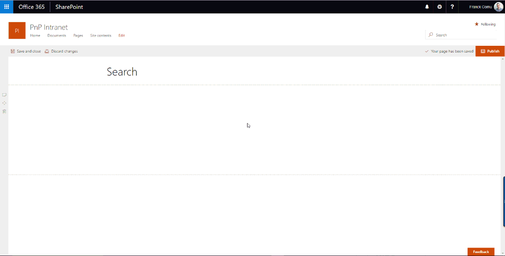
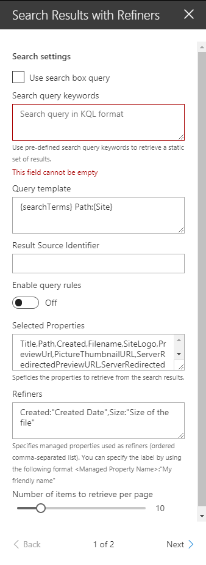

# SharePoint Framework search with refiners and paging sample

## Summary
This sample shows you how to build user friendly SharePoint search experiences using Office UI fabric tiles, custom refiners and paging.

  

An associated [blog post](http://thecollaborationcorner.com/2017/10/16/build-dynamic-sharepoint-search-experiences-with-refiners-and-paging-with-spfx-office-ui-fabric-and-pnp-js-library/) is available to give you more details about this sample implementation.

## Used SharePoint Framework Version 

## Applies to

* [SharePoint Framework](https:/dev.office.com/sharepoint)
* [Office 365 tenant](https://dev.office.com/sharepoint/docs/spfx/set-up-your-development-environment)

## Solution

Solution|Author(s)
--------|---------
react-search-refiners | Franck Cornu (MVP Office Development at aequos) - [@FranckCornu](http://www.twitter.com/FranckCornu) Mikael Svenson -[@mikaelsvenson](http://www.twitter.com/mikaelsvenson)

## Version history

Version|Date|Comments
-------|----|--------
1.0 | October 17, 2017 | Initial release
1.1 | January 03, 2018 | Improvements and updating to SPFx drop 1.4
1.2 | February 12, 2018 | Added a search box Web Part + Added a "Result Source Id" and "Enable Query Rules" parameters.

## Disclaimer
**THIS CODE IS PROVIDED *AS IS* WITHOUT WARRANTY OF ANY KIND, EITHER EXPRESS OR IMPLIED, INCLUDING ANY IMPLIED WARRANTIES OF FITNESS FOR A PARTICULAR PURPOSE, MERCHANTABILITY, OR NON-INFRINGEMENT.**

---

## Minimal Path to Awesome

- Clone this repository
- In the command line run:
  - `npm install`
  - `gulp serve`

### Web Part property pane options

The following settings are available in the Web Part property pane:

  

Setting | Description 
-------|----
Search query keywords | The search query in KQL format. You can use search query variables (See this [post](http://www.techmikael.com/2015/07/sharepoint-rest-do-support-query.html) to know which ones are allowed).
Query template | The search query template in KQL format. You can use search variables here (like Path:{Site}).
Selected properties | The search managed properties to retrieve. You can use these proeprties then in the code like this (`item.property_name`). (See the *Tile.tsx* file) .
Refiners | The search managed properties to use as refiners. Make sure these are refinable. With SharePoint Online, you have to reuse the default ones to do so (RefinableStringXX etc.). The order is the same as they will appear in the refnement panel.
Number of items to retrieve per page | Quite explicit. The paging behavior is done directly by the search API (See the *SearchDataProvider.ts* file), not by the code on post-render.
Show paging | Indicates whether or not the component should show the paging control at the bottom.

## Features
This Web Part illustrates the following concepts on top of the SharePoint Framework:

- Build an user friendly search experience on the top of the SharePoint search REST API with paging and refiners using the *sp-pnp-js* library.
- Integrate the [@pnp/spfx-property-controls](https://github.com/SharePoint/sp-dev-fx-property-controls) in your solution (*PlaceHolder* control).
- Integrate multiple Office UI Fabric components (DocumentCard, Panel, GroupedList, ...) to fit with the native Office 365 theme.
- Use the React container component approach inspiring by the [react-todo-basic sample](https://github.com/SharePoint/sp-dev-fx-webparts/tree/master/samples/react-todo-basic).

