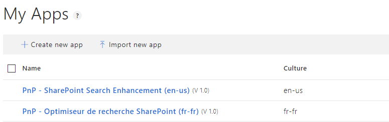
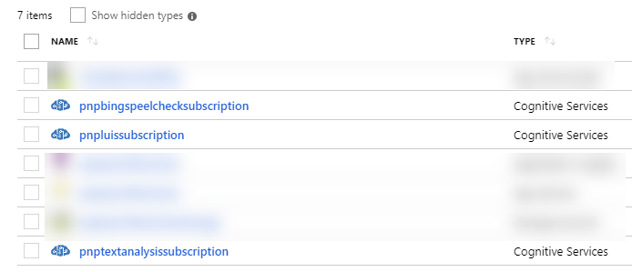
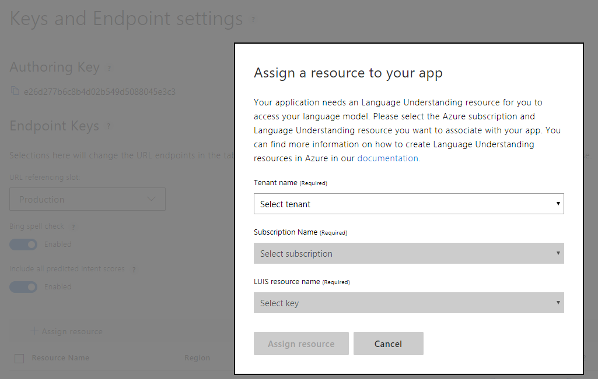
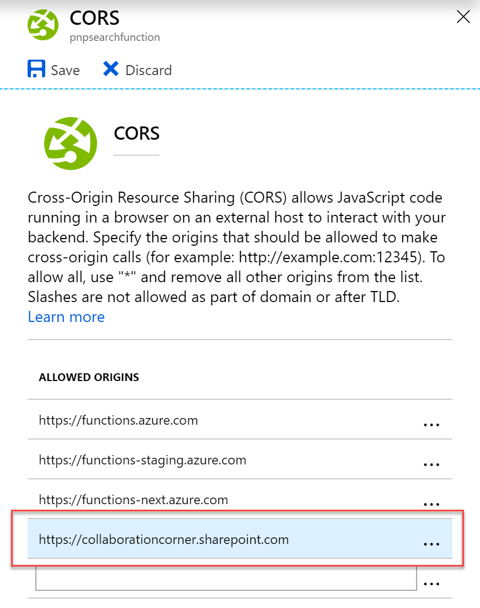

# PnP - Search Query Enhancer

## Description

This sample demonstrates the following principles:
- Create an Azure function using TypeScript and Webpack. The original setup was reused from this [article](https://medium.com/burak-tasci/backend-development-on-azure-functions-with-typescript-56113b6be4b9) with only few adjustments.
- Connect Azure Function to an SPFx component
- Use third party back end services like Microsoft LUIS or Text Analysis to interpret a search query and enhance it with NLP services.

***In this sample, the function is secured by a function code. For production use, refer to [this article](https://docs.microsoft.com/en-us/sharepoint/dev/spfx/use-aadhttpclient-enterpriseapi) to protect and use it with Azure AD and SPFx.***

***In real world scenarios, you may want add your own intents and build your enhanced search queries accordingly. Use this sample as a starter.***

## Why LUIS instead of SharePoint search query rules?

- Easy to manage for power users .They don't have to deal with complex SharePoint concepts. With LUIS, they can manage and refine the model more easily in a friendly comprehensive interface.
- Real time monitoring. Power users can review utterances submitted by end users in the LUIS portal and what keywords are entered. They can add new terms as synonyms automatically from the utterances and identify new intentions more precisely.
- Extensible model with custom intents mapped to predefined well know SharePoint search queries.
- Able to plug in the Bing Spell checker automatically to correct mispeleld words and get a clean query

## Set up the solution

- In the [www.luis.ai](www.luis.ai) portal, imports new applications from the JSON files in the [/luis](./luis) folder.

- In Azure, create keys for the following Microsoft Cognitive Services:
    - Language Understanding
    - Bing Spell Check v7
    - Text Analytics

- Fill the following values in the `local.settings.json` file according to your environment:

| Setting | Description
| ------- | ---------
LUIS_SubscriptionKey | The key value for LUIS retrieved from the Azure portal
LUIS_AzureRegion | Azure region where you created the LUIS key 
Bing_SpellCheckApiKey | The Bing Spell Check API key retrieved from the Azure portal
TextAnalytics_SubscriptionKey | The key value for Text Analytics Service retrieved from the Azure portal 
TextAnalytics_AzureRegion | Azure region where you created the Text Analytics key

- Add keys to your LUIS applications

- Train and publish the LUIS applications
- Fill LUIS app ids in the `luismappings.json` according to your environment
- Play with the function!

### Intents

| Intent | Description
| ------ | -----------
| PnP.SearchByKeywords | The default intent for the search query. Used to improve free text searches for SharePoint (90% of users queries in the portal).
| None | Needed to avoid unrelevant query such as noise words, trolling or insulting words

### Entities

| Entity | Type | Description | Recognition method |
| ------ | ---- | ----------- | ------------ |
| [keyPhrase](https://docs.microsoft.com/en-us/azure/cognitive-services/luis/luis-quickstart-intent-and-key-phrase) | Builtin | This prebuilt enity catches important keywords in the phrase. In this case, we treat these values as a "free" keyword which will be matched with all relevant SharePoint search managed properties. | Machine Learning

## How to debug this function locally ? ##

### Prerequisites ###

- In VSCode, open the root folder `./functions`.
- Install all dependencies using `npm i`.
- Install [Azure CLI](https://docs.microsoft.com/en-us/cli/azure/install-azure-cli-windows?view=azure-cli-latest) on youre machine.
- Install Azure Function Core tools globaly using `npm install -g azure-functions-core-tools@2` (version 2).
- In a Node.js console, build the solution using `npm run build:dev` cmd. For production use, execute `npm run build` (minified version of the JS code).
- In a Node.js console, from the `pnp-query-enhancer/dist` folder, run the following command `func start`.
- In VSCode, launch the *'Debug Local Azure Function'* debug configuration
- Set breakpoints directly in your **'.ts'** files
- Send your requests either using Postman with the localhost address according to your settings (i.e. `http://localhost:7071/api/enhanceQuery`) or directly in the 'Search Box Webpart' via the 'Service URL' parameter.
- Enjoy ;)

### Azure Function Proxy configuration ###

This solution uses an Azure function proxy to get an only single endpoint URL for multiple functions. See the **proxies.json** file to see defined routes.

## How to deploy the solution to Azure ? ##

### Development scenario

We recommend to use Visual Studio Code to work with this solution.

- In VSCode, download the [Azure Function](https://code.visualstudio.com/tutorials/functions-extension/getting-started) extension
- Sign-in to to Azure account into the extension
- In a Node.js console, build the application using the command `npm run build` (minified version)
- Use the **"Deploy to Function App"** feature (in the extension top bar) using the *'dist'* folder. Make sure you've run the `npm run build` cmd before.
- Upload the application settings (`local.settings.json`)

### Production scenario with CI

A `deploy.ps1` script is available to also deploy this function into your Azure environment.

- From you Azure portal, create a new empty function
- Set the `Azure_Function_Name` value in the `local.settings.json` accordingly.
- Login to Azure using `az login` then run `deploy.ps1` script with your parameters.

***In both scenarios, you can test your function using Postman. If you test it using a SPFx component, don't forget to add the SharePoint domain to the CORS settings to allow this origin:***

