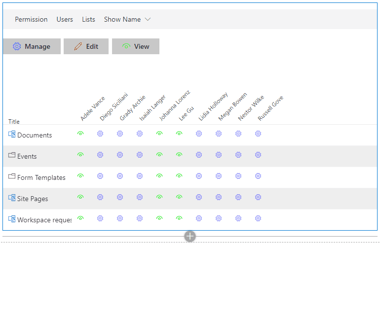
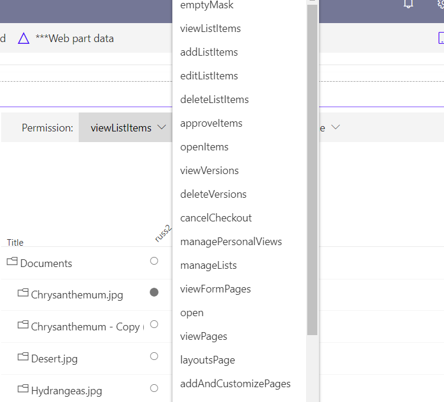
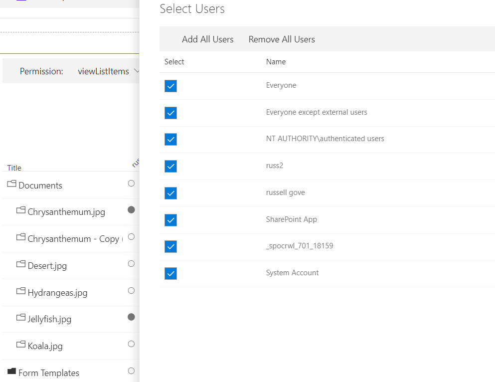
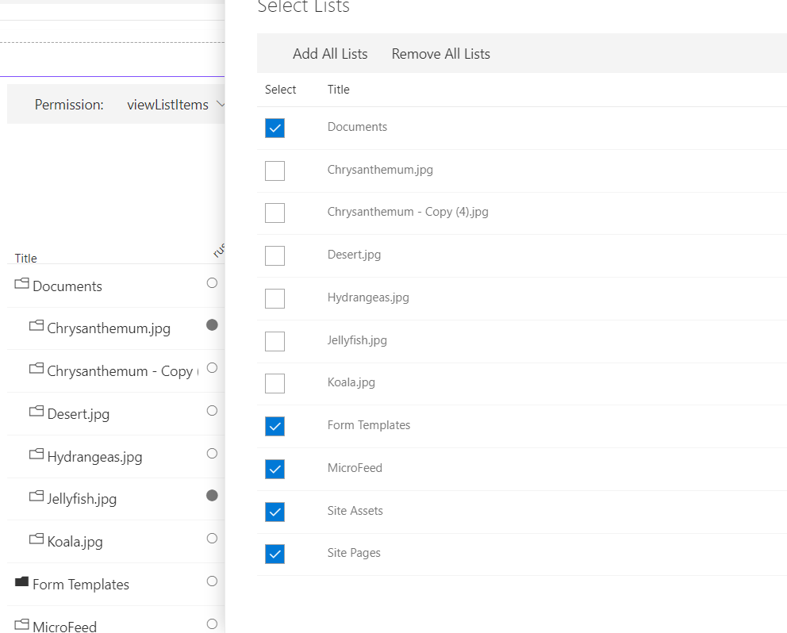
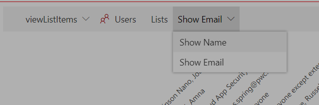
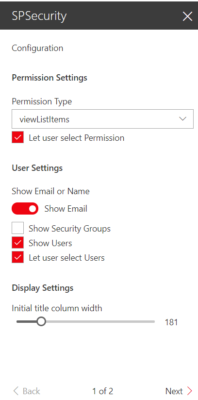
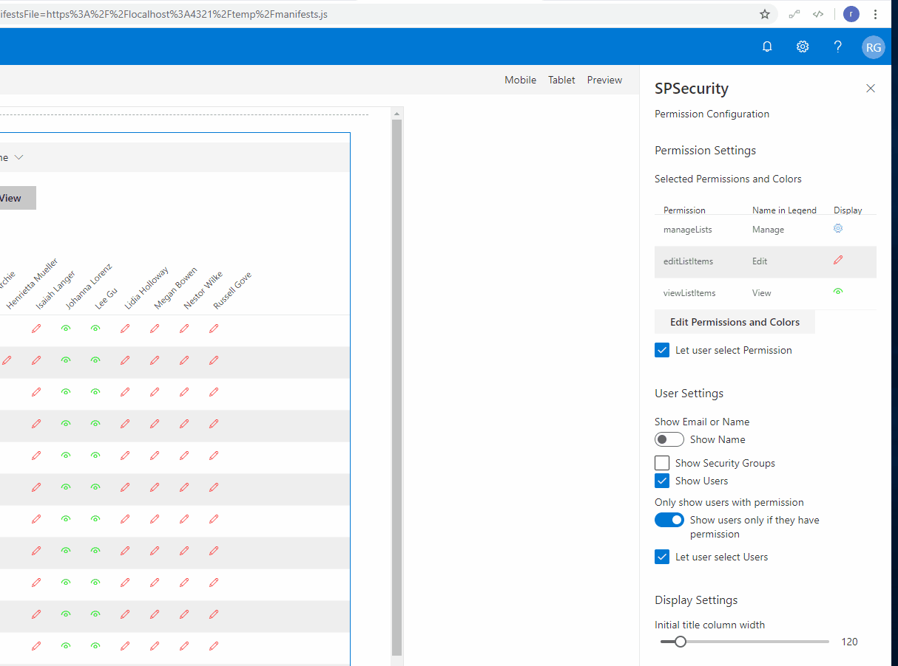
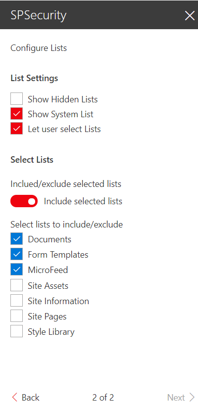

# Security Grid

## Summary

React-securitygrid is an SPFX web part that uses React and Office-UI-Fabric to render a grid showing which users have access to which lists/libraries/folders/files on a Web as shown here:

Empty libraries are displayed with a black folder icon, those with items are displayed with a white folder. The user can expand a list or library by clicking on the desired row. (If the library or folder has more than 5000 items an error will be displayed ) For deeply nested folders the Title column can be resized by drag and drop. The display shows a the appropriate icon circle if the user has the selected permission to the given list, library, file or folder. (NOTE:The grid does not currently take into account access give via membership in an active directory group-- coming soon!). IMPORTANT: The user must have permissions to access lists and enumerate permissions in order to view the grid.

The user can change the permission being tested by clicking the Permission in the command bar and selecting a new Permission:

The user can change which users are being shown in the grid by selecting the users button in the command bar and selecting a desired users:

The user can change which lists are being shown in the grid by selecting the lists button in the command bar and selecting a desired lists:

The user can change alternate between displaying user names and emails  selecting the Show Email/Show Name button in the command bar and selecting the desired option:

The the first configuration panel of the web part is shown below:

Permission Settings

The Permission Settings allow you to select which permissions to show in the grid and to select the Icon and color used to display the selected permission.

User Settings

The Show Email or Name Toggle determines whether the name or email is displayed by default.
The Show Security Groups checkbox determines whether SharePoint Security groups are included in the grid.
The Show Users checkbox determines whether Users are included in the grid.
The Only show users with permissions toggle determines whether the grid should display all users with access to the web, or only users with the selected permission

The Let Users Select users checkbox determines whether Users can filter the selected users in the grid.

Display Settings

The Initial Title column width determines the initial width of the Title column(it can be resized).

The second configuration panel allows the owner to configure the List Settings

List Settings

The Show Hidden Lists checkbox determines whether Hidden lists  are displayed.
The Show System Lists checkbox determines whether System Lists (Catalogs) are included in the grid.
The Show Users checkbox determines whether Users are included in the grid.
The Let Users Select lists checkbox determines whether Users can filter the selected lists in the grid.

Select Lists

The Include/Exclude Selected lists Toggle determines whether the lists selected are to be included or excluded.

The admin can select lists and libraries below to have them included/excluded from the grid

## Notes

This is a port of an Angular 1.3 SharePoint hosted App at https://github.com/russgove/SPSecurity.

## Compatibility

 
 

-Incompatible-red.svg "SharePoint Server 2016 Feature Pack 2 requires SPFx 1.1")

-yellow.svg)

## Applies to

* [SharePoint Framework Developer Preview](https://docs.microsoft.com/sharepoint/dev/spfx/sharepoint-framework-overview)
* [Office 365 developer tenant](https://docs.microsoft.com/sharepoint/dev/spfx/set-up-your-developer-tenant)

## Prerequisites

> React, Office-UI-Fabric, sp-pnp-js, lodash

## Solution

Solution|Author(s)
--------|---------
 react-securitygrid | [Russell Gove](https://github.com/russgove) ([@russgove](https://twitter.com/russgove))

## Version history

Version|Date|Comments
-------|----|--------
1.0.5.0|March 6, 2021 | Added webApiPermission request
1.0.0.4|February 22, 2021 | Added support for AD groups
1.0.0.3|October 28, 2020 | Update to office-ui-fabric-react 7.148.1, fixing icons and indentation for sub-folders 
1.0.0.2|April 5, 2021| Updates to SPFx 1.10; Allow display of multiple permissions
1.0.0.1|April 25, 2018|Update to SPFx 1.4.1
1.0.0.0|December 31, 2016|Initial version

## Minimal Path to Awesome

- Clone this repository
- in the command line run:
  - `npm install`
  - `gulp serve`

## Help

We do not support samples, but we this community is always willing to help, and we want to improve these samples. We use GitHub to track issues, which makes it easy for  community members to volunteer their time and help resolve issues.

If you're having issues building the solution, please run [spfx doctor](https://pnp.github.io/cli-microsoft365/cmd/spfx/spfx-doctor/) from within the solution folder to diagnose incompatibility issues with your environment.

You can try looking at [issues related to this sample](https://github.com/pnp/sp-dev-fx-webparts/issues?q=label%3A%22sample%3A%20react-securitygrid") to see if anybody else is having the same issues.

You can also try looking at [discussions related to this sample](https://github.com/pnp/sp-dev-fx-webparts/discussions?discussions_q=react-securitygrid) and see what the community is saying.

If you encounter any issues while using this sample, [create a new issue](https://github.com/pnp/sp-dev-fx-webparts/issues/new?assignees=&labels=Needs%3A+Triage+%3Amag%3A%2Ctype%3Abug-suspected%2Csample%3A%20react-securitygrid&template=bug-report.yml&sample=react-securitygrid&authors=@russgove&title=react-securitygrid%20-%20).

For questions regarding this sample, [create a new question](https://github.com/pnp/sp-dev-fx-webparts/issues/new?assignees=&labels=Needs%3A+Triage+%3Amag%3A%2Ctype%3Aquestion%2Csample%3A%20react-securitygrid&template=question.yml&sample=react-securitygrid&authors=@russgove&title=react-securitygrid%20-%20).

Finally, if you have an idea for improvement, [make a suggestion](https://github.com/pnp/sp-dev-fx-webparts/issues/new?assignees=&labels=Needs%3A+Triage+%3Amag%3A%2Ctype%3Aenhancement%2Csample%3A%20react-securitygrid&template=question.yml&sample=react-securitygrid&authors=@russgove&title=react-securitygrid%20-%20).

## Disclaimer

**THIS CODE IS PROVIDED *AS IS* WITHOUT WARRANTY OF ANY KIND, EITHER EXPRESS OR IMPLIED, INCLUDING ANY IMPLIED WARRANTIES OF FITNESS FOR A PARTICULAR PURPOSE, MERCHANTABILITY, OR NON-INFRINGEMENT.**

