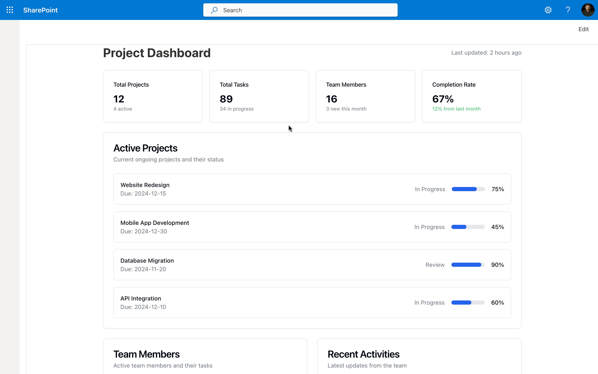

# React ShadCN Dashboard

## Summary

This SharePoint Framework (SPFx) web part serves as a foundational solution for developers aiming to use ShadCN components within SPFx projects. By integrating ShadCN components with Tailwind CSS in an SPFx web part, this project enables developers to craft modern, responsive, and visually appealing SharePoint web parts. This solution provides a seamless, intuitive developer experience for building advanced UI elements in SharePoint.

## Compatibility

| :warning: Important          |
|:---------------------------|
| Every SPFx version is optimally compatible with specific versions of Node.js. In order to be able to build this sample, you need to ensure that the version of Node on your workstation matches one of the versions listed in this section. This sample will not work on a different version of Node.|
|Refer to <https://aka.ms/spfx-matrix> for more information on SPFx compatibility.   |

This sample is optimally compatible with the following environment configuration:

-Incompatible-red.svg "SharePoint Server 2016 Feature Pack 2 requires SPFx 1.1")

## Applies to

- [SharePoint Framework](https://aka.ms/spfx)
- [Microsoft 365 tenant](https://docs.microsoft.com/en-us/sharepoint/dev/spfx/set-up-your-developer-tenant)

> Get your own free development tenant by subscribing to [Microsoft 365 developer program](http://aka.ms/o365devprogram)

## Contributors🧑‍💻

- [Sandeep P S](https://github.com/Sandeep-FED)

## Version history

| Version | Date             | Comments                                |
| ------- | ---------------- | --------------------------------------- |
| 1.0     | November 9, 2024 | Initial release with ShadCN and Tailwind CSS integration |

## Features💡

Key features demonstrated by this solution:

- Enables ShadCN component integration within SPFx projects
- Utilizes Tailwind CSS for efficient, responsive styling
- Empowers developers to create modern, modular, and user-friendly web parts in SharePoint

## Minimal Path to Awesome⚡

- Clone this repository
- Ensure that you are in the solution folder
- Run these commands:
  - `npm install`
  - `gulp serve`

## Deploy Package Solution 🚀

- Ensure that you are in the solution folder
- Run these commands:
  - `gulp build --ship`
  - `gulp bundle --ship`
  - `gulp package-solution --ship`
- Upload the package to the AppCatalog and add it to your SharePoint site.

## References

- [ShadCN Library](https://shadcn.dev) - Powerful UI components for modern web apps.
- [Tailwind CSS](https://tailwindcss.com) - Utility-first CSS framework for rapid UI development.
- [Microsoft 365 Patterns and Practices](https://aka.ms/m365pnp)
- [SharePoint Framework](https://docs.microsoft.com/en-us/sharepoint/dev/spfx/set-up-your-developer-tenant)

## Help

We do not support samples, but this community is always willing to help, and we want to improve these samples. We use GitHub to track issues, which makes it easy for  community members to volunteer their time and help resolve issues.

If you're having issues building the solution, please run [spfx doctor](https://pnp.github.io/cli-microsoft365/cmd/spfx/spfx-doctor/) from within the solution folder to diagnose incompatibility issues with your environment.

You can try looking at [issues related to this sample](https://github.com/pnp/sp-dev-fx-webparts/issues?q=label%3A%22sample%3A%20react-shadcn-dashboard%22) to see if anybody else is having the same issues.

You can also try looking at [discussions related to this sample](https://github.com/pnp/sp-dev-fx-webparts/discussions?discussions_q=react-shadcn-dashboard) and see what the community is saying.

If you encounter any issues using this sample, [create a new issue](https://github.com/pnp/sp-dev-fx-webparts/issues/new?assignees=&labels=Needs%3A+Triage+%3Amag%3A%2Ctype%3Abug-suspected%2Csample%3A%20react-shadcn-dashboard&template=bug-report.yml&sample=react-shadcn-dashboard&authors=@Sandeep-FED&title=react-shadcn-dashboard%20-%20).

For questions regarding this sample, [create a new question](https://github.com/pnp/sp-dev-fx-webparts/issues/new?assignees=&labels=Needs%3A+Triage+%3Amag%3A%2Ctype%3Aquestion%2Csample%3A%20react-shadcn-dashboard&template=question.yml&sample=react-shadcn-dashboard&authors=@Sandeep-FED&title=react-shadcn-dashboard%20-%20).

Finally, if you have an idea for improvement, [make a suggestion](https://github.com/pnp/sp-dev-fx-webparts/issues/new?assignees=&labels=Needs%3A+Triage+%3Amag%3A%2Ctype%3Aenhancement%2Csample%3A%20react-shadcn-dashboard&template=suggestion.yml&sample=react-shadcn-dashboard&authors=@Sandeep-FED&title=react-shadcn-dashboard%20-%20).

## Disclaimer

**THIS CODE IS PROVIDED *AS IS* WITHOUT WARRANTY OF ANY KIND, EITHER EXPRESS OR IMPLIED, INCLUDING ANY IMPLIED WARRANTIES OF FITNESS FOR A PARTICULAR PURPOSE, MERCHANTABILITY, OR NON-INFRINGEMENT.**

