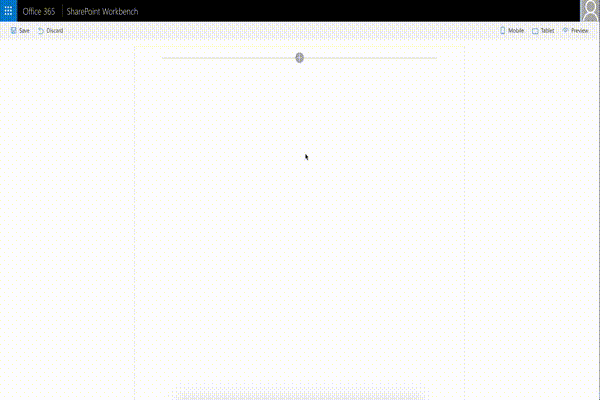

# React Side Panel Client-Side Web Part

## Summary

The web part illustrates creation and usage of Side Panel (Sidebar) control.



## Used SharePoint Framework Version 


## Applies to

* [SharePoint Framework](https://docs.microsoft.com/sharepoint/dev/spfx/sharepoint-framework-overview)

## Solution

Solution|Author(s)
--------|---------
react-side-panel | Alex Terentiev ([Sharepointalist Inc.](http://www.sharepointalist.com), [AJIXuMuK](https://github.com/AJIXuMuK))

## Version history

Version|Date|Comments
-------|----|--------
1.0|May 11, 2017|Initial release

## Disclaimer
**THIS CODE IS PROVIDED *AS IS* WITHOUT WARRANTY OF ANY KIND, EITHER EXPRESS OR IMPLIED, INCLUDING ANY IMPLIED WARRANTIES OF FITNESS FOR A PARTICULAR PURPOSE, MERCHANTABILITY, OR NON-INFRINGEMENT.**

## Features
Sample features:
- ability to add controls outside web part markup (thanks to Layout component)
- usage of Office UI Fabric React (Layout, ImageButton) 
- CSS transition animations

Control features:
- left or right positioning
- usage of this.props.children for content

### Resources
- [React Quick Start](https://facebook.github.io/react/docs/tutorial.html) 
- [TypeScript React Tutorials](https://www.typescriptlang.org/docs/handbook/react-&-webpack.html)
- [Office UI Fabric](https://developer.microsoft.com/fluentui/)

## Building the code

```bash
git clone the repo
npm i
npm i -g gulp
gulp
```

This package produces the following:

* lib/* - intermediate-stage commonjs build artifacts
* dist/* - the bundled script, along with other resources
* deploy/* - all resources which should be uploaded to a CDN.


