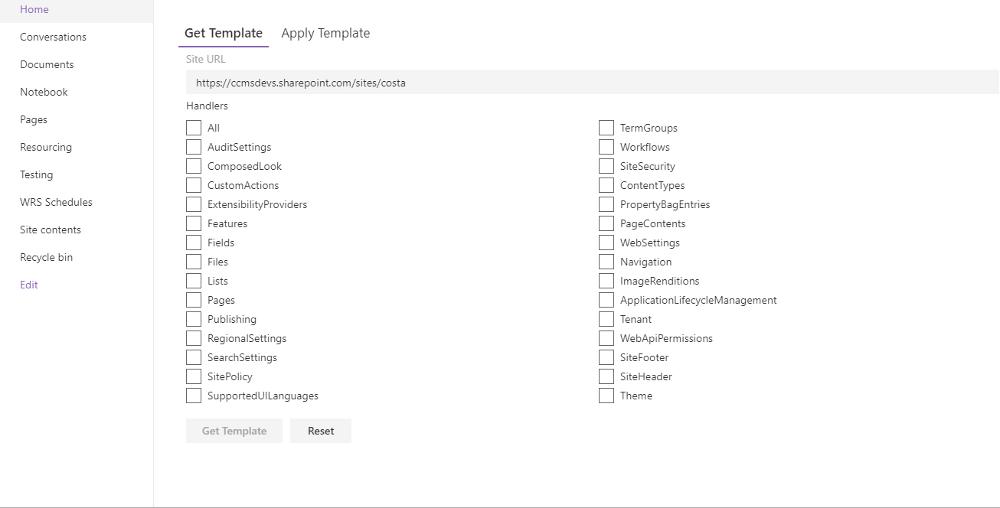
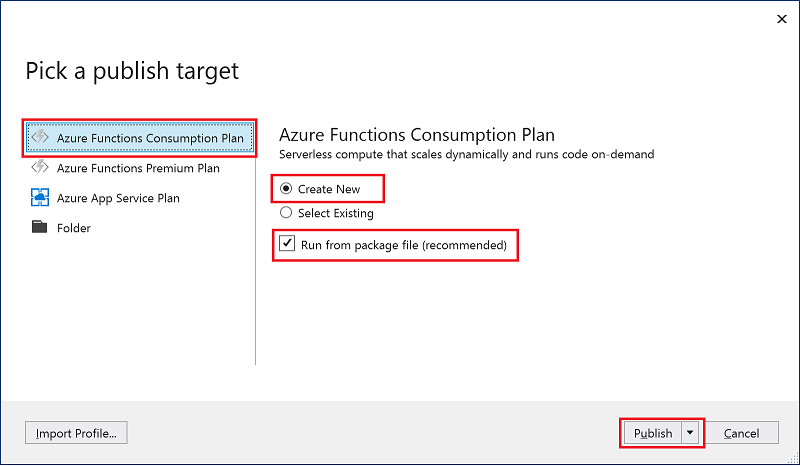
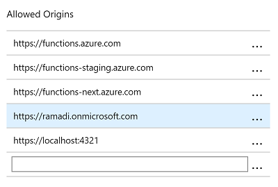
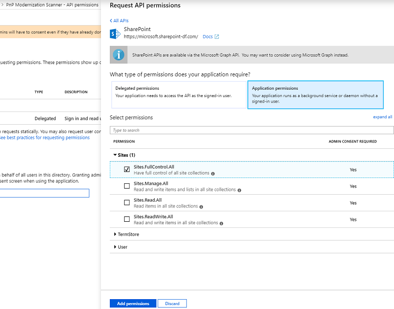

# Site Provisioning Manager Web Part

## Summary
This sample shows how you can manage site provisioning by calling Azure functions.

You can also find out how you can use React Hooks to manage the state of your application and share data across all components.




## Used SharePoint Framework Version 


## Applies to

* [SharePoint Framework](https://dev.office.com/sharepoint)
* [Office 365 tenant](https://dev.office.com/sharepoint/docs/spfx/set-up-your-development-environment)

## Solution

Solution|Author(s)
--------|---------
react-site-provisioning-manager | Ramin Ahmadi

## Version history

Version|Date|Comments
-------|----|--------
1.0|August 14, 2019|Initial release

## Features
This sample illustrates the following concepts on top of the SharePoint Framework:

* Using React Hooks.
* Using aadHttpClientFactory to call Azure functions.
* PnP/graph to call Microsoft Graph Api.

## Configure Azure Function

### Publishing the Azure function app

Follow below steps in order to publish the functions:

1. Open Provisioning App solution with Visual Studio 2017/2019.
2. In Solution Explorer, right-click the project and select Publish.
3. In the Pick a publish target dialog, use the publish options as specified in the table below the image:



4. Select Publish. If you haven't already signed-in to your Azure account from Visual Studio, select Sign-in.
5. In the App Service: Create new dialog, enter the hosting settings.
6. Select Create to create a function app and related resources in Azure with these settings and deploy your function project code.

### Securing the Azure function app

1. Open Azure Portal https://portal.azure.com.
2. Click App Services and find the app you just created.
3. Click "Platform features" tab.
4. Under Networking, click "Authentication / Authorization".
5. In the option “App Service Authentication”, select “ON”.
6. For "Action to take when request is not authenticated" option, select “Log in with Azure Active Directory”.
7. Under “Authentication Providers”, select “Azure Active Directory”.
8. Select “Management mode” as Express.
9. Create new AD App or select an existing one.
10. Click OK and then Save.

### Enable CORS on Azure Function

1. Click Platform features.
2. Under API, click CORS.
3. Specify the Office 365 tenant domain url and SharePoint local workbench url.
4. Click Save.



## Setting up an Azure AD app for app-only access

### Create a self signed certificate

1. Run below command using Create-SelfSignedCertificate.ps1 in powershell-scripts folder.

```
.\Create-SelfSignedCertificate.ps1 -CommonName "NAME" -StartDate 2019-08-11 -EndDate 2025-08-11 -Password (ConvertTo-SecureString -String "PASSWORD" -AsPlainText -Force)
```

> The dates are provided in US date format: YYYY-MM-dd
> Don't forget to update the PASSWORD and NAME.

2. Open Azure Portal https://portal.azure.com.
3. Select Azure Active Director, App Registration and then the App your created in previous steps.
4. Click on "Certificates & secrets".
5. Click on the "Upload certificate" button.
6. Select the .CER file you generated earlier and click on "Add" to upload it.

### API permissions

1. Click on API Permissions.
2. Click on the "Add a permission" button.
3. Choose the following permissions:
* SharePoint -> Application permissions -> Sites -> Sites.FullControl.All


### Update App Settings

1. Go the `App Settings` page of the Azure functions.
2. Create new key/value entries under ‘App settings’ as per the following table:

Key|Value|Note
---|-----|----
CERTIFIATE| .pfx file name | you should copy .pfx file in Cert folder
PASSWORD| Password you set for the certificate file
CLIENTID| Application Registration Client ID| you can find the client id from overview tab
TENANT| e.x. contoso.onmicrosoft.com

