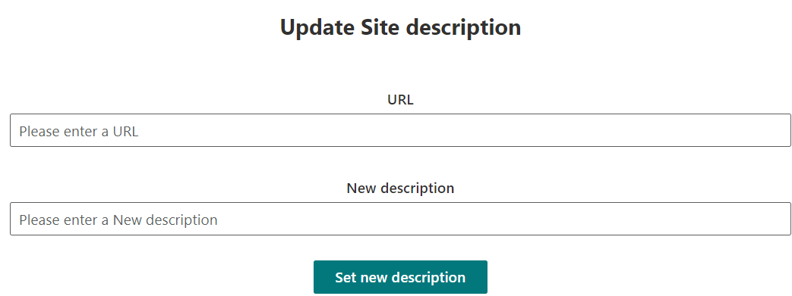

# Site Secure Function Call

## Summary

This combined SharpPoint Framework and Azure Function solution is to provide the potentially most secure access from SharePoint Framework to any kind of third party API, in fact here Microsoft Graph. It shows that AadHttpClient should be preferred over MSGraphClient.

|Update site description|
:-------------------------:


For further details see the author's [blog post](https://mmsharepoint.wordpress.com/2024/06/18/calling-microsoft-graph-in-spfx-the-secure-way/SS)

## Compatibility

| :warning: Important          |
|:---------------------------|
| Every SPFx version is optimally compatible with specific versions of Node.js. In order to be able to build this sample, you need to ensure that the version of Node on your workstation matches one of the versions listed in this section. This sample will not work on a different version of Node.|
|Refer to <https://aka.ms/spfx-matrix> for more information on SPFx compatibility.   |

This sample is optimally compatible with the following environment configuration:


-Incompatible-red.svg "SharePoint Server 2016 Feature Pack 2 requires SPFx 1.1")


## Applies to

- [SharePoint Framework](https://aka.ms/spfx)
- [Microsoft 365 tenant](https://docs.microsoft.com/en-us/sharepoint/dev/spfx/set-up-your-developer-tenant)
- [AzureFunctions .Net8 *LTS](https://learn.microsoft.com/en-us/azure/azure-functions/functions-overview?pivots=programming-language-csharp?WT.mc_id=M365-MVP-5004617)


## Version history

Version|Date|Author|Comments
-------|----|--------|--------
1.0|July 12, 2024|[Markus Moeller](http://www.twitter.com/moeller2_0)|Initial release

## Minimal Path to Awesome

- Clone this repository
    ```bash
    git clone https://github.com/pnp/sp-dev-fx-webparts.git
    ```
- You will need to register an app in Entra ID 
  - with client secret
  - with **delegated** Graph permission Sites.FullControl.All
  - With exposed Api "access_as_user" and App ID Uri api://[Your-Desired-Func-Url]/[Your-ClienID]
- Azure Function:
  - Rename local.sample.settings.json to local.settings.json and fill out tenantId, clientId, clientSecret and domain [Your-Desired-Func-Url]
  - Run F5
- SPFx web part
  - Move to web part folder
  ```bash
  cd samples\react-site-secure-function-call
  ```
  - Rename azFunct.sample.json to azFunct.json and fill out appIdUri api://[Your-Desired-Func-Url]/[Your-ClienID] 
  - Ensure that you are at the solution folder
  - in the command-line run:
    - `npm install`
    - `gulp serve`

> Include any additional steps as needed.

## Features

Description of the extension that expands upon high-level summary above.

This extension illustrates the following concepts:

- [Consume multi-tenant enterprise APIs secured with Azure AD in SharePoint Framework](https://learn.microsoft.com/en-us/sharepoint/dev/spfx/use-aadhttpclient-enterpriseapi-multitenant?WT.mc_id=M365-MVP-5004617)


## References

- [Getting started with SharePoint Framework](https://docs.microsoft.com/en-us/sharepoint/dev/spfx/set-up-your-developer-tenant)
- [Building for Microsoft teams](https://docs.microsoft.com/en-us/sharepoint/dev/spfx/build-for-teams-overview)
- [Use Microsoft Graph in your solution](https://docs.microsoft.com/en-us/sharepoint/dev/spfx/web-parts/get-started/using-microsoft-graph-apis?WT.mc_id=M365-MVP-5004617)
- [Publish SharePoint Framework applications to the Marketplace](https://docs.microsoft.com/en-us/sharepoint/dev/spfx/publish-to-marketplace-overview)
- [Microsoft 365 Patterns and Practices](https://aka.ms/m365pnp) - Guidance, tooling, samples and open-source controls for your Microsoft 365 development

## Help


We do not support samples, but this community is always willing to help, and we want to improve these samples. We use GitHub to track issues, which makes it easy for  community members to volunteer their time and help resolve issues.

If you're having issues building the solution, please run [spfx doctor](https://pnp.github.io/cli-microsoft365/cmd/spfx/spfx-doctor/) from within the solution folder to diagnose incompatibility issues with your environment.

You can try looking at [issues related to this sample](https://github.com/pnp/sp-dev-fx-webparts/issues?q=label%3A%22sample%3A%20react-site-secure-function-call%22) to see if anybody else is having the same issues.

You can also try looking at [discussions related to this sample](https://github.com/pnp/sp-dev-fx-webparts/discussions?discussions_q=react-site-secure-function-call) and see what the community is saying.

If you encounter any issues using this sample, [create a new issue](https://github.com/pnp/sp-dev-fx-webparts/issues/new?assignees=&labels=Needs%3A+Triage+%3Amag%3A%2Ctype%3Abug-suspected%2Csample%3A%20react-site-secure-function-call&template=bug-report.yml&sample=react-site-secure-function-call&authors=@mmsharepoint&title=react-site-secure-function-call%20-%20).

For questions regarding this sample, [create a new question](https://github.com/pnp/sp-dev-fx-webparts/issues/new?assignees=&labels=Needs%3A+Triage+%3Amag%3A%2Ctype%3Aquestion%2Csample%3A%20react-site-secure-function-call&template=question.yml&sample=react-site-secure-function-call&authors=@mmsharepoint&title=react-site-secure-function-call%20-%20).

Finally, if you have an idea for improvement, [make a suggestion](https://github.com/pnp/sp-dev-fx-webparts/issues/new?assignees=&labels=Needs%3A+Triage+%3Amag%3A%2Ctype%3Aenhancement%2Csample%3A%20react-site-secure-function-call&template=suggestion.yml&sample=react-site-secure-function-call&authors=@mmsharepoint&title=react-site-secure-function-call%20-%20).

## Disclaimer

**THIS CODE IS PROVIDED *AS IS* WITHOUT WARRANTY OF ANY KIND, EITHER EXPRESS OR IMPLIED, INCLUDING ANY IMPLIED WARRANTIES OF FITNESS FOR A PARTICULAR PURPOSE, MERCHANTABILITY, OR NON-INFRINGEMENT.**


