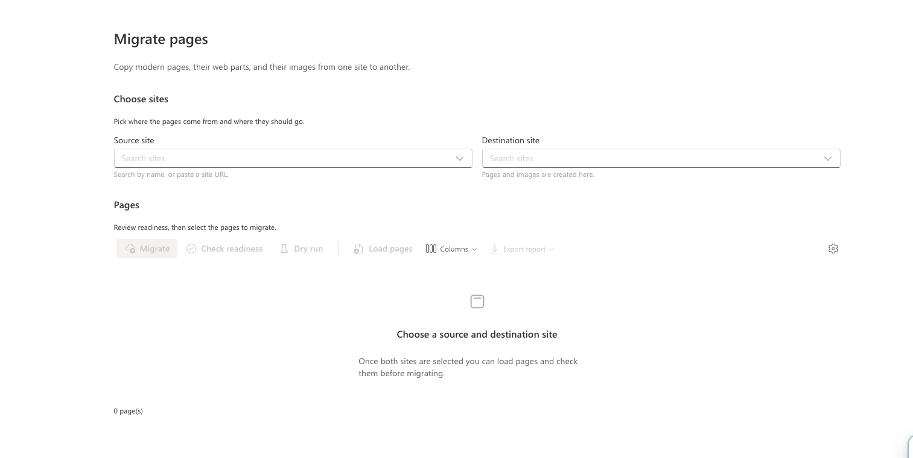
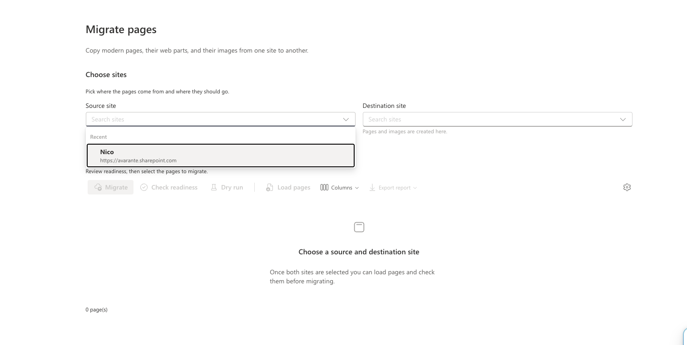
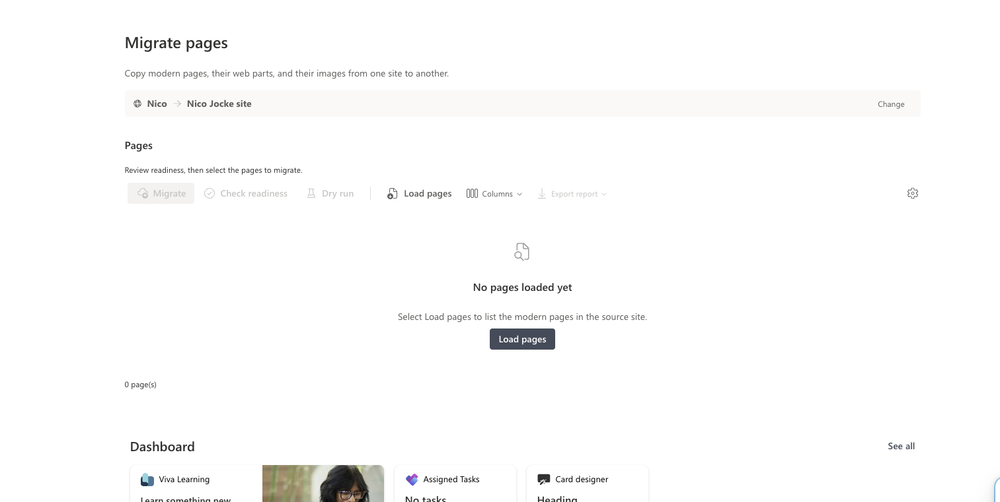
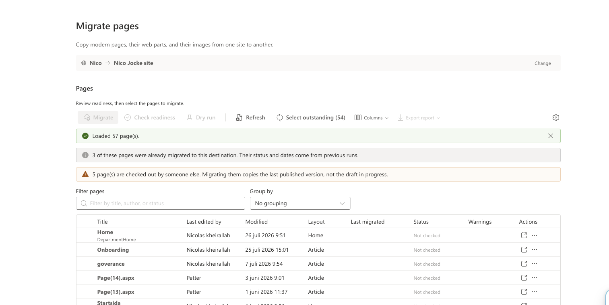
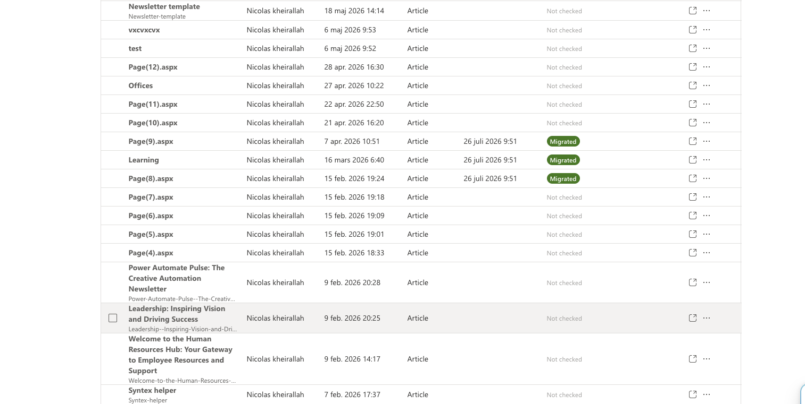
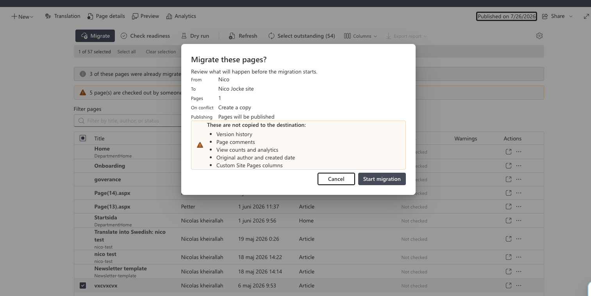

# Page Migration Admin

## Summary

Copies modern Site Pages from one SharePoint Online site to another, with their images, layout and web part configuration.

Microsoft Graph enumerates the source pages. SharePoint REST and PnPjs do the rest: reading `CanvasContent1`, copying assets into the destination Site Assets library, rewriting URLs and identifiers, and rebuilding the page on the target site. Between the two sits a normalized page model, so a web part the tool cannot migrate is recorded in the report rather than dropped without trace.

Built for administrators running site consolidations, tenant-to-tenant style reorganizations, or repeated content syncs between an authoring site and a published one.

## Compatibility


-green.svg)


> The local workbench cannot be used. The web part needs a real `WebPartContext`, an app catalog approval for its Graph permission, and two live sites to migrate between.

## Screenshots

| | |
| --- | --- |
|  Choosing a source and destination site |  Recently used sites remembered per user |
|  Sites selected, ready to load pages |  Inventory with readiness checks and warnings |
|  Previously migrated pages flagged in the inventory |  Confirmation dialog before a migration starts |

## Applies to

- [SharePoint Framework](https://learn.microsoft.com/sharepoint/dev/spfx/sharepoint-framework-overview)
- [Microsoft 365 tenant](https://learn.microsoft.com/sharepoint/dev/spfx/set-up-your-developer-tenant)

## Contributors

- Nicolas Kheirallah

## Version history

| Version | Date          | Comments                                                                                                                                                                          |
| ------- | ------------- | ---------------------------------------------------------------------------------------------------------------------------------------------------------------------------- |
| 1.1.0   | July 26, 2026 | Fluent 2 UI, dry run, incremental and resumed runs, migration history, run metrics, page templates, folder preservation, carried page settings and columns, chunked asset upload, pre-flight checkout and comment reporting, eight locales, code-split entry bundle. |
| 1.0.0   | May 3, 2026   | Initial release.                                                                                                                                                                |

## Prerequisites

### Graph permission

The package requests one delegated permission, which an administrator approves in the SharePoint admin center **API access** page:

| Resource        | Scope            | Used for                                     |
| --------------- | ---------------- | -------------------------------------------- |
| Microsoft Graph | `Sites.Read.All` | Site search and modern page enumeration only. |

Author identity is read from the payload Graph and SharePoint REST already return, so `User.ReadBasic.All` is not requested.

### SharePoint permissions

The person running a migration needs, on their own account:

- read access to the source site;
- contribute access to the destination `Site Pages` library, plus publish rights if pages are published automatically;
- contribute access to the destination `Site Assets` library;
- `manageLists` on the reporting site, but only when the audit and log lists have not been created yet.

Permissions are checked before a run starts, and the result is shown per check rather than as a single pass/fail.

## Minimal path to awesome

```bash
git clone <this-repo>
cd React-SitePage-Migration
npm install
npm run package
```

Then:

1. Upload `sharepoint/solution/spfx-page-migration-admin.sppkg` to the tenant app catalog and deploy it.
2. Approve the pending `Sites.Read.All` request in **SharePoint admin center → Advanced → API access**.
3. Add the **Page Migration Admin** web part to a page on an administrative site.
4. Open the property pane and, if you want persistent reporting, use **Create or update lists** to provision the audit and log lists.

For development against a hosted workbench, use `npm start`.

This solution uses Heft rather than gulp. `gulp serve` and `gulp bundle` do not apply.

## Features

- Site search over Microsoft Graph, with recent sites remembered per user.
- Page inventory with filter, sort, grouping, column selection, and multi-select.
- Readiness check that parses each page and reports unsupported web parts before anything is written.
- Dry run that plans an entire migration without writing to the destination.
- Asset copy into `Site Assets`, with content-addressed names so re-runs reuse files instead of duplicating them.
- URL and GUID rewriting, including `siteId`, `webId` and `uniqueId` inside web part JSON.
- Cross-page link rewriting that accounts for pages renamed by the conflict mode.
- Page settings, repost bindings and portable custom columns carried alongside the canvas.
- Optional migration of page templates, which land back in `SitePages/Templates`.
- Source folder structure preserved, rather than flattening every page into the library root.
- Pre-flight reporting of pages checked out by other people, and of the comments a migration will discard.
- Chunked upload for assets too large for a single request.
- Migration history per source/target pair, so reopening the console shows what was already done.
- Incremental selection of pages that are new, changed, or left undone.
- Cancellation mid-run, with a report covering the pages that finished.
- JSON and CSV report export, plus optional audit and log lists in SharePoint.
- Eight locales: English, German, Spanish, French, Swedish, Norwegian Bokmål, Danish, Finnish.

## How it works

### Migration flow

```text
Graph: enumerate source pages
  → REST: read CanvasContent1 and LayoutWebpartsContent
  → parse canvas into the normalized page model
  → resolve every destination page name (pass 1)
  → copy assets into the destination Site Assets library
  → rewrite URLs, page links and identifiers
  → write the canvas to the destination page (pass 2)
  → publish, if configured
  → report
```

Target names are resolved for the whole batch before any canvas is written. Under the `Rename` conflict mode the destination file name can differ from the source, and links between pages in the same batch are only correct once every name is known.

### Services

| Service                        | Responsibility                                                                                     |
| ------------------------------ | -------------------------------------------------------------------------------------------------- |
| `GraphDiscoveryService`        | Site search, modern page enumeration, paging.                                                      |
| `SharePointPageService`        | Page read and write, permission checks, asset upload and download, list provisioning, publishing.    |
| `PageNormalizationService`     | Canvas parsing, control extraction, asset discovery, compatibility classification.                  |
| `PageTransformService`         | URL, page-link and GUID rewriting.                                                                  |
| `AssetMigrationService`        | Asset copy, conflict handling, target naming.                                                       |
| `PageMigrationOrchestrator`    | Two-pass run, bounded concurrency, cancellation, progress, per-page reporting.                      |
| `ReportExportService`          | JSON and CSV output.                                                                                |
| `SharePointReportStorageService` | Audit and log lists, report artifact upload, history read-back.                                    |

`ISharePointPageService` exists so the orchestrator, asset copier and reporting service can be tested against `FakeSharePointPageService`, an in-memory SharePoint that reproduces behaviours the real one exhibits: `ListItemAllFields` omitting `FileLeafRef`, a missing folder answering `200` with `Exists: false`, a canvas write accepted and then not stored, and a filter on a multi-line column rejected outright.

### Fidelity

Preserved: title, description, topic header, banner image, thumbnail, page layout type, promoted state, first published date, `CanvasContent1` and `LayoutWebpartsContent`.

The destination shell is created with `AddTemplateFile(..., ClientSidePage)`, then the content type, client-side application id and canvas are written directly to the list item. The PnP page model is deliberately not used for the write: loading and saving it overwrites `CanvasContent1` and `LayoutWebpartsContent`, and creating a page through it leaves the file checked out with no checked-in version, which then blocks the write that follows.

Canvas writes are read back and verified, because SharePoint can return a success status without persisting the value.

## Web part properties

| Property                                        | Default                | Description                                                                          |
| ----------------------------------------------- | ---------------------- | ------------------------------------------------------------------------------------ |
| Publish migrated pages automatically            | On                     | When off, migrated pages stay as drafts.                                             |
| Default conflict handling                       | `Rename`               | Applied when a page or asset already exists at the destination.                      |
| Include page templates                          | Off                    | Adds the site's page templates to the inventory. Uses a Graph beta endpoint.          |
| Persist migration reports and logs to SharePoint | On                     | Enables the audit list, log list and report artifact upload.                         |
| Report storage site URL                         | *(blank)*              | Where artifacts and lists are written. Blank means each migration's destination site. |
| Audit list name                                 | `Page Migration Audit` | Per-page audit records.                                                              |
| Log list name                                   | `Page Migration Logs`  | Structured operational log.                                                          |
| Compatibility overrides JSON                    | `[]`                   | Tenant-specific classifications for custom web parts.                                |

A value entered in **Report storage site URL** is re-validated at run time. A URL that is not a SharePoint URL, or that points at a different host from the destination, falls back to the destination site and logs a warning.

## Conflict handling

| Mode      | Pages                                       | Assets                                                          |
| --------- | ------------------------------------------- | --------------------------------------------------------------- |
| `Rename`  | Appends a numeric suffix, up to 50 attempts. | Uses a content-addressed name, so an identical asset is reused.  |
| `Replace` | Overwrites the existing page.               | Overwrites the existing file.                                    |
| `Skip`    | Leaves the page untouched, reports `Skipped`. | Leaves the file untouched and reuses it.                        |
| `Fail`    | Stops that page and reports the conflict.    | Stops that page and reports the conflict.                        |

A page created by the current run is deleted if its canvas write fails. A page that already existed is never deleted, whatever the mode.

## Dry run

**Dry run** performs every read-only step of a migration: loading and parsing each page, resolving the destination name under the current conflict mode, planning where each asset would land, and transforming the canvas. It then reports each page with a `Planned` status.

Nothing is created, uploaded or published. Dry-run results are not written to the audit list, so they cannot later be mistaken for a completed migration.

The warnings and unsupported web parts a dry run reports are the same ones a real run produces.

## Incremental and resumed runs

When a source and destination pair has been migrated before, a **Select outstanding** command appears in the toolbar. It selects:

- pages never migrated to this destination;
- pages whose source has been modified since they were last migrated;
- pages whose last attempt wrote nothing, meaning a failure, a cancellation or a dry run.

History comes from the audit list first, because it is durable and shared between everyone working on the same migration. It is merged with a per-browser mirror that covers the cases the list cannot: reporting switched off, or the moment right after a run before the list has been read back.

Only outcomes that actually wrote to the destination count as migrated. A cancelled or planned page stays outstanding.

## Web part compatibility

The canvas is copied verbatim and then rewritten, so the question is never whether a web part can be recreated. It is whether the configuration it carries still points at something real once the page is on another site.

| Classification          | Meaning                                                                                                                    |
| ----------------------- | -------------------------------------------------------------------------------------------------------------------------- |
| **Fully supported**     | Self-contained, or its only site references are ones the asset copier rewrites.                                            |
| **Partially supported** | Carries references rewritten only when their target is also in the migrated set. Anything else still points at the source.  |
| **Unsupported**         | Queries or binds to something scoped to the source site. The configuration is captured so it can be rebuilt by hand.        |

| Web part                                                                                                                                                        | Classification         |
| --------------------------------------------------------------------------------------------------------------------------------------------------------------- | ---------------------- |
| **Text**, Image, Image gallery, YouTube, Bing maps, Divider, Spacer, Markdown, Code snippet, Countdown timer, Weather                                            | Fully supported        |
| File viewer, Quick links, Hero, People, Link preview, Embed, Button, Call to action, Org chart, Quick chart, Power BI, Microsoft Forms, Stream video, Power Apps | Partially supported    |
| Highlighted content, List, List properties, Page properties, Events, Group calendar, News, Site activity, Planner, Viva Engage, SharePoint add-in                | Unsupported            |
| Third-party and custom web parts                                                                                                                                | Unsupported by default |

### Text

Text is migrated one for one. Every word, every bit of formatting, every list and table is copied exactly as authored.

The only change made to it is the one the whole tool exists for: a link or image pointing at the source site is repointed at the destination. Nothing else in the text is altered.

Text does not appear in the compatibility registry because it is not a web part and has no web part id — in `CanvasContent1` it is a `controlType: 4` control carrying `innerHTML`, so it never reaches a registry lookup. Its absence there is a fact about SharePoint's data model, not a limitation of this tool.

One caveat, which applies to the whole canvas rather than to text specifically: the canvas is parsed and re-serialised in order to rewrite URLs, so the *markup* comes out normalised — attribute quoting and entity encoding may differ from the source byte for byte. The rendered content is identical.

Unsupported components are not dropped silently. Their serialized configuration appears in the page detail panel and in the exported report.

Every identifier in the registry is cross-checked against the supported web part table in the [Microsoft Graph `Create sitePage` reference](https://learn.microsoft.com/en-us/graph/api/sitepage-create?view=graph-rest-1.0) and an independent community GUID table, which agree on all eleven entries they have in common.

### Compatibility override format

```json
[
  {
    "id": "11111111-1111-1111-1111-111111111111",
    "title": "Contoso Announcement",
    "compatibility": "PartiallySupported",
    "notes": "Configuration is preserved, but the data source must be checked after migration."
  }
]
```

`compatibility` accepts `FullySupported`, `PartiallySupported` or `Unsupported`. Overrides are matched on the web part id and take precedence over the built-in registry. Invalid JSON is reported in the property pane and the built-in registry is used.

## Reporting

Each page report entry records the source and destination URL, start and completion timestamps, duration, asset copy results, unsupported web part snapshots, warnings, errors, and a final status.

The JSON artifact is an object:

```json
{
  "schemaVersion": 1,
  "generatedAt": "2026-07-26T09:12:44.108Z",
  "summary": { "totalPages": 42, "byStatus": { "Completed": 40 }, "medianPageMs": 1840 },
  "pages": []
}
```

`summary` holds counts per final status, assets copied and failed, unsupported web parts, warnings, elapsed wall-clock time, total and median page duration, the slowest page, and pages per minute. The median is reported rather than the mean because a handful of image-heavy pages skew an average badly. The same summary is written to the diagnostic log at the end of every run.

With persistent reporting enabled, the solution also:

- uploads JSON and CSV artifacts to `/SiteAssets/PageMigration/Reports/`;
- writes one audit row per page to the audit list;
- writes structured log entries to the log list.

`SourceSiteId` and `TargetSiteId` are indexed single-line text columns on the audit list. They are indexed so history keeps working once the list passes the list view threshold, and they are separate columns because the URL columns are multi-line, which SharePoint cannot filter on.

## Fluent 2

Fluent 2 does not require React 18. `@fluentui/react-components` declares `react: >=16.14.0 <20.0.0` and runs correctly on the React 17.0.1 that SPFx 1.23.x ships. Forcing React 18 into a web part would put two copies of React on the page — SPFx supplies its own as a bundle external — which breaks hooks, context and portals in ways that surface as intermittent runtime errors rather than build failures.

Two Fluent 2 details matter on a SharePoint page:

- Every `FluentProvider` on the page emits the same `fui-FluentProvider{N}` class name, so a provider mounted by the page host can capture styles intended for the web part. Modal surfaces are given an explicit mount node to keep them out of that scope.
- Anchored surfaces such as `Combobox` and `Menu` use `inlinePopup` so they render in place and position against their trigger. Only true modal surfaces are portaled.

## What is and is not carried across

Beyond the canvas, a page carries settings and columns that live in neither `CanvasContent1` nor `LayoutWebpartsContent`.

**Carried:** the comments on/off setting (`_CommentsDisabled`), the repost bindings of a news-link page (`_OriginalSource*`, with their URL and identifiers repointed at the destination), and custom Site Pages columns of a portable type — text, note, number, currency, boolean, date, choice and URL.

**Not carried, and reported by name:** custom columns of a type whose value means nothing on another site — user, lookup and taxonomy. A user column holds an id into a list that stays behind; a taxonomy column binds to a term set the destination may not share. Any of these holding a value raises a `Column.NotPortable` warning naming the column.

A carried value is written only where the destination library defines the same field. A column that exists only at the source is skipped rather than rejecting the whole update.

## Known limitations

**Platform, not fixable from a web part**

- Only modern Site Pages are migrated. Classic, wiki and publishing pages need PnP.Framework's page transformation engine, which is .NET only.
- Graph is used for discovery and listing only, deliberately. Expanding `canvasLayout` or `webParts` returns `500 generalException` on a large share of real pages ([sp-dev-docs #9637](https://github.com/SharePoint/sp-dev-docs/issues/9637), [#9465](https://github.com/SharePoint/sp-dev-docs/issues/9465)), and `POST /sites/{id}/pages` accepts only [14 web part types](https://learn.microsoft.com/en-us/graph/api/sitepage-create?view=graph-rest-1.0). Neither is a basis for a migration tool.
- Graph has no `delta` for site pages, so incremental runs compare timestamps rather than subscribing to changes.

**Inherent to copying a page between sites**

- Page version history, comments and page analytics do not survive. The confirmation dialog now states how many comments are on the selected pages rather than only that comments exist.
- Original authorship is not preserved. Migrated pages are authored by whoever ran the migration.
- Audience targeting, dynamic data connections between web parts, and tenant-specific data sources are not reconstructed.
- URLs are rewritten where they can be mapped deterministically. Quick links, embeds and custom web part payloads may still need checking afterwards.

**Scale**

- Migration runs in the browser. A batch of a few hundred pages is realistic; a full tenant migration is not.
- A single asset is capped at 100 MB, because the whole file passes through memory. Assets above 4 MB upload in chunks; below that a single request is used.

**Handled, previously a limitation**

- Page templates are migrated when **Include page templates** is on. They are enumerated from Graph beta and land back in `SitePages/Templates`.
- Pages in subfolders of `SitePages` keep their folder at the destination. Previously every page was flattened into the root of the library, which lost the structure and let two pages of the same name in different folders collide.
- `$filter` on `lastModifiedDateTime` is documented as supported on the pages endpoint but is rejected by some tenants. The enumeration probes for it once and filters client-side when the server refuses, rather than failing the load.
- A source page checked out by someone else serves its last published version, not their draft. The inventory now reports how many pages this affects before a run starts.

## Operational notes

- Run a dry run before the first real migration of any site with custom web parts.
- Migrate in batches and export the report after each one.
- Add compatibility overrides for your tenant's custom web parts before a production rollout, so the report distinguishes "known and acceptable" from "unknown".
- Leaving publish off produces drafts, which lets someone review the destination before anything is visible to readers.

## References

- [SharePoint Framework overview](https://learn.microsoft.com/sharepoint/dev/spfx/sharepoint-framework-overview)
- [Use Microsoft Graph in SharePoint Framework solutions](https://learn.microsoft.com/sharepoint/dev/spfx/use-msgraph)
- [PnPjs — client-side pages](https://pnp.github.io/pnpjs/sp/clientside-pages/)
- [Fluent UI React v9](https://react.fluentui.dev/)
- [Modern page content types and `ClientSideApplicationId`](https://learn.microsoft.com/sharepoint/dev/apis/pages-api-reference)

## Disclaimer

**THIS CODE IS PROVIDED *AS IS* WITHOUT WARRANTY OF ANY KIND, EITHER EXPRESS OR IMPLIED, INCLUDING ANY IMPLIED WARRANTIES OF FITNESS FOR A PARTICULAR PURPOSE, MERCHANTABILITY, OR NON-INFRINGEMENT.**

This solution writes to SharePoint. Test it against a non-production destination site before using it on content anyone depends on.


