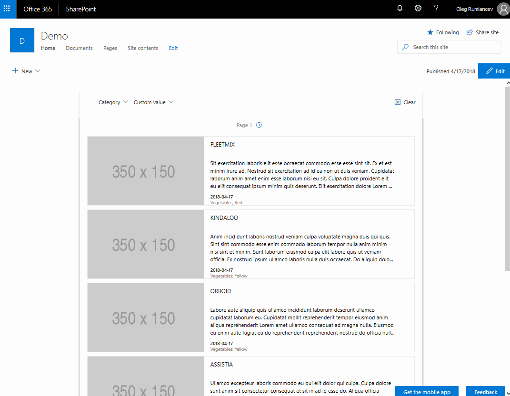
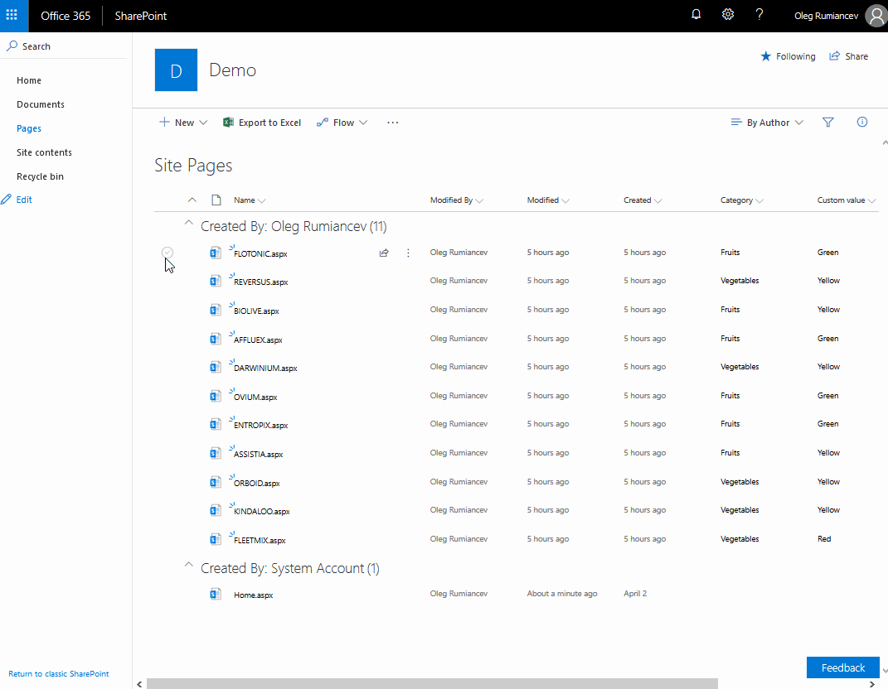

# react-sitepages-metadata

## Summary
Solution provides an enhancement to SitePages library that enables updating existing items with metadata, and a rollup WebPart to display them.

### News rollup WebPart

### SitePages library CommandSet

## Used SharePoint Framework Version 

## Applies to

* [SharePoint Framework](https://docs.microsoft.com/sharepoint/dev/spfx/sharepoint-framework-overview)
* [Office 365 tenant](https://docs.microsoft.com/sharepoint/dev/spfx/set-up-your-development-environment)

## Prerequisites
 
> If you plan on using included PowerShell script make sure you have [PnP PowerShell](https://github.com/SharePoint/PnP-PowerShell) installed

## Solution

Solution|Author(s)
--------|---------
react-sitepages-metadata | Oleg Rumiancev ([LinkedIn](https://linkedin.com/in/olegrumiancev), [Twitter (olezhka_lt)](https://twitter.com/olezhka_lt))

## Version history

Version|Date|Comments
-------|----|--------
1.0|April 17, 2018|Initial release

## Disclaimer
**THIS CODE IS PROVIDED *AS IS* WITHOUT WARRANTY OF ANY KIND, EITHER EXPRESS OR IMPLIED, INCLUDING ANY IMPLIED WARRANTIES OF FITNESS FOR A PARTICULAR PURPOSE, MERCHANTABILITY, OR NON-INFRINGEMENT.**

---

## Features
Solution provides an enhancement to SitePages library that enables updating existing items with metadata (implemented as Lookup fields). 
Relies heavily on Office UI Fabric. 

Contains following elements:
- Metadata-News rollup WebPart - displays published SitePages items (promoted to news), provides filtering and paging capabilities, as well as many configuration options
- CommandSet extension for SitePages library - a button appears when a single item is selected. Clicking on the item shows a fillable dialog with lookup fields

### Important notes
- Changes in some WebPart properties will not be reflected after hitting "Apply" button - please refresh the page, too
- To see a collection of lookup fields in the WebPart property pane change/edit any of the instantly visible properties, such as Item limit, width or item height. Reason for this is SitePages library will be queried for lookup lists only after the property pane is initially opened

### Resources
- [React Quick Start](https://facebook.github.io/react/docs/tutorial.html) 
- [TypeScript React Tutorials](https://www.typescriptlang.org/docs/handbook/react-&-webpack.html)
- [Office UI Fabric](https://developer.microsoft.com/fluentui/)

## Path to Awesome

- Clone this repository
- [Optional] run cofigure-lists.ps1 in install folder to create lookup lists and fields (amend according to your needs).
- [Optional] fill lookup lists with items and publish some items in SitePages library
- in the command line run:
  - `git clone the rero`
  - `npm install`
  - `gulp serve --nobrowser`
- navigate to `https://<tenant>.sharepoint.com/sites/<target site>/_layouts/workbench.aspx`

