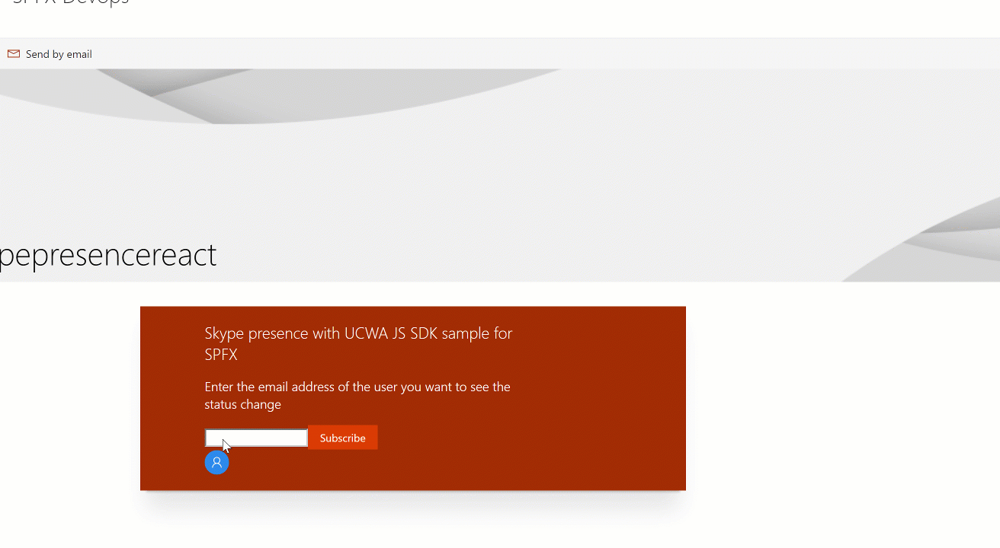
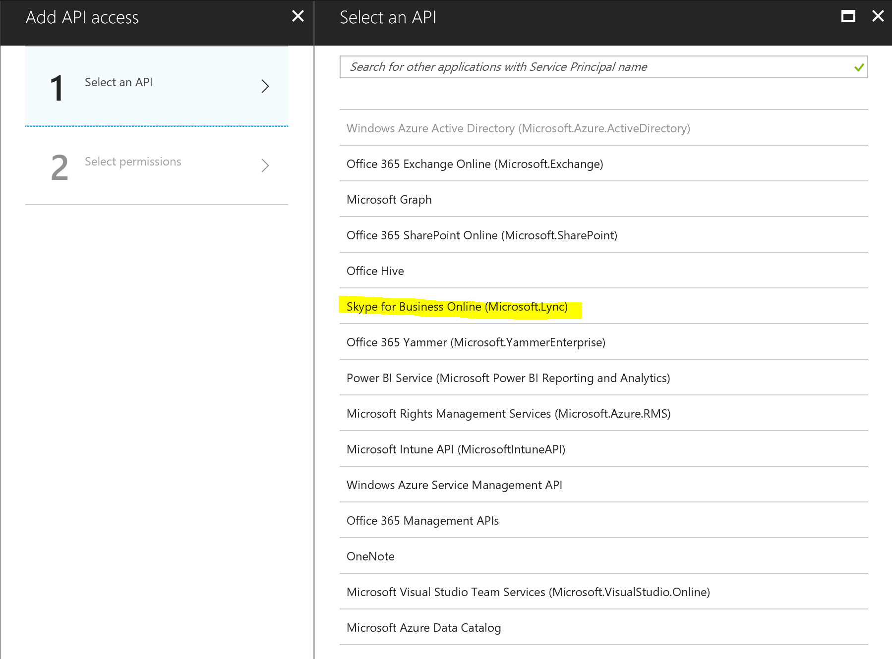
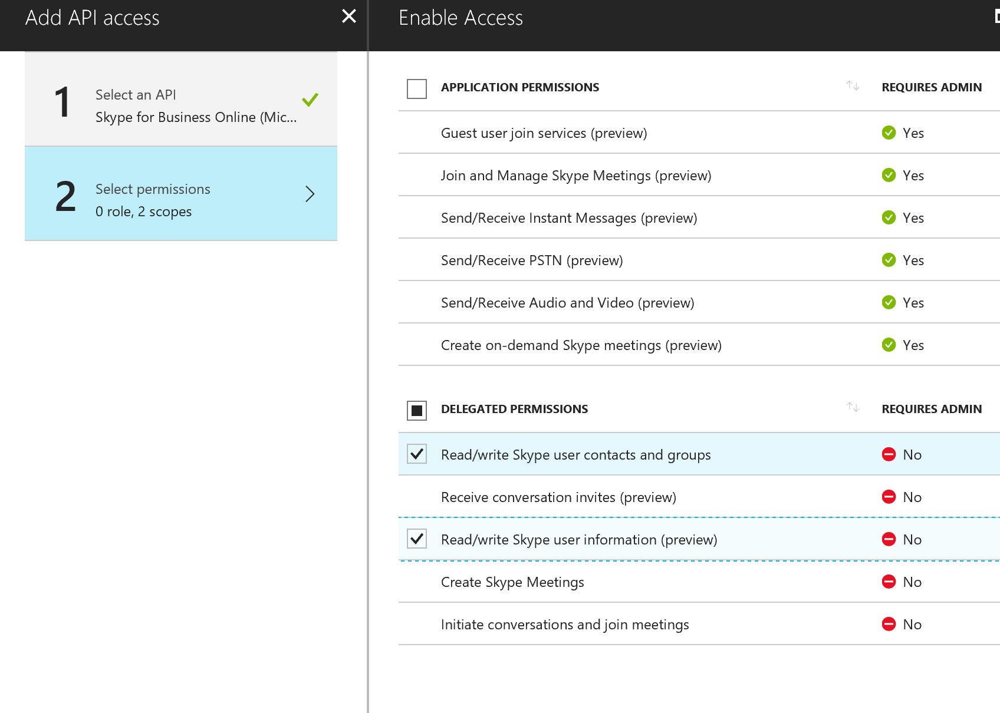

# Skype Status

## Summary
This sample demonstrates how to use the *UCWA JS SDK* for skype with the SharePoint Framework. It shows how to subscribe to status change of the different people of the organization but you can get much more information, checkout the [documentation](https://msdn.microsoft.com/en-us/skype/websdk/docs/generalreference?f=255&MSPPError=-2147217396)  
It allows leverages the *Office UI Fabric* Persona card to display comprehensive information about the user.

Allows you to properly display and subscribe to change of users' availability.  
See the demo:  

## Compatibility

 
 

-Incompatible-red.svg "SharePoint Server 2016 Feature Pack 2 requires SPFx 1.1")

## Applies to

* [SharePoint Framework Developer](https://docs.microsoft.com/sharepoint/dev/spfx/sharepoint-framework-overview)
* [Office 365 developer tenant](https://docs.microsoft.com/sharepoint/dev/spfx/set-up-your-developer-tenant)

## Solution

Solution|Author(s)
--------|---------
react-skype-status|[Vincent Biret](https://github.com/baywet)

## Version history

Version|Date|Comments
-------|----|--------
1.4|March 27th, 2019|Upgrade to SPFx 1.8.0
1.3|November 18th, 2018|Upgrade to SPFx 1.7.0
1.2|July 4th, 2018|Fixed a bug when subscribing to the current user's status
1.1|June 25th, 2018|Upgrade to 1.5
1.0|December 1, 2017|Initial release

## Minimal Path to Awesome
### Authentication
Because the Skype API's are secured, you first need to register an Azure Active Directory application.  
To do that go to `portal.azure.com` and sign in as your tenant administrator.  
  
Click on `Azure Active Directory`.  
  
Click on on `App Registrations` and then `New Application Registration`  
  
Enter any name, select `Web app / API` in `Application Type` and in `Sign-In URL` enter `https://*.sharepoint.com/*`, then click on `Create`  
  
Take note of the `application ID`, we'll need it later. Click on `required permissions`.  
  
Click on `add` then `select an API` and select `Skype for Business`.  
  
Select under `delegated permissions` both `Read/Write Skype user contacts and groups`,  `Read/Write Skype user information (preview)`, `Receive conversation invites (preview)` (the receive conversation permission is required to get access to the mePerson object and have access to the current user's presence information) then click `select`. Finish by clicking `Done`.  
  
Don't forget to click on `Grant permissions` and `yes`.

>  This sample can also be opened with [VS Code Remote Development](https://code.visualstudio.com/docs/remote/remote-overview). Visit https://aka.ms/spfx-devcontainer for further instructions.

### Updating the app
After copying that sample to your local machine and running `npm install` to install the depenencies, `/src/webparts/skypePresence/services/Constants.ts` open your favorite editor. Make sure you replace the value of `ApplicationIdKey` to the value application id we kept earlier.  

### Deploying the application
Start by running `gulp package-solution` and deploy the application to the app catalog. More information on how to do it [here](https://docs.microsoft.com/en-us/sharepoint/dev/spfx/web-parts/get-started/serve-your-web-part-in-a-sharepoint-page)  
**At the end select SkypePresence web part instead**  
Don't forget to run `gulp serve --nobrowser` to start the debugging server.

### Addtional page required
Because Skype needs to silently redirect the user to a page for the authentication flow, you need to create an additional page called `skypepresence` in your site.  
You don't need to add anything on that page.  

## Help

We do not support samples, but this community is always willing to help, and we want to improve these samples. We use GitHub to track issues, which makes it easy for  community members to volunteer their time and help resolve issues.

If you're having issues building the solution, please run [spfx doctor](https://pnp.github.io/cli-microsoft365/cmd/spfx/spfx-doctor/) from within the solution folder to diagnose incompatibility issues with your environment.

You can try looking at [issues related to this sample](https://github.com/pnp/sp-dev-fx-webparts/issues?q=label%3A%22sample%3A%20react-skype-status") to see if anybody else is having the same issues.

You can also try looking at [discussions related to this sample](https://github.com/pnp/sp-dev-fx-webparts/discussions?discussions_q=react-skype-status) and see what the community is saying.

If you encounter any issues while using this sample, [create a new issue](https://github.com/pnp/sp-dev-fx-webparts/issues/new?assignees=&labels=Needs%3A+Triage+%3Amag%3A%2Ctype%3Abug-suspected%2Csample%3A%20react-skype-status&template=bug-report.yml&sample=react-skype-status&authors=@baywet&title=react-skype-status%20-%20).

For questions regarding this sample, [create a new question](https://github.com/pnp/sp-dev-fx-webparts/issues/new?assignees=&labels=Needs%3A+Triage+%3Amag%3A%2Ctype%3Aquestion%2Csample%3A%20react-skype-status&template=question.yml&sample=react-skype-status&authors=@baywet&title=react-skype-status%20-%20).

Finally, if you have an idea for improvement, [make a suggestion](https://github.com/pnp/sp-dev-fx-webparts/issues/new?assignees=&labels=Needs%3A+Triage+%3Amag%3A%2Ctype%3Aenhancement%2Csample%3A%20react-skype-status&template=question.yml&sample=react-skype-status&authors=@baywet&title=react-skype-status%20-%20).

## Disclaimer

**THIS CODE IS PROVIDED *AS IS* WITHOUT WARRANTY OF ANY KIND, EITHER EXPRESS OR IMPLIED, INCLUDING ANY IMPLIED WARRANTIES OF FITNESS FOR A PARTICULAR PURPOSE, MERCHANTABILITY, OR NON-INFRINGEMENT.**

