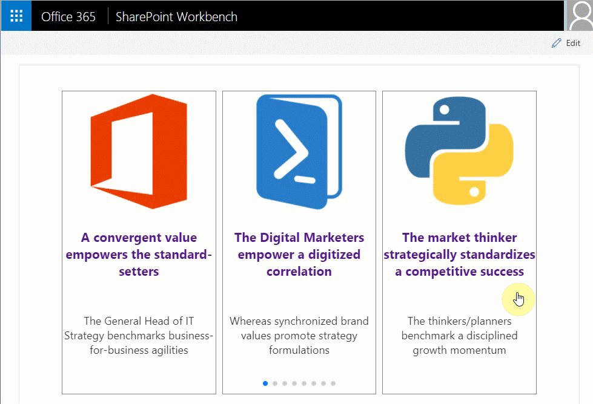

# SPFx React Slide Swiper #

## Summary

This SPFx React web part sample demonstrates mobile touch slide swiper. By default the swiper web part is responsive, has cross device and browser touch support and uses paging, but additional features like navigation, autoplay, loop of the slides and more can be enabled from the web part properties panel. The swiper web part can be used as carousel as well. The slides or cards template can easily be customized. The SPFx React swiper client side solution can easly be extended with more swiper, carousel like features because it is based on a popular feature rich JavaScript library called [Swiper](https://github.com/nolimits4web/swiper).

## Solution packaging and bundle optimization considerations

This sample uses the Swiper JavaScript library thought the npm packages, but just for the purpose of the sample so it can quicky be run without addional setup. It is highly recomended to add the Swiper library as SPFx solution [external reference](https://docs.microsoft.com/en-us/sharepoint/dev/spfx/web-parts/basics/add-an-external-library) to resize the solution bundle size and improve Site Page load times. 

## Used SharePoint Framework Version 

## Applies to

* [SharePoint Framework](https://docs.microsoft.com/sharepoint/dev/spfx/sharepoint-framework-overview)
* [Office 365 developer tenant](https://docs.microsoft.com/sharepoint/dev/spfx/set-up-your-developer-tenant)

## Prerequisites

- Office 365 subscription with SharePoint Online.
- SharePoint Framework [development environment](https://docs.microsoft.com/sharepoint/dev/spfx/set-up-your-development-environment) already set up.

## Solution

Solution|Author(s)
--------|---------
react-slide-swiper | Velin Georgiev ([@VelinGeorgiev](https://twitter.com/velingeorgiev))

## Version history

Version|Date|Comments
-------|----|--------
0.0.1|February 08, 2018 | Initial commit
0.0.2|September 07, 2018 | Upgrade to 1.6.0
0.0.3|December 10, 2018 | Upgrade to 1.7.0

## Disclaimer
**THIS CODE IS PROVIDED *AS IS* WITHOUT WARRANTY OF ANY KIND, EITHER EXPRESS OR IMPLIED, INCLUDING ANY IMPLIED WARRANTIES OF FITNESS FOR A PARTICULAR PURPOSE, MERCHANTABILITY, OR NON-INFRINGEMENT.**

---

## Minimal Path to Awesome

- Clone this repository.
- Open the command line, navigate to the web part folder and execute:
    - `npm i`
    - `gulp serve`

## Features

This Web Part illustrates the following concepts on top of the SharePoint Framework:

- Using React for building SharePoint Framework client-side web parts.
- How external css can be included in module.css.
- How JavaScript library can be loaded by the help of requirejs in web part.
- Mobile Touch capabilities

## SharePoint info

When using the webpart in SharePoint, either in the SharePoint Workbench or deployed, the webpart reads by default from a List called "Swiper Content" with fields Title, ImageUrl, Description of type Single line of text. The list has to be created manually.

