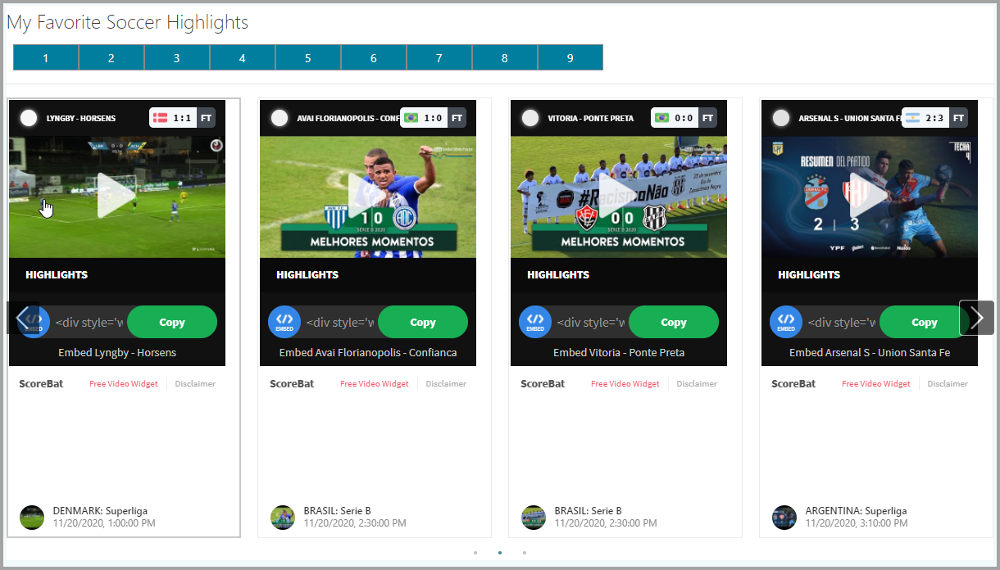

# Soccer Highlights Web Part

## Summary

- This react web part sample displays soccer highlights from a public Soccer API.  
- It shows a maximum of 100 highlights at one time.  
- The web part show live status of game scores and ability to watch them live in small or full screen view.
- You can view the highlights as FilmStrip Control (Thanks to Hugo for the tip and great blog) or Flat Mode.
- You can configure highlights per page and use Paging.

### Web Part in Action

### Usage

1) Deploy the package to SharePoint Online App Catalog.

2) Add the Web Part to Page, Configure the web Part, provide **Title** and **Page Size**.

3) Click on pager to move pages or arrows or dots in filmstrip view.

## Compatibility

-Incompatible-red.svg "SharePoint Server 2016 Feature Pack 2 requires SPFx 1.1")

## Applies to

- [SharePoint Framework](https://docs.microsoft.com/sharepoint/dev/spfx/sharepoint-framework-overview)
- [Office 365 tenant](https://docs.microsoft.com/sharepoint/dev/spfx/set-up-your-development-environment)

## Prerequisites

None

## Solution

| Solution              | Author(s)                                |
| --------------------- | ---------------------------------------- |
| Soccer Highlights Web Part | [Jerry Yasir](https://github.com/jyasir) |

## Version history

| Version | Date               | Comments      |
| ------- | ------------------ | ------------- |
| 1.0     | October 30, 2020 | First Version |

## Minimal Path to Awesome

- Clone or download this repository
- Run in command line:
  - `npm install` to install the npm dependencies
  - `gulp serve` to display in Developer Workbench (recommend using your tenant workbench so you can test with real lists within your site)
- To package and deploy:
  - Use `gulp bundle --ship` & `gulp package-solution --ship`
  - Add the `.sppkg` to your SharePoint App Catalog

>  This sample can also be opened with [VS Code Remote Development](https://code.visualstudio.com/docs/remote/remote-overview). Visit https://aka.ms/spfx-devcontainer for further instructions.

## Video

## Help

We do not support samples, but this community is always willing to help, and we want to improve these samples. We use GitHub to track issues, which makes it easy for  community members to volunteer their time and help resolve issues.

If you're having issues building the solution, please run [spfx doctor](https://pnp.github.io/cli-microsoft365/cmd/spfx/spfx-doctor/) from within the solution folder to diagnose incompatibility issues with your environment.

You can try looking at [issues related to this sample](https://github.com/pnp/sp-dev-fx-webparts/issues?q=label%3A%22sample%3A%20react-soccer-highlights") to see if anybody else is having the same issues.

You can also try looking at [discussions related to this sample](https://github.com/pnp/sp-dev-fx-webparts/discussions?discussions_q=react-soccer-highlights) and see what the community is saying.

If you encounter any issues while using this sample, [create a new issue](https://github.com/pnp/sp-dev-fx-webparts/issues/new?assignees=&labels=Needs%3A+Triage+%3Amag%3A%2Ctype%3Abug-suspected%2Csample%3A%20react-soccer-highlights&template=bug-report.yml&sample=react-soccer-highlights&authors=@jyasir&title=react-soccer-highlights%20-%20).

For questions regarding this sample, [create a new question](https://github.com/pnp/sp-dev-fx-webparts/issues/new?assignees=&labels=Needs%3A+Triage+%3Amag%3A%2Ctype%3Aquestion%2Csample%3A%20react-soccer-highlights&template=question.yml&sample=react-soccer-highlights&authors=@jyasir&title=react-soccer-highlights%20-%20).

Finally, if you have an idea for improvement, [make a suggestion](https://github.com/pnp/sp-dev-fx-webparts/issues/new?assignees=&labels=Needs%3A+Triage+%3Amag%3A%2Ctype%3Aenhancement%2Csample%3A%20react-soccer-highlights&template=question.yml&sample=react-soccer-highlights&authors=@jyasir&title=react-soccer-highlights%20-%20).

