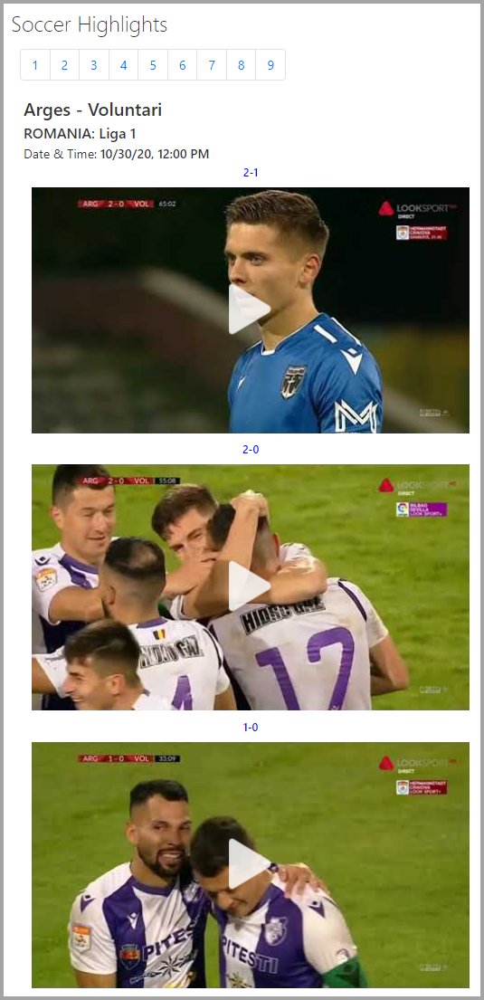

# Soccer Highlights Web Part

## Summary

- This sample displays Soccer Highlights from public Soccer API.  
- You can set Title and Number of Highlights to show.

### Web Part in Action

### Usage

1) Deploy the package to SharePoint Online App Catalog.

2) Add the Web Part to Page, Configure the web Part, provide Title and Page Size.**

3) Double click on Pager to move Pages. **

## Used SharePoint Framework Version

## Applies to

- [SharePoint Framework](https://docs.microsoft.com/sharepoint/dev/spfx/sharepoint-framework-overview)
- [Office 365 tenant](https://docs.microsoft.com/sharepoint/dev/spfx/set-up-your-development-environment)

## Prerequisites

- A package is available for direct download.

## Solution

| Solution              | Author(s)                                |
| --------------------- | ---------------------------------------- |
| Soccer Highlights Web Part | [Jerry Yasir](https://github.com/jyasir) |

## Version history

| Version | Date               | Comments      |
| ------- | ------------------ | ------------- |
| 1.0     | October 30, 2020 | First Version |

## Disclaimer

**THIS CODE IS PROVIDED _AS IS_ WITHOUT WARRANTY OF ANY KIND, EITHER EXPRESS OR IMPLIED, INCLUDING ANY IMPLIED WARRANTIES OF FITNESS FOR A PARTICULAR PURPOSE, MERCHANTABILITY, OR NON-INFRINGEMENT.**

---

## Minimal Path to Awesome

- Clone or download this repository
- Run in command line:
  - `npm install` to install the npm dependencies
  - `gulp serve` to display in Developer Workbench (recommend using your tenant workbench so you can test with real lists within your site)
- To package and deploy:
  - Use `gulp bundle --ship` & `gulp package-solution --ship`
  - Add the `.sppkg` to your SharePoint App Catalog

