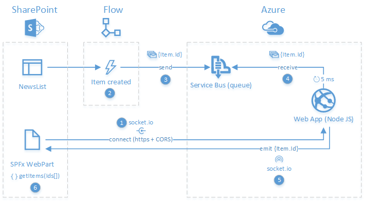
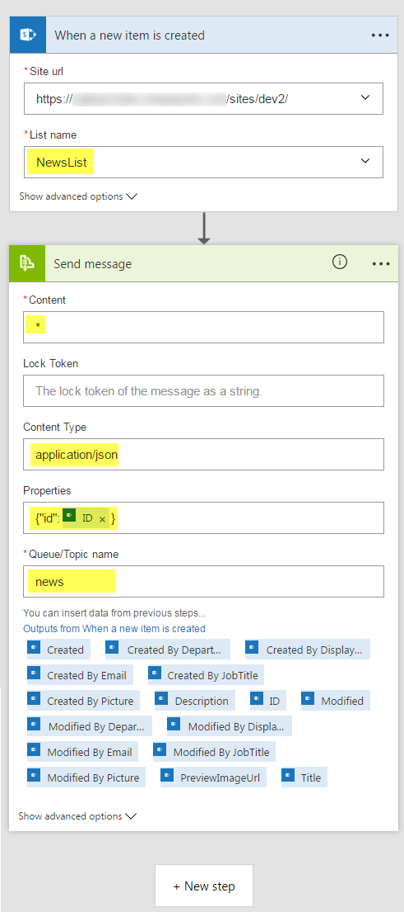

# Real Time News Feed using SPFx, Flow, Azure and socket.io #

## Summary

This sample shows you how to implement real time web parts using the SPFx, Microsoft Flow and socket.io.

<p align="center">
  
</p>

### Solution Architecture ###

Here is the solution overview:

<p align="center">
  
</p>

1. The SPFx Web Part first connects to the Azure web application via socket.io and subscribes to events (the web application have to be in https and allow cross domain calls (CORS)).
2. Microsoft Flow is used to catch new item creation events in the SharPoint list.
3. When an item is added, the flow sends its id to an Azure service bus queue using JSON format.
4. A Node JS Azure web application listens to the queue and check for new messages every 5 ms.
5. When a new message is available, the web application emits the data to all subscribers via socket.io.
6. The SPFx Web Part notifies user there are new items available. Items are effectively retrieved via REST according to received ids when the user clicks on the notification.

## Applies to

* [SharePoint Framework Developer Preview](http://dev.office.com/sharepoint/docs/spfx/sharepoint-framework-overview)
* [Office 365 developer tenant](http://dev.office.com/sharepoint/docs/spfx/set-up-your-developer-tenant)

## Prerequisites
 
Before starting, you'll need to install some prerequisites:

- Install the [Azure PowerShell SDK](https://azure.microsoft.com/en-us/documentation/articles/powershell-install-configure/). Make sure you've installed the AzureRM module as well.
- Install the latest release of [PnP PowerShell cmdlets 'SharePointPnPPowerShellOnline'](https://github.com/OfficeDev/PnP-PowerShell/releases) or a version compatible with the 201605 PnP schema version.
- Install [Node.js](https://nodejs.org/en/) on your machine.
- Install [Git for Windows](https://git-scm.com/download/win).
- Get the [latest version](https://dev.office.com/sharepoint/docs/spfx/set-up-your-development-environment) of the SharePoint Framework yeoman generator (in this case **SPFx Drop 5**) and make sure TypeScript 2.0 is available on your machine (`npm install -g typescript@latest`).
- Create a site collection with the developer template.
- Go to the ".\client" folder and install all dependencies listed in the package.json file by running the `npm install` cmd.

## Solution

Solution|Author(s)
--------|---------
samples\react-socket-io | Franck Cornu (MVP, @franckcornu)

## Version history

Version|Date|Comments
-------|----|--------
1.0|October 25, 2016 | Initial commit

## Disclaimer
**THIS CODE IS PROVIDED *AS IS* WITHOUT WARRANTY OF ANY KIND, EITHER EXPRESS OR IMPLIED, INCLUDING ANY IMPLIED WARRANTIES OF FITNESS FOR A PARTICULAR PURPOSE, MERCHANTABILITY, OR NON-INFRINGEMENT.**

---

## Minimal Path to Awesome

1. Download the source code as ZIP from GitHub and extract it to your destination folder
2. On a remote machine (basically, where PnP & Azure cmdlets are installed), start new PowerShell session as an **administrator** an call the `Deploy-Solution.ps1` script with your parameters like this:

    ```csharp
    $UserName = "username@<your_tenant>.onmicrosoft.com"
    $Password = "<your_password>"
    $SiteUrl = "https://<your_tenant>.sharepoint.com/sites/<your_developer_site_collection>"

    Set-Location "<extracted_solution_root_folder>\samples\react-socket-io"

    $Script = ".\Deploy-Solution.ps1" 
    & $Script -SiteUrl $SiteUrl -UserName $UserName -Password $Password 

    ```

    It will configure the targeted SharePoint site and create the Azure resource group for the server part using an Azure Resource Manager template (JSON file).

    **IMPORTANT NOTES**

    It is recommended to deploy this solution on a test Azure subscription because by default, the script will override the local git deployment credentials configured for your subscription (for the web application provisioning).
    If you want to set you own parameters, update the `Deploy-Solution.ps1` script and replace tokens with your desired configuration.
    Notice that some values have to be unique within the whole Azure platform (for instance, the web application name and the deployment user name), that's why we use a random guid each time.


    ```ps

    # -----------------------------------------------------
    # Azure Configuration
    # -----------------------------------------------------

    Login-AzureRmAccount

    $GitPublishingUserName = "tempdeployuser" + [Guid]::NewGuid();
    $GitPublishingUserPassword = "socketio123!"
    $AzureSBNamespace = "SPFxSocketIOServiceBus";
    $AzureWebAppName = "SPFxSocketIOWebApp"+[Guid]::NewGuid()
    $AppServicePlanName = "SPFxSocketIOServicePlan"
    $TemplateFilePath = ".\azure-deploy.json"
    $AzureResourceGroupLocation = "East US2"
    $AzureResourceGroupName = "SPFxSocketIODemo"
    $AzureRmResourceGroupDeploymentName = "SPFxSocketIODemo" 
    $ServerCodeFolderLocation = ".\server"

    ```
3. When prompted, enter your Azure credentials
4. Wait for the installation to finish. It can take several minutes to complete due to the npm packages installation on the Azure web application.
5. Go to the ".\client" folder and run the `gulp serve` cmd to launch the SharePoint Workbench on localhost. Open the network panel in developer console and make sure the Azure web application can be reached. 

    <p align="center">
        
    </p>

   You can let the `gulp serve` cmd running.

6. Because there is no automated mechanism to provision new template in the Microsoft Flow application, you have to manually create the flow on the SharePoint list in your developer site.
   Go the 'NewsList' and create a new flow from scratch and add the following steps:

- **[Condition]** *"SharePoint - When a new item is created"*
- **[Action]** *"Service Bus - Send Message"*

    <p align="center">
        
    </p>

   **TIP**

   The first time you will add the "Service bus - Send Message" action, you will asked to enter the service bus connection string:
   
    <p align="center">
        
    </p>
   
   To get it, go to your Azure portal and select the "*SPFxSocketIODemo*" resource group and click on the service bus resource.
   From here your will be able to get the primary connection string:

    <p align="center">
        
    </p>
    
7. Go back to your list and add initial items in the list.
8. In your SharePoint site, [upload the workbench.aspx page](https://dev.office.com/sharepoint/docs/spfx/set-up-your-developer-tenant) in the *Documents* library and add the *"RealTimeNewsFeed"* Web Part to your page. You should see newly created items.
    
    <p align="center">
        
    </p>

9. Go back to your list and create some others items. Because of the flow is asynchronous, you should see new items appear after few seconds (between 5 and 30 seconds) on the opened Workbench page.

    <p align="center">
        
    </p>


## Features

This Web Part illustrates the following concepts on top of the SharePoint Framework:

- Using web sockets through the socket.io library to implement real time communications with an Azure back end server.
- Using PnP JS library (1.0.5) to get items from a list. 
- Using Office UI Fabric React components to build a beautiful design.

