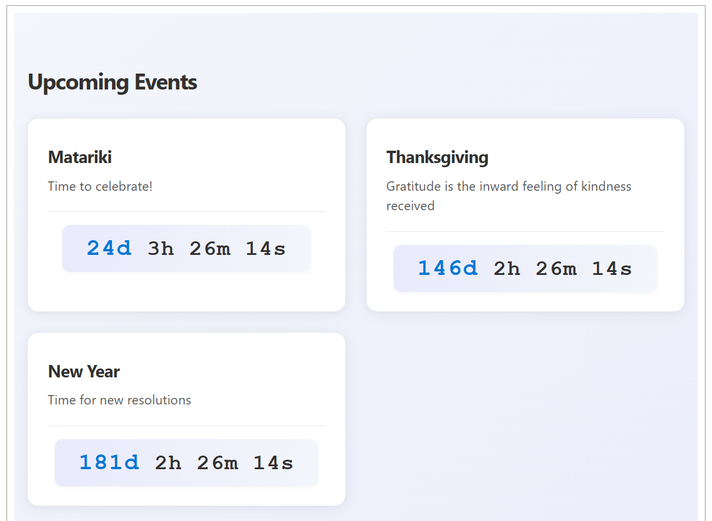

# Countdown Timer Web Part

## Summary

This SharePoint Framework (SPFx) web part displays a countdown timer for upcoming events from a SharePoint list. It helps organizations keep users informed about important dates and deadlines by showing a live countdown for each event.

## Applies to

- [SharePoint Framework](https://aka.ms/spfx)
- [Microsoft 365 tenant](https://docs.microsoft.com/en-us/sharepoint/dev/spfx/set-up-your-developer-tenant)

> Get your own free development tenant by subscribing to [Microsoft 365 developer program](http://aka.ms/o365devprogram)

## Prerequisites

SharePoint list (default name: `Events`) with the following fields:

- **Title** (Single line of text)
- **EventDate** (Date and Time)
- **Description** (Multiple lines of text, optional)

## Compatibility

| :warning: Important          |
|:---------------------------|
| Every SPFx version is only compatible with specific version(s) of Node.js. In order to be able to build this sample, please ensure that the version of Node on your workstation matches one of the versions listed in this section. This sample will not work on a different version of Node.|
|Refer to <https://aka.ms/spfx-matrix> for more information on SPFx compatibility.   |

-Incompatible-red.svg "SharePoint Server 2016 Feature Pack 2 requires SPFx 1.1")

## Contributors

- [Sudeep Ghatak](https://github.com/sudeepghatak)

## Version history

Version|Date|Comments
-------|----|--------
1.0|April 20, 2025|Initial release

## Minimal Path to Awesome

### Build and Test

> This sample can also be opened with [VS Code Remote Development](https://code.visualstudio.com/docs/remote/remote-overview). Visit <https://aka.ms/spfx-devcontainer> for further instructions.

1. Clone this repo
1. In the command line run
    - `npm i`
    - `gulp build`
    - `gulp serve --nobrowser`
1. Create a SharePoint custom list (default: `Events`) with the required fields
1. Navigate to the hosted version of SharePoint workbench, eg. **https://<tenant>.sharepoint.com/sites/<your site>/_layouts/15/workbench.aspx**
1. Add the Web Part to the canvas and configure the list name if different from `Events`.

### Package and deploy

1. In the command line run
    - `gulp bundle --ship`
    - `gulp package-solution --ship`
2. Install into your SharePoint app catalog and add it to a SharePoint site.
3. Navigate to your site, eg. **https://<tenant>.sharepoint.com/sites/<your site>**
4. Create or ensure the custom list exists with the required fields
5. Populate the list with some upcoming events
6. Add the Web Part to a page and configure it if needed.

## Features

- Displays a live countdown for each upcoming event
- Fetches events from a configurable SharePoint list
- Responsive design
- Error handling and retry for data loading
- Works in Microsoft Teams context

## Help

If you have issues building or using the solution, please run [spfx doctor](https://pnp.github.io/cli-microsoft365/cmd/spfx/spfx-doctor/) from within the solution folder to diagnose incompatibility issues with your environment.

For questions or issues, please use the GitHub issues section of this repository.

## Disclaimer

**THIS CODE IS PROVIDED *AS IS* WITHOUT WARRANTY OF ANY KIND, EITHER EXPRESS OR IMPLIED, INCLUDING ANY IMPLIED WARRANTIES OF FITNESS FOR A PARTICULAR PURPOSE, MERCHANTABILITY, OR NON-INFRINGEMENT.**
