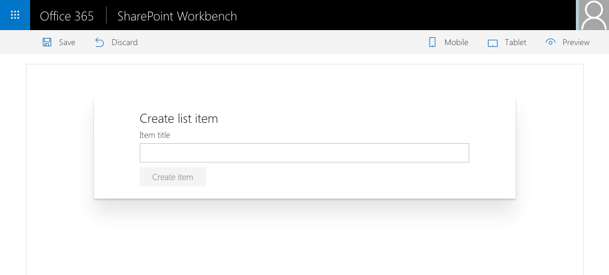

# Communicate using elevated privileges with SharePoint

## Summary

Sample SharePoint Framework client-side web part illustrating communication with SharePoint using elevated privileges through a custom Web API.




## Compatibility


 


-Compatible-green.svg)


## Applies to

* [SharePoint Framework Developer Preview](https://docs.microsoft.com/sharepoint/dev/spfx/sharepoint-framework-overview)
* [Office 365 developer tenant](https://docs.microsoft.com/sharepoint/dev/spfx/set-up-your-developer-tenant)

## Solution

Solution|Author(s)
--------|---------
react-sp-elevatedprivileges|[Waldek Mastykarz](https://github.com/waldekmastykarz) (MVP, Rencore, @waldekm)

## Version history

Version|Date|Comments
-------|----|--------
1.0|October 12, 2016|Initial release

## Minimal Path to Awesome

- clone this repo

### Deploy custom Web API

- in the Azure Management Portal at https://portal.azure.com create a new API App
  - in the settings enable CORS for all origins using an `*`
  - copy the URL of the API App
- in your SharePoint site
  - create a new list called **Tasks**
  - navigate to https://yourtenant.sharepoint.com/_layouts/15/appregnew.aspx
    - generate client ID and copy it
    - generate client secret and copy it
    - as the name use: **SPFx sample elevated privileges**
    - as the URL use the URL of the Azure API App created previously
    - as the domain use the host name of the Azure API App
  - navigate to https://yourtenant.sharepoint.com/_layouts/15/appinv.aspx
    - lookup the newly registered Add-in using the client ID you copied
    - in the **Permissions** field past the following code:

```xml
<AppPermissionRequests AllowAppOnlyPolicy="true">
  <AppPermissionRequest Scope="http://sharepoint/content/sitecollection/web/list" Right="Write" />
</AppPermissionRequests>
```

- after confirming the changes, when prompted, select the previously created **Tasks** list 
- from the **api** folder, in Visual Studio open the **pnp.api.elevatedprivileges.sln** file
- in the web.config file
  - update the value of the **clientId** setting with the previously copied client ID
  - update the value of the **clientSecret** setting with the previously copied client secret
  - update hte value of the **siteUrl** setting with the URL of your SharePoint site
  - if you named your list other than **Tasks** update the value of the **listName** property with the name of your list
- build the solution
- deploy the **pnp.api.elevatedprivileges** project to the newly created API App
- verify that you can access the API by navigating in your web browser to **https://your-api-app.azurewebsites.net/api/items**
  - you should get an error that GET is not a supported method

### Configure web part

- in the command line
  - change the working directory to the **webpart** folder
  - run `npm i`
- in your code editor open the **webpart** folder
- in the **./src/webparts/createTask/components/CreateTask.tsx** file
  - in line 76 replace the URL with the URL of your API App
- in the command line execute `gulp serve`
- add the web part to SharePoint workbench
- enter the name of the new item and click the **Create** button
  - verify that a new item with the name you specified has been created in the Tasks list

## Features

This project contains sample Web API using app-only permissions to create items in a specific SharePoint list, and a client-side web part connected to that API.

This project illustrates the following concepts:
- elevating user privileges for communicating with SharePoint through a custom Web API
- connecting SharePoint Framework client-side web part to a custom Web API hosted in Azure
- persisting state in React components
- communicating state updates in React components to users
- executing REST API web requests from React components
- using Office UI Fabric React components in SharePoint Framework client-side web parts
- using form controls in Rest components

## Help

We do not support samples, but this community is always willing to help, and we want to improve these samples. We use GitHub to track issues, which makes it easy for  community members to volunteer their time and help resolve issues.

If you're having issues building the solution, please run [spfx doctor](https://pnp.github.io/cli-microsoft365/cmd/spfx/spfx-doctor/) from within the solution folder to diagnose incompatibility issues with your environment.

You can try looking at [issues related to this sample](https://github.com/pnp/sp-dev-fx-webparts/issues?q=label%3A%22sample%3A%20react-sp-elevatedprivileges%22) to see if anybody else is having the same issues.

You can also try looking at [discussions related to this sample](https://github.com/pnp/sp-dev-fx-webparts/discussions?discussions_q=react-sp-elevatedprivileges) and see what the community is saying.

If you encounter any issues while using this sample, [create a new issue](https://github.com/pnp/sp-dev-fx-webparts/issues/new?assignees=&labels=Needs%3A+Triage+%3Amag%3A%2Ctype%3Abug-suspected%2Csample%3A%20react-sp-elevatedprivileges&template=bug-report.yml&sample=react-sp-elevatedprivileges&authors=@waldekmastykarz&title=react-sp-elevatedprivileges%20-%20).

For questions regarding this sample, [create a new question](https://github.com/pnp/sp-dev-fx-webparts/issues/new?assignees=&labels=Needs%3A+Triage+%3Amag%3A%2Ctype%3Aquestion%2Csample%3A%20react-sp-elevatedprivileges&template=question.yml&sample=react-sp-elevatedprivileges&authors=@waldekmastykarz&title=react-sp-elevatedprivileges%20-%20).

Finally, if you have an idea for improvement, [make a suggestion](https://github.com/pnp/sp-dev-fx-webparts/issues/new?assignees=&labels=Needs%3A+Triage+%3Amag%3A%2Ctype%3Aenhancement%2Csample%3A%20react-sp-elevatedprivileges&template=suggestion.yml&sample=react-sp-elevatedprivileges&authors=@waldekmastykarz&title=react-sp-elevatedprivileges%20-%20).


## Disclaimer

**THIS CODE IS PROVIDED *AS IS* WITHOUT WARRANTY OF ANY KIND, EITHER EXPRESS OR IMPLIED, INCLUDING ANY IMPLIED WARRANTIES OF FITNESS FOR A PARTICULAR PURPOSE, MERCHANTABILITY, OR NON-INFRINGEMENT.**

