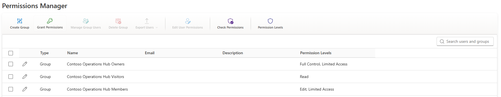
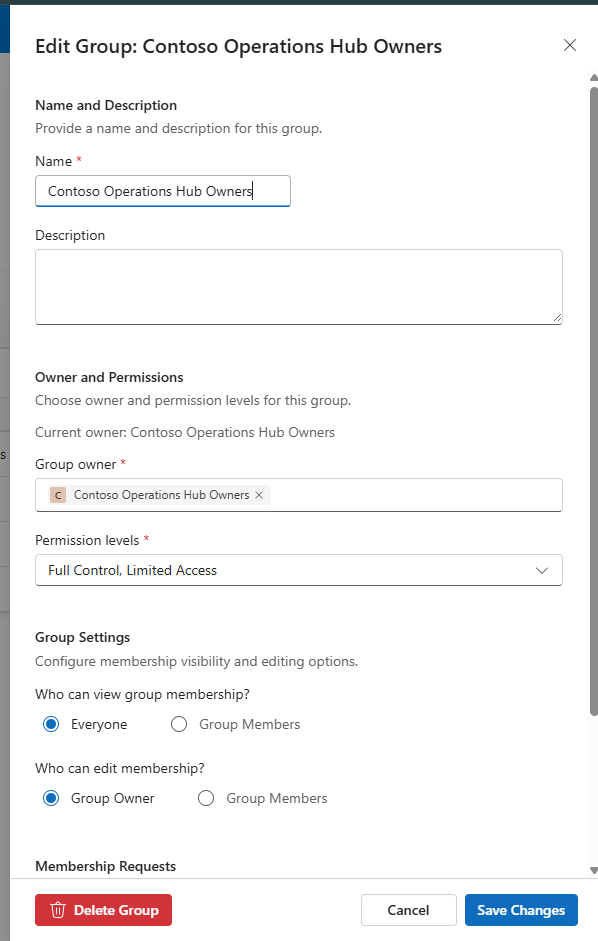
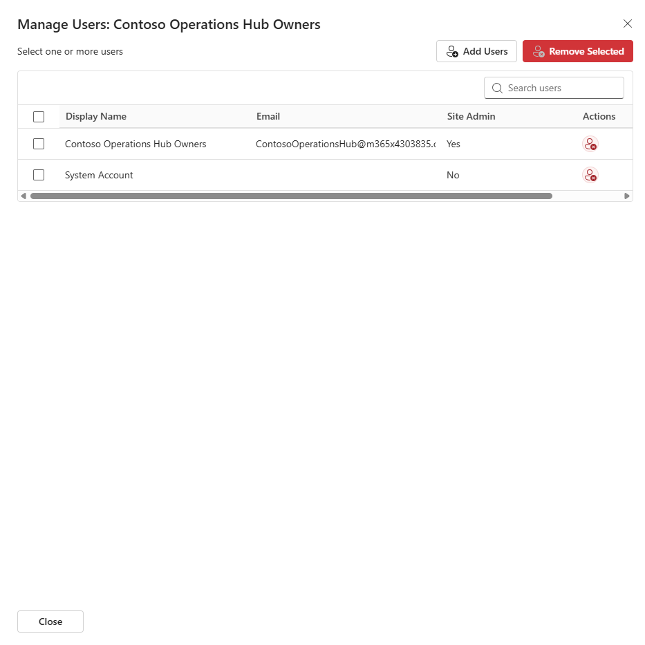
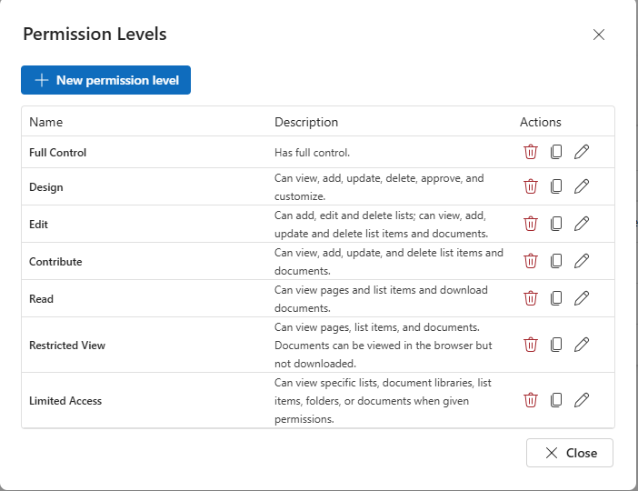
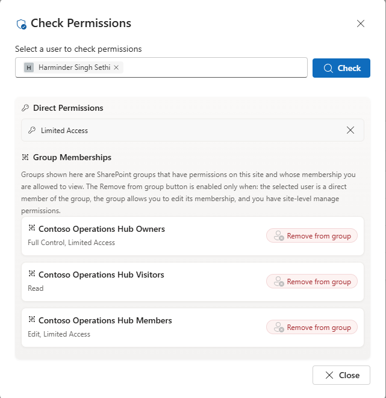

# SharePoint Permissions Manager

## Summary

SharePoint Permissions Manager is a SharePoint Framework web part for administering SharePoint site groups, group membership, and user permissions from a single interface.

The solution provides a Fluent UI based management experience for:

- listing SharePoint groups and principals
- creating, editing, and deleting SharePoint groups
- managing users in groups
- granting, editing, and removing user permissions
- checking effective permissions for selected users
- viewing available permission levels
- exporting group membership to CSV or Excel

The implementation uses SharePoint APIs and PnPjs only. 

## Compatibility

| :warning: Important          |
|:---------------------------|
| Every SPFx version is optimally compatible with specific versions of Node.js. In order to be able to Toolchain this sample, you need to ensure that the version of Node on your workstation matches one of the versions listed in this section. This sample will not work on a different version of Node.|
|Refer to <https://aka.ms/spfx-matrix> for more information on SPFx compatibility.   |

This sample is optimally compatible with the following environment configuration:

-Incompatible-red.svg "SharePoint Server 2016 Feature Pack 2 requires SPFx 1.1")

## Applies to

- [SharePoint Framework](https://learn.microsoft.com/sharepoint/dev/spfx/sharepoint-framework-overview)
- [Microsoft 365 tenant](https://learn.microsoft.com/sharepoint/dev/spfx/set-up-your-development-environment)

> Get your own free development tenant by subscribing to the [Microsoft 365 Developer Program](https://developer.microsoft.com/microsoft-365/dev-program)

## Prerequisites

- Microsoft 365 tenant with SharePoint Online
- SharePoint App Catalog for tenant deployment
- SharePoint Framework [development environment](https://learn.microsoft.com/sharepoint/dev/spfx/set-up-your-development-environment)
- Site permissions that allow managing SharePoint groups and permissions when using the administrative actions in the web part

## Contributors

- [Harminder Singh](https://github.com/HarminderSethi)

## Solution

| Solution | Author(s) |
| -------- | --------- |
| react-sp-permission-manager | [Harminder Singh](https://github.com/HarminderSethi) |

## Version history

| Version | Date | Comments |
| ------- | ---- | -------- |
| 1.0.0 | April 13, 2026 | First Version |

## Minimal Path to Awesome

- Clone this repository
- Ensure that you are at the solution folder
- In the command-line run:
  - `npm install`
  - `npm run start`
- Open the SharePoint workbench:
  - `https://{tenant}.sharepoint.com/_layouts/15/workbench.aspx`
- Add the `SPPermissionManager` web part to the page

To package and deploy the solution:

- In the command-line run:
  - `npm run build`
- Upload [sharepoint/solution/react-sp-permission-manager.sppkg](sharepoint/solution/react-sp-permission-manager.sppkg) to the tenant/site collection App Catalog
- Deploy the package

> This solution currently has no `webApiPermissionRequests`, so there are no Microsoft Graph permission approvals required during deployment.

## Web Part Properties

Property | Type | Required | Description
-------- | ---- | -------- | -----------
Title | Text | No | Title displayed above the management experience
Edit Group | Toggle | No | Enables renaming and description updates for SharePoint groups
Create New Group | Toggle | No | Enables creation of new SharePoint groups
Delete Group | Toggle | No | Enables deletion of selected SharePoint groups
Export Users to CSV | Toggle | No | Enables exporting group membership to CSV
Export Users to Excel | Toggle | No | Enables exporting group membership to Excel
Manage Permission Levels | Toggle | No | Enables permission level management views

## Features

This sample illustrates the following concepts on top of the SharePoint Framework:

- React based SPFx web part architecture
- Fluent UI based management experience
- SharePoint group CRUD operations
- Group membership management
- User permission grant, edit, and removal workflows
- Effective permission inspection for principals
- Permission level browsing and maintenance dialogs
- Exporting membership data to CSV and Excel with `xlsx`
- SharePoint local people resolution without Microsoft Graph dependencies
- Heft based SPFx build and packaging workflow

## Implementation Notes

- The package is configured with `skipFeatureDeployment: true` and includes client-side assets in the generated package.
- The packaged solution output is [sharepoint/solution/react-sp-permission-manager.sppkg](sharepoint/solution/react-sp-permission-manager.sppkg).

## References

- [SharePoint Framework overview](https://learn.microsoft.com/sharepoint/dev/spfx/sharepoint-framework-overview)
- [Set up your SharePoint Framework development environment](https://learn.microsoft.com/sharepoint/dev/spfx/set-up-your-development-environment)
- [PnPjs documentation](https://pnp.github.io/pnpjs/)
- [Fluent UI React Components](https://react.fluentui.dev/)
- [Microsoft 365 Patterns and Practices](https://aka.ms/m365pnp)
- [Heft documentation](https://heft.rushstack.io/)

## Disclaimer

**THIS CODE IS PROVIDED _AS IS_ WITHOUT WARRANTY OF ANY KIND, EITHER EXPRESS OR IMPLIED, INCLUDING ANY IMPLIED WARRANTIES OF FITNESS FOR A PARTICULAR PURPOSE, MERCHANTABILITY, OR NON-INFRINGEMENT.**

