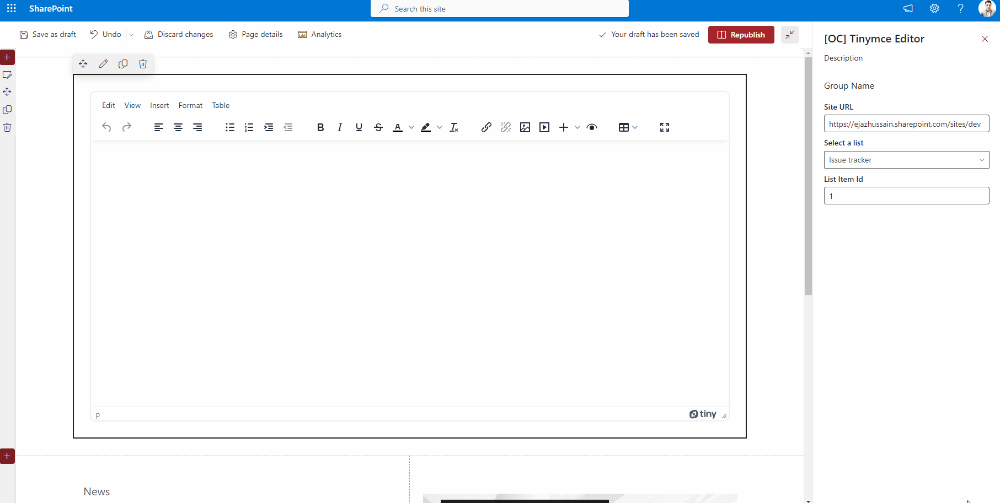

# SharePoint List Integration with TinyMCE Editor

## Summary

An example of integrating SharePoint lists with TinyMCE editors can be found in this sample. The web part allows users to insert column data from associated SharePoint lists using a split button on the toolbar. An editor preview plugin for TinyMce was developed in order to be able to preview changes before they are saved.

## Compatibility

| :warning: Important          |
|:---------------------------|
| Every SPFx version is only compatible with specific version(s) of Node.js. In order to be able to build this sample, please ensure that the version of Node on your workstation matches one of the versions listed in this section. This sample will not work on a different version of Node.|
|Refer to <https://aka.ms/spfx-matrix> for more information on SPFx compatibility.   |

-Incompatible-red.svg "SharePoint Server 2016 Feature Pack 2 requires SPFx 1.1")

## Applies to

- [SharePoint Framework](https://aka.ms/spfx)
- [Microsoft 365 tenant](https://learn.microsoft.com/sharepoint/dev/spfx/set-up-your-developer-tenant)

> Get your own free development tenant by subscribing to [Microsoft 365 developer program](http://aka.ms/m365devprogram)

## Prerequisites

Access to a SharePoint online site with various tenant users granted access to various site resources directly, via AAD groups and via SharePoint groups.

## Contributors

- [Ejaz Hussain](https://github.com/ejazhussain)

## Version history

| Version | Date              | Comments        |
| ------- | ----------------- | --------------- |
| 1.0.0   | June 6, 2023 | Initial release |

## Minimal Path to Awesome

- Clone this repository
- Ensure that you are at the solution folder
- in the command-line run:
  - `npm install`
  - `gulp trust-dev-cert`
  - `gulp serve --nobrowser`
- Open the hosted workbench on a SharePoint site - i.e. https://_tenant_.sharepoint.com/site/_sitename_/_layouts/workbench.aspx
- Add the [OC] Tinymce Editor web part to the page.
- In the web part properties, Add absolute URL of the site under Site URL field.
- Select the required list from the available list under Select a list dropdown. This dropdown will be auto populated based on the Site URL property

- Provide list Item Id

- Close the web part properties pane and save and reload the page

## Features

An example of integrating SharePoint lists with TinyMCE editors can be found in this sample. The web part allows users to insert column data from associated SharePoint lists using a split button on the toolbar. An editor preview plugin for TinyMce was developed in order to be able to preview changes before they are saved.

## Supported list columns

- Text
- DateTime
- Number
- Note
- Single taxonomy
- Multi taxonomy
- User
- User Multi
- Choices
- Hyperlink

## Help

We do not support samples, but we this community is always willing to help, and we want to improve these samples. We use GitHub to track issues, which makes it easy for  community members to volunteer their time and help resolve issues.

If you're having issues building the solution, please run [spfx doctor](https://pnp.github.io/cli-microsoft365/cmd/spfx/spfx-doctor/) from within the solution folder to diagnose incompatibility issues with your environment.

If you encounter any issues while using this sample, [create a new issue](https://github.com/pnp/sp-dev-fx-webparts/issues/new?assignees=&labels=Needs%3A+Triage+%3Amag%3A%2Ctype%3Abug-suspected%2Csample%3A%20react-sp-tinymce&template=bug-report.yml&sample=react-sp-tinymce&authors=@ejazhussain&title=react-sp-tinymce%20-%20).

For questions regarding this sample, [create a new question](https://github.com/pnp/sp-dev-fx-webparts/issues/new?assignees=&labels=Needs%3A+Triage+%3Amag%3A%2Ctype%3Aquestion%2Csample%3A%20react-sp-tinymce&template=question.yml&sample=react-sp-tinymce&authors=@ejazhussain&title=react-sp-tinymce%20-%20).

Finally, if you have an idea for improvement, [make a suggestion](https://github.com/pnp/sp-dev-fx-webparts/issues/new?assignees=&labels=Needs%3A+Triage+%3Amag%3A%2Ctype%3Aenhancement%2Csample%3A%20react-sp-tinymce&template=question.yml&sample=react-sp-tinymce&authors=@ejazhussain&title=react-sp-tinymce%20-%20).

## Disclaimer

**THIS CODE IS PROVIDED *AS IS* WITHOUT WARRANTY OF ANY KIND, EITHER EXPRESS OR IMPLIED, INCLUDING ANY IMPLIED WARRANTIES OF FITNESS FOR A PARTICULAR PURPOSE, MERCHANTABILITY, OR NON-INFRINGEMENT.**

