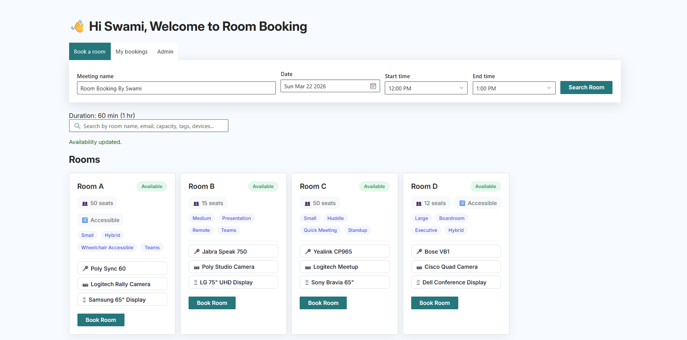
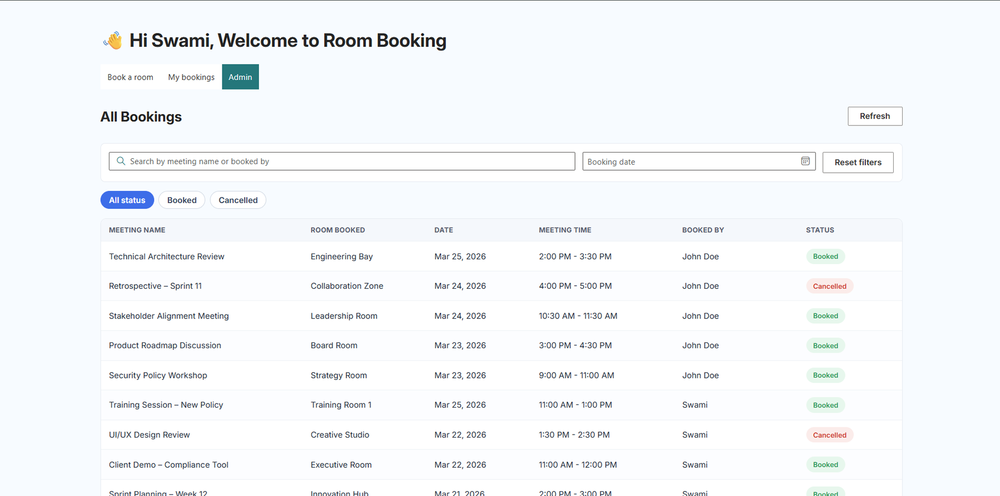
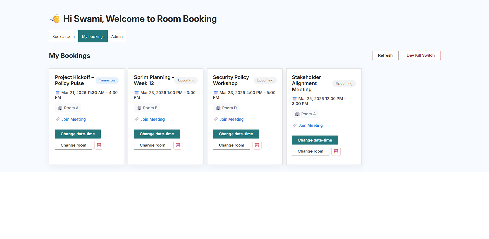

# Room Booking

## Summary

This sample shows how to build a SharePoint Framework web part that lets users:

- Discover meeting rooms from Microsoft Graph Places API.
- Check room availability with Graph `getSchedule`.
- Create, update, and delete room bookings in Outlook calendar.
- Sync booking metadata to a SharePoint list using PnPjs (`@pnp/sp`).
- Manage booking records from an admin view with dynamic status filters.

The sample is built with SPFx, React, Fluent UI v8, Microsoft Graph, and PnPjs.

## 

## 

## 

_Developed using [GitHub Copilot](https://github.com/features/copilot) and vibe coding 🧑‍💻_

## Compatibility

| ⚠️ Important                                                                                                 |
| :----------------------------------------------------------------------------------------------------------- |
| Every SPFx version is only compatible with specific Node.js versions. Refer to <https://aka.ms/spfx-matrix>. |

This sample is optimally compatible with the following configuration:

## Applies to

- [SharePoint Framework](https://learn.microsoft.com/sharepoint/dev/spfx/sharepoint-framework-overview)
- [Microsoft 365 tenant](https://learn.microsoft.com/sharepoint/dev/spfx/set-up-your-development-environment)

> Get your own free development tenant by subscribing to the [Microsoft 365 developer program](https://aka.ms/m365/devprogram)

## Contributors

- [Swami Nawale](https://github.com/swaminawale)
- [Divyanshu Barania](https://github.com/divyanshubarania)

## Version history

| Version | Date           | Comments                     |
| ------- | -------------- | ---------------------------- |
| 1.0.0   | March 22, 2026 | Initial community submission |

## Prerequisites

1. SharePoint App Catalog configured for your tenant.
2. Microsoft Graph API permissions approved in SharePoint Admin Center.
3. Install project dependencies with `npm install` (this includes the Heft-based toolchain used by this sample).
4. A SharePoint list for booking details with the following schema:

| Column Name         | Column Type         | Notes                                          |
| ------------------- | ------------------- | ---------------------------------------------- |
| `MeetingId`         | Single line of text | Stores the Microsoft Graph event id.           |
| `Title`             | Single line of text | Stores the meeting title.                      |
| `Status`            | Choice              | Add these choices: `Booked`, `Cancelled`       |
| `BookingDate`       | Date only           | Stores the booking date.                       |
| `StartTime`         | Single line of text | Stores the formatted start time.               |
| `EndTime`           | Single line of text | Stores the formatted end time.                 |
| `RoomBooked`        | Single line of text | Stores the room name selected for the booking. |
| `DurationInMinutes` | Number              | Stores meeting duration in minutes.            |

### Solution configuration

These values are configured through the web part **property pane** , no source code changes are needed.

After adding the web part to a SharePoint page, open the property pane (edit the page and select the web part) and fill in:

| Property pane field                 | Description                                                                                                                                        |
| ----------------------------------- | -------------------------------------------------------------------------------------------------------------------------------------------------- |
| **SharePoint List ID for Bookings** | The GUID of your SharePoint list created in the step above. Find it under **List Settings** > the URL contains `List=%7B...%7D` (decode the GUID). |
| **Admin Emails (comma-separated)**  | One or more email addresses that should have access to the Admin tab (e.g. `admin@contoso.com,manager@contoso.com`).                               |

> Changes to property pane values take effect immediately on save/publish, no rebuild or redeploy required.

### Required Microsoft Graph permissions

Delegated permissions used by this sample:

| Permission             | Type      | Reason                                                    |
| ---------------------- | --------- | --------------------------------------------------------- |
| `User.Read.All`        | Delegated | Read user profile data (display name, email)              |
| `Place.Read.All`       | Delegated | Discover meeting rooms via Graph Places API               |
| `Calendars.ReadWrite`  | Delegated | Create, update, and delete calendar events                |
| `MailboxSettings.Read` | Delegated | Read mailbox timezone settings for accurate time handling |

> Ensure all of the above are declared in `config/package-solution.json` under `webApiPermissionRequests` and approved in **SharePoint Admin Center** > **API access** before using the web part.

## Minimal path to awesome

- Clone this repository.
- From command line, change directory to this sample folder.
- Make sure dependencies are installed, including the Heft-based toolchain used by this sample.
- Run:
  - `npm install`
  - `npm run start`
- Add the web part on a SharePoint page.
- Approve pending Graph permissions from **SharePoint Admin Center** > **API access**.

## ⏱️ Important Timing Notes for API Approval and Room Sync

When using the Microsoft Graph Place API (`Place.Read.All`):

- **After API permission is approved in SharePoint Admin Center:**
  - **Minimum wait time:** 3 hours
  - **Maximum wait time:** 12-24 hours

During these waiting periods, rooms may not appear in the web part's room discovery even if the API is called. Once the sync period is complete, newly created rooms will start appearing in the **Discover Rooms** dropdown.

---

## Features

This sample demonstrates:

- Room discovery with Graph Places.
- Availability checks with Graph `getSchedule`.
- Timezone-aware booking operations.
- Booking lifecycle sync between Outlook and SharePoint list.
- Admin filter UX with dynamic status values from SharePoint choice column.

## Developer Kill Switch

> ⚠️ **WARNING: For development use only. Read carefully before using.**

The web part includes a **Dev Kill Switch**

**What it does:** It permanently deletes **every single calendar booking** associated with the current user's account, including all Graph calendar events and their corresponding SharePoint list entries. There is no confirmation prompt and no undo.

**Why it exists:** During development and testing, it is easy to accumulate a large number of dummy or test bookings. This button was added to quickly wipe all of that test data in a developer tenant where none of the meetings matter.

**Before you use it:**

- This was tested on a **dedicated developer tenant** where all bookings were disposable test data.
- If you are working on your **primary work tenant**, do **not** use this feature as-is. It will delete real calendar meetings.
- If you need something similar for a production scenario, modify the function `onDeveloperKillSwitch` in `SpFxRoomBooking.tsx` to scope the deletion appropriately (e.g. filter by subject prefix, date range, or organizer).

---

## Observations

- After a room is booked, Microsoft Graph availability data may take a short time to reflect the latest booking. (around 2-3 mintues max )
- During that propagation window, a room may still appear as available for a few minutes even though it has already been booked. If you need instant reflection of room availability, cross-reference the SharePoint list data alongside the Graph `getSchedule` response the list is updated immediately on booking and can serve as a real-time source of truth while Graph catches up.

## Project structure

- `src/webparts/spFxRoomBooking/components/SpFxRoomBooking.tsx`: main UI and interaction logic
- `src/webparts/spFxRoomBooking/components/services/PnpService.ts`: Graph + SharePoint services
- `src/webparts/spFxRoomBooking/components/utils/DateTimeHelper.ts`: date/time helpers
- `config/package-solution.json`: solution metadata and Graph permission declarations

## Build and package

- `npm run build`

The production package is generated under `sharepoint/solution/`.

## Help

If you have issues with this sample:

- Make sure `npm install` completed successfully so the Heft toolchain and all required dependencies are available.
- Run [spfx doctor](https://pnp.github.io/cli-microsoft365/cmd/spfx/spfx-doctor/).
- Check [PnP SPFx sample issues](https://github.com/pnp/sp-dev-fx-webparts/issues).
- Ask in [PnP Discussions](https://github.com/pnp/sp-dev-fx-webparts/discussions).

## Disclaimer

**THIS CODE IS PROVIDED _AS IS_ WITHOUT WARRANTY OF ANY KIND, EITHER EXPRESS OR IMPLIED, INCLUDING ANY IMPLIED WARRANTIES OF FITNESS FOR A PARTICULAR PURPOSE, MERCHANTABILITY, OR NON-INFRINGEMENT.**

