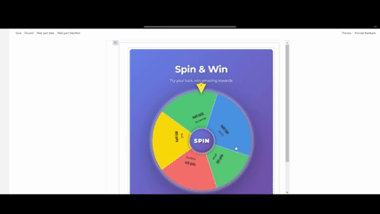
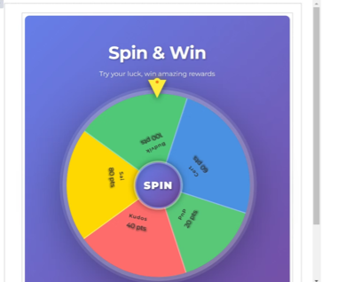

# Spin Wheel Game

## Summary

An interactive daily spin wheel game with probability-based rewards, featuring smooth animations, sound effects, and comprehensive spin history tracking. Built with React, TypeScript, and PnPjs v4.

## Used SharePoint Framework Version

## Applies to

- [SharePoint Framework](https://aka.ms/spfx)
- [Microsoft 365 tenant](https://docs.microsoft.com/en-us/sharepoint/dev/spfx/set-up-your-developer-tenant)

> Get your own free development tenant by subscribing to [Microsoft 365 developer program](http://aka.ms/o365devprogram)

## Prerequisites

Before using this web part, you need to create two SharePoint lists:

### 1. WheelRewards List

Create a list named `WheelRewards` with the following columns:

| Column Name | Type | Required | Description |
|------------|------|----------|-------------|
| Title | Single line of text | Yes | Reward name (e.g., "50 Points") |
| Points | Number | Yes | Points value to award |
| Probability | Number | Yes | Probability weight for selection |
| Color | Single line of text | No | Hex color code (e.g., #FF5733) |
| Active | Yes/No | Yes | Whether reward is active |

### 2. GameScores List

Create a list named `GameScores` with the following columns:

| Column Name | Type | Required | Description |
|------------|------|----------|-------------|
| Title | Single line of text | Yes | Auto-generated title |
| Player | Single line of text | Yes | Player display name |
| PlayerEmail | Single line of text | Yes | Player email address |
| GameName | Single line of text | Yes | Always "Spin Wheel" |
| Score | Number | Yes | Points earned |
| CorrectCount | Number | Yes | Always 1 for spins |
| TimeTakenSeconds | Number | Yes | Always 0 for spins |
| Timestamp | Date and Time | Yes | When the spin occurred |

## Solution

| Solution | Author(s) |
|----------|-----------|
| react-spin-wheel | [Sai Siva Ram Bandaru](https://github.com/saiiiiiii)

## Version history

| Version | Date | Comments |
|---------|------|----------|
| 1.0 | February 8, 2026 | Initial release |

---

## Features

This web part illustrates the following concepts:

### User Experience
- **Daily Spin Limit**: Users can spin the wheel once every 24 hours
- **Probability-Based Rewards**: Configure different rewards with custom probabilities
- **Sound Effects**: Engaging audio feedback during spins using Web Audio API

### Daily Limit Enforcement

The web part checks the last spin date from the GameScores list and compares it with the current date. Users can only spin if:
- They have never spun before, OR
- Their last spin was on a different day (24+ hours ago)

### Data Flow

1. **Initialization**: Load rewards from WheelRewards list
2. **Eligibility Check**: Verify user can spin today
3. **Spin Action**: Calculate winning reward using probability algorithm
4. **Animation**: 5-second spin with smooth easing
5. **Result**: Display congratulations dialog
6. **Save**: Record spin in GameScores list
7. **History**: Refresh user's spin history

## Performance Considerations

- **Initial Load**: < 2 seconds
- **Spin Animation**: 5 seconds
- **Data Save**: < 1 second  
- **Bundle Size**: ~400KB (minified)
- **API Calls**: 2-3 per spin operation

## Help

We do not support samples, but this community is always willing to help, and we want to improve these samples. We use GitHub to track issues, which makes it easy for  community members to volunteer their time and help resolve issues.

If you're having issues building the solution, please run [spfx doctor](https://pnp.github.io/cli-microsoft365/cmd/spfx/spfx-doctor/) from within the solution folder to diagnose incompatibility issues with your environment.

You can try looking at [issues related to this sample](https://github.com/pnp/sp-dev-fx-webparts/issues?q=label%3A%22sample%3A%20react-spin-wheel%22) to see if anybody else is having the same issues.

You can also try looking at [discussions related to this sample](https://github.com/pnp/sp-dev-fx-webparts/discussions?discussions_q=react-spin-wheel) and see what the community is saying.

If you encounter any issues using this sample, [create a new issue](https://github.com/pnp/sp-dev-fx-webparts/issues/new?assignees=&labels=Needs%3A+Triage+%3Amag%3A%2Ctype%3Abug-suspected%2Csample%3A%20react-spin-wheel&template=bug-report.yml&sample=react-spin-wheel&authors=@YOUR-GITHUB-USERNAME&title=react-spin-wheel%20-%20).

For questions regarding this sample, [create a new question](https://github.com/pnp/sp-dev-fx-webparts/issues/new?assignees=&labels=Needs%3A+Triage+%3Amag%3A%2Ctype%3Aquestion%2Csample%3A%20react-spin-wheel&template=question.yml&sample=react-spin-wheel&authors=@YOUR-GITHUB-USERNAME&title=react-spin-wheel%20-%20).

Finally, if you have an idea for improvement, [make a suggestion](https://github.com/pnp/sp-dev-fx-webparts/issues/new?assignees=&labels=Needs%3A+Triage+%3Amag%3A%2Ctype%3Aenhancement%2Csample%3A%20react-spin-wheel&template=suggestion.yml&sample=react-spin-wheel&authors=@YOUR-GITHUB-USERNAME&title=react-spin-wheel%20-%20).

## References

- [Getting started with SharePoint Framework](https://docs.microsoft.com/en-us/sharepoint/dev/spfx/set-up-your-developer-tenant)
- [Building for Microsoft teams](https://docs.microsoft.com/en-us/sharepoint/dev/spfx/build-for-teams-overview)
- [Use Microsoft Graph in your solution](https://docs.microsoft.com/en-us/sharepoint/dev/spfx/web-parts/get-started/using-microsoft-graph-apis)
- [Publish SharePoint Framework applications to the Marketplace](https://docs.microsoft.com/en-us/sharepoint/dev/spfx/publish-to-marketplace-overview)
- [Microsoft 365 Patterns and Practices](https://aka.ms/m365pnp) - Guidance, tooling, samples and open-source controls for your Microsoft 365 development
- [PnPjs Documentation](https://pnp.github.io/pnpjs/)
- [Fluent UI React](https://developer.microsoft.com/en-us/fluentui#/controls/web)

## Disclaimer

**THIS CODE IS PROVIDED *AS IS* WITHOUT WARRANTY OF ANY KIND, EITHER EXPRESS OR IMPLIED, INCLUDING ANY IMPLIED WARRANTIES OF FITNESS FOR A PARTICULAR PURPOSE, MERCHANTABILITY, OR NON-INFRINGEMENT.**

