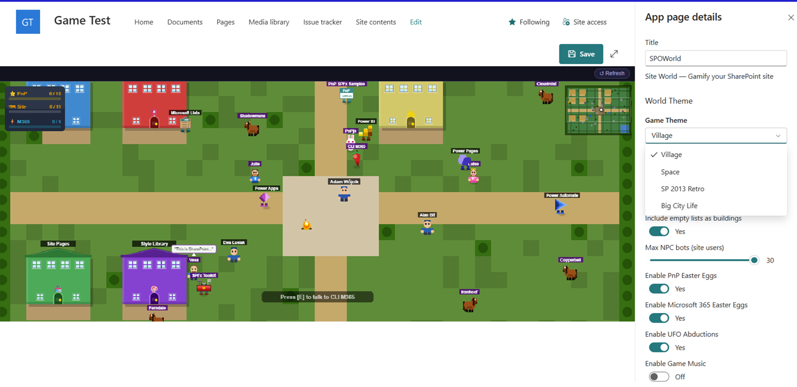
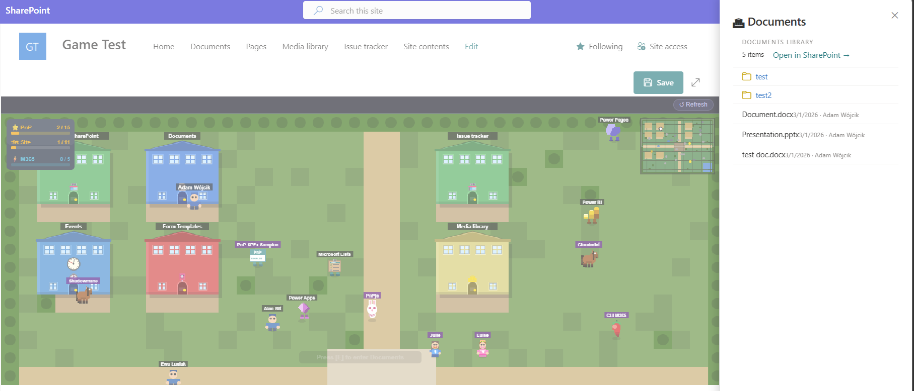
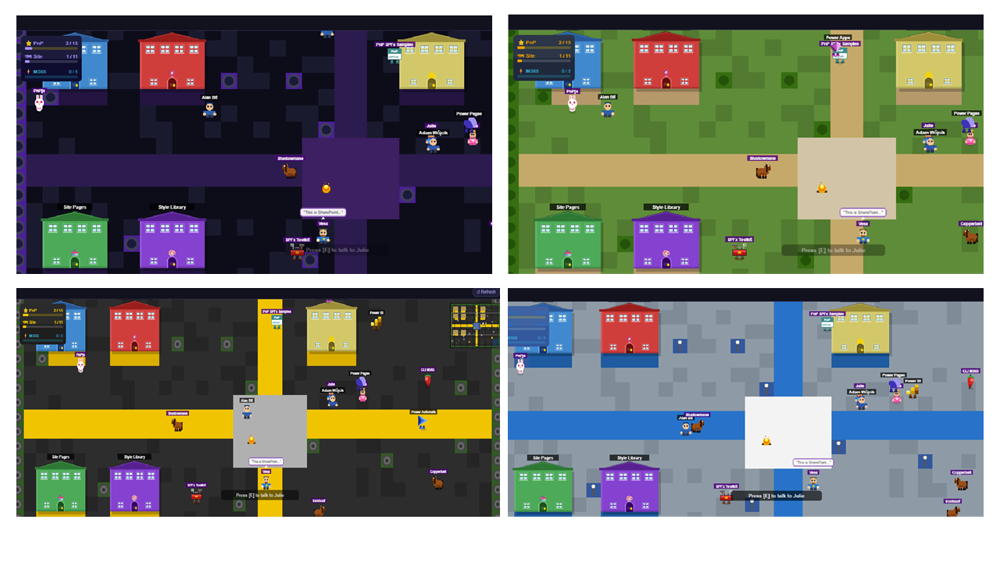
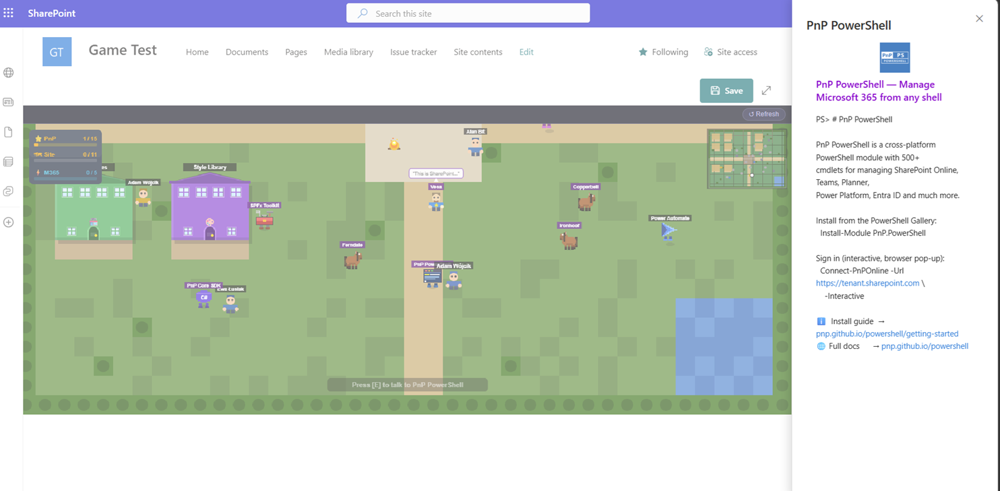
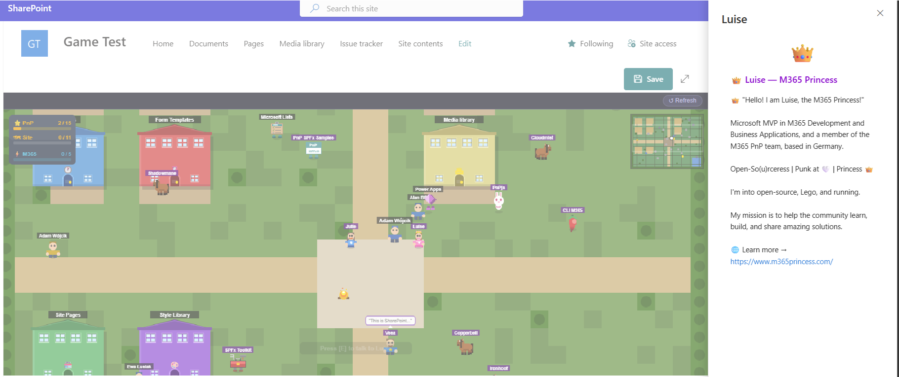

# SPO Site Game

## Summary

This web part will change any site content into a 2D game in which the players aim is to discover list, libraries, which are represented as buildings, and their content in a fun and engaging way. The game also show other people that are other users with direct access to the site.

The game comes with a few different themes which will help you make it part of your unique SharePoint site experience. 

Besides current SharePoint site content, the game also allows to discover Microsoft 365 development related resources like Power App, Power Automate or Microsoft Lists. As well as Microsoft 365 and Power Platform Community (PnP) resources like PnPjs, SPFx Toolkit, CLI for Microsoft 365 and many others.

## Compatibility

| :warning: Important          |
|:---------------------------|
| Every SPFx version is optimally compatible with specific versions of Node.js. In order to be able to Toolchain this sample, you need to ensure that the version of Node on your workstation matches one of the versions listed in this section. This sample will not work on a different version of Node.|
|Refer to <https://aka.ms/spfx-matrix> for more information on SPFx compatibility.   |

This sample is optimally compatible with the following environment configuration:

-Incompatible-red.svg "SharePoint Server 2016 Feature Pack 2 requires SPFx 1.1")

 

## Applies to

* [SharePoint Framework](https://learn.microsoft.com/sharepoint/dev/spfx/sharepoint-framework-overview)
* [Microsoft 365 tenant](https://learn.microsoft.com/sharepoint/dev/spfx/set-up-your-development-environment)

> Get your own free development tenant by subscribing to [Microsoft 365 developer program](https://aka.ms/m365/devprogram)

## Contributors

* [Adam Wójcik](https://github.com/Adam-it)
* [Saurabh Tripathi](https://github.com/Saurabh7019)
* [Nico De Cleyre](https://github.com/nicodecleyre)

## Version history

|Version|Date|Comments|
|-------|----|--------|
|1.0|March 14, 2026|Initial release|

## Prerequisites

- just add it to a site and have fun discovering your site content, Microsoft 365 and PnP resources

## Minimal path to awesome

* Clone this repository (or [download this solution as a .ZIP file](https://pnp.github.io/download-partial/?url=https://github.com/pnp/sp-dev-fx-webparts/tree/main/samples/react-spo-site-game) then unzip it)

To just build and run the sample in the workbench, please follow the below guidance:

* From your command line, change your current directory to the directory containing this sample (`react-spo-site-game`, located under `samples`)
* in the command line run:
  * `npm install`
  * `heft start`

To build, package and deploy the solution to a tenant, please follow the below guidance:

* From your command line, change your current directory to the directory containing this sample (`react-spo-site-game`, located under `samples`)
* in the command line run:
  * `npm install`
  * `heft build --production`
  * `heft package-solution --production`
* Deploy the generated .sppkg file from the `sharepoint/solution` folder to your tenant's app catalog

### Pro Tip - SPFx Toolkit ⭐

Use [SPFx Toolkit VS Code extension](https://marketplace.visualstudio.com/items?itemName=m365pnp.viva-connections-toolkit) to streamline building, testing, deploying, installing and everything that is needed for your SPFx project.

Using [SPFx Toolkit Task view](https://marketplace.visualstudio.com/items?itemName=m365pnp.viva-connections-toolkit) You may simply use the `publish` task to build, package your solution. 

Then use the [deploy action](https://marketplace.visualstudio.com/items?itemName=m365pnp.viva-connections-toolkit) to deploy the .sppkg file to your tenant's app catalog without leaving VS Code. 

You may even install the web part to any site on your tenant using the [install management capability](https://pnp.github.io/vscode-viva/features/management-capabilities/#app-catalogs-management)

> This sample can also be opened with [VS Code Remote Development](https://code.visualstudio.com/docs/remote/remote-overview). Visit <https://aka.ms/spfx-devcontainer> for further instructions.

## Features

This Web Part illustrates the following concepts on top of the SharePoint Framework:

* How to embed a game engine into a SharePoint Framework web part

## Help

We do not support samples, but this community is always willing to help, and we want to improve these samples. We use GitHub to track issues, which makes it easy for  community members to volunteer their time and help resolve issues.

If you're having issues building the solution, please run [spfx doctor](https://pnp.github.io/cli-microsoft365/cmd/spfx/spfx-doctor/) from within the solution folder to diagnose incompatibility issues with your environment.

You can try looking at [issues related to this sample](https://github.com/pnp/sp-dev-fx-webparts/issues?q=label%3A%22sample%3A%20react-spo-site-game%22) to see if anybody else is having the same issues.

You can also try looking at [discussions related to this sample](https://github.com/pnp/sp-dev-fx-webparts/discussions?discussions_q=react-spo-site-game) and see what the community is saying.

If you encounter any issues using this sample, [create a new issue](https://github.com/pnp/sp-dev-fx-webparts/issues/new?assignees=&labels=Needs%3A+Triage+%3Amag%3A%2Ctype%3Abug-suspected%2Csample%3A%20react-spo-site-game&template=bug-report.yml&sample=react-spo-site-game&authors=@YOURGITHUBUSERNAME&title=react-spo-site-game%20-%20).

For questions regarding this sample, [create a new question](https://github.com/pnp/sp-dev-fx-webparts/issues/new?assignees=&labels=Needs%3A+Triage+%3Amag%3A%2Ctype%3Aquestion%2Csample%3A%20react-spo-site-game&template=question.yml&sample=react-spo-site-game&authors=@YOURGITHUBUSERNAME&title=react-spo-site-game%20-%20).

Finally, if you have an idea for improvement, [make a suggestion](https://github.com/pnp/sp-dev-fx-webparts/issues/new?assignees=&labels=Needs%3A+Triage+%3Amag%3A%2Ctype%3Aenhancement%2Csample%3A%20react-spo-site-game&template=suggestion.yml&sample=react-spo-site-game&authors=@YOURGITHUBUSERNAME&title=react-spo-site-game%20-%20).

## Disclaimer

**THIS CODE IS PROVIDED *AS IS* WITHOUT WARRANTY OF ANY KIND, EITHER EXPRESS OR IMPLIED, INCLUDING ANY IMPLIED WARRANTIES OF FITNESS FOR A PARTICULAR PURPOSE, MERCHANTABILITY, OR NON-INFRINGEMENT.**

