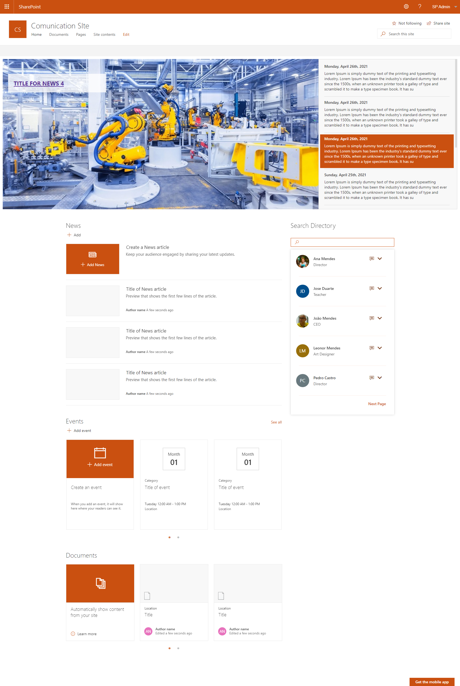

# Staff Directory (Search Directory) Version 2019

## Summary

This web part shows the current user's colleagues, and allows the user to search AD directory, The user can configure the properties to show when expand the user card.

 

## Compatibility

| :warning: Important          |
|:---------------------------|
| Every SPFx version is only compatible with specific version(s) of Node.js. In order to be able to build this sample, please ensure that the version of Node on your workstation matches one of the versions listed in this section. This sample will not work on a different version of Node.|
|Refer to <https://aka.ms/spfx-matrix> for more information on SPFx compatibility.   |

 
 

For more information about SPFx compatibility, please refer to https://aka.ms/spfx-matrix

## Applies to

[SharePoint Framework](https://aka.ms/spfx)

## Contributors

* [João Mendes](https://github.com/joaojmendes) 

## Version history

Version|Date|Comments
-------|----|--------
1.0.0|May 22, 2021|Initial release

## Minimal Path to Awesome

Please follow all the steps:

>  This sample can also be opened with [VS Code Remote Development](https://code.visualstudio.com/docs/remote/remote-overview). Visit https://aka.ms/spfx-devcontainer for further instructions.

- Clone this repository
- in the command line run:
  - `npm install`
  - `gulp build`
  - `gulp bundle --ship`
  - `gulp package-solution --ship`
- Add and deploy package to your tenant's App Catalog

## Disclaimer

**THIS CODE IS PROVIDED *AS IS* WITHOUT WARRANTY OF ANY KIND, EITHER EXPRESS OR IMPLIED, INCLUDING ANY IMPLIED WARRANTIES OF FITNESS FOR A PARTICULAR PURPOSE, MERCHANTABILITY, OR NON-INFRINGEMENT.**

