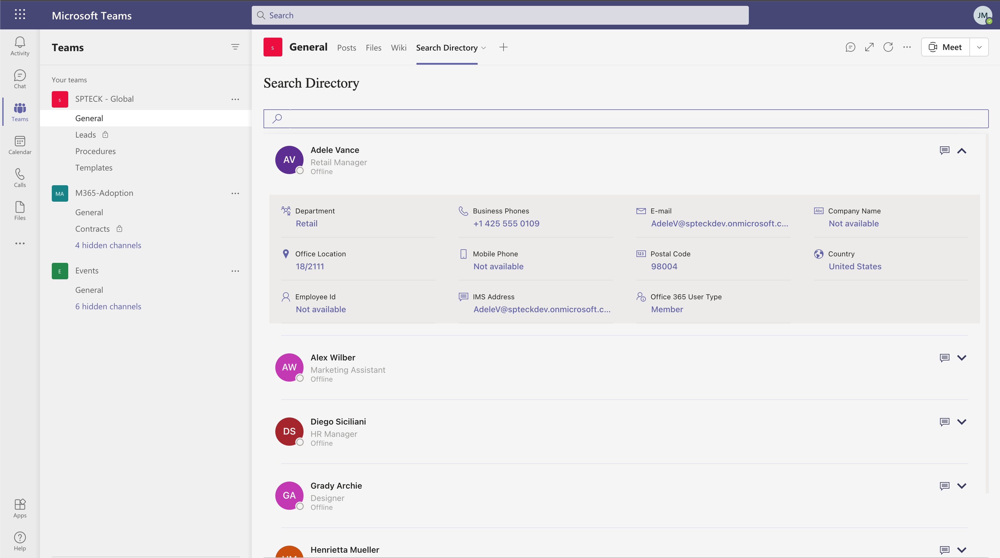
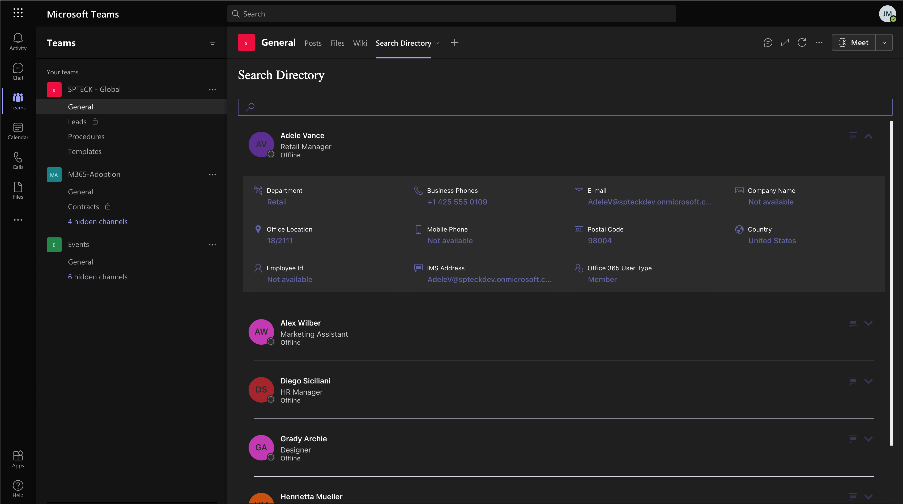

# Staff Directory (Search Directory)

## Summary

This web part shows the current user's colleagues, and allows the user to search AD directory, The user can configure the properties to show when expand the user card.

## Compatibility

 

-Incompatible-red.svg "SharePoint Server 2016 Feature Pack 2 requires SPFx 1.1")

## Applies to

* [SharePoint Framework](https://learn.microsoft.com/sharepoint/dev/spfx/sharepoint-framework-overview)
* [Microsoft 365 tenant](https://learn.microsoft.com/sharepoint/dev/spfx/set-up-your-development-environment)

## Solution

Solution|Author(s)
--------|---------
react-staffdirectory|[Ari Gunawan](https://github.com/AriGunawan) ([@arigunawan3023](https://twitter.com/arigunawan3023))
react-staffdirectory|[João Mendes](https://github.com/joaojmendes) ([joaojmendes](https://github.com/joaojmendes))
react-staffdirectory|[Tristian O'brien](https://github.com/tristian2)
react-staffdirectory|[Milan Holemans](https://github.com/milanholemans)

## Version history

Version|Date|Comments
-------|----|--------
1.0.0|February 16, 2021|Initial release
1.0.1|March 28, 2021|Added missing Graph API Permission (User.Read.All) for getting users information
1.0.2|April 14, 2021|Added About Me and Skills 
1.0.3|June 16, 2022|Upgraded project to SPFx v1.14.0

## Minimal Path to Awesome

Please follow all the steps:

>  This sample can also be opened with [VS Code Remote Development](https://code.visualstudio.com/docs/remote/remote-overview). Visit https://aka.ms/spfx-devcontainer for further instructions.

- Clone this repository (or [download this solution as a .ZIP file](https://pnp.github.io/download-partial/?url=https://github.com/pnp/sp-dev-fx-webparts/tree/main/samples/react-staffdirectory) then unzip it)
- From your command line, change your current directory to the directory containing this sample (`react-staffdirectory`, located under `samples`)
- in the command line run:
  - `npm install`
  - `gulp build`
  - `gulp bundle --ship`
  - `gulp package-solution --ship`
- Add and deploy package to your tenant's App Catalog
- Go to **API Access** - from **SharePoint Admin Center** new experience, and **Approve** the permission to use Microsoft Graph scopes **Presence.Read.All** and **User.Read.All**

## Help

We do not support samples, but this community is always willing to help, and we want to improve these samples. We use GitHub to track issues, which makes it easy for  community members to volunteer their time and help resolve issues.

If you're having issues building the solution, please run [spfx doctor](https://pnp.github.io/cli-microsoft365/cmd/spfx/spfx-doctor/) from within the solution folder to diagnose incompatibility issues with your environment.

You can try looking at [issues related to this sample](https://github.com/pnp/sp-dev-fx-webparts/issues?q=label%3A%22sample%3A%20react-staffdirectory%22) to see if anybody else is having the same issues.

You can also try looking at [discussions related to this sample](https://github.com/pnp/sp-dev-fx-webparts/discussions?discussions_q=react-staffdirectory) and see what the community is saying.

If you encounter any issues using this sample, [create a new issue](https://github.com/pnp/sp-dev-fx-webparts/issues/new?assignees=&labels=Needs%3A+Triage+%3Amag%3A%2Ctype%3Abug-suspected%2Csample%3A%20react-staffdirectory&template=bug-report.yml&sample=react-staffdirectory&authors=@AriGunawan%20@joaojmendes%20@tristian2%20@milanholemans&title=react-staffdirectory%20-%20).

For questions regarding this sample, [create a new question](https://github.com/pnp/sp-dev-fx-webparts/issues/new?assignees=&labels=Needs%3A+Triage+%3Amag%3A%2Ctype%3Aquestion%2Csample%3A%20react-staffdirectory&template=question.yml&sample=react-staffdirectory&authors=@AriGunawan%20@joaojmendes%20@tristian2%20@milanholemans&title=react-staffdirectory%20-%20).

Finally, if you have an idea for improvement, [make a suggestion](https://github.com/pnp/sp-dev-fx-webparts/issues/new?assignees=&labels=Needs%3A+Triage+%3Amag%3A%2Ctype%3Aenhancement%2Csample%3A%20react-staffdirectory&template=suggestion.yml&sample=react-staffdirectory&authors=@AriGunawan%20@joaojmendes%20@tristian2%20@milanholemans&title=react-staffdirectory%20-%20).

## Disclaimer

**THIS CODE IS PROVIDED *AS IS* WITHOUT WARRANTY OF ANY KIND, EITHER EXPRESS OR IMPLIED, INCLUDING ANY IMPLIED WARRANTIES OF FITNESS FOR A PARTICULAR PURPOSE, MERCHANTABILITY, OR NON-INFRINGEMENT.**

