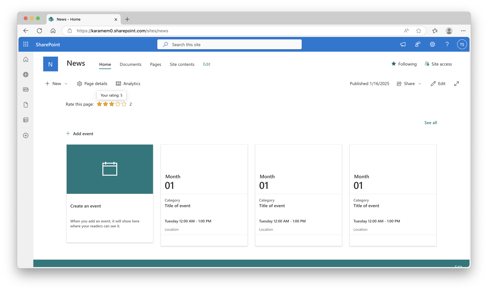

# Star Ratings

## Summary

This web part demonstrates *Star Ratings* capablities to SharePoint News. The "Ratings" site collection feature provides *Likes* and *Star Ratings*, but SharePoint News provides only provides *Likes*. This web part can get or set ratings of the current page.



## Compatibility


 


-Incompatible-red.svg "SharePoint Server 2016 Feature Pack 2 requires SPFx 1.1")


## Prerequisites

1. Enable the "Ratings" feature of the site collection. The feature GUID is `915c240e-a6cc-49b8-8b2c-0bff8b553ed3`.

```
Enable-PnPFeature -Identity 915c240e-a6cc-49b8-8b2c-0bff8b553ed3
```

2. Update "Rating settings".

    - Select **⚙** - **Site contents**.
    - Select **Site Pages** - **︙** - **Settings**.
    - Select **Rating settings**.
    - Update values.
        - **Rating Settings**: Select **Yes**
        - **Which voting/rating experience you would like to enable for this list?**: Select **Star Ratings**

## Solution

Solution|Author(s)
--------|---------
react-star-ratings|[Takashi Shinohara](https://github.com/karamem0) ([@karamem0](https://twitter.com/karamem0))

## Version history

Version|Date|Comments
-------|----|--------
1.1|January 12, 2022|Updated to retrieve values from API
1.0|October 7, 2021|Initial release

## Help

We do not support samples, but we this community is always willing to help, and we want to improve these samples. We use GitHub to track issues, which makes it easy for  community members to volunteer their time and help resolve issues.

If you're having issues building the solution, please run [spfx doctor](https://pnp.github.io/cli-microsoft365/cmd/spfx/spfx-doctor/) from within the solution folder to diagnose incompatibility issues with your environment.

If you encounter any issues while using this sample, [create a new issue](https://github.com/pnp/sp-dev-fx-webparts/issues/new?assignees=&labels=Needs%3A+Triage+%3Amag%3A%2Ctype%3Abug-suspected%2Csample%3A%20react-star-ratings&template=bug-report.yml&sample=react-star-ratings&authors=@karamem0&title=react-star-ratings%20-%20).

For questions regarding this sample, [create a new question](https://github.com/pnp/sp-dev-fx-webparts/issues/new?assignees=&labels=Needs%3A+Triage+%3Amag%3A%2Ctype%3Aquestion%2Csample%3A%20react-star-ratings&template=question.yml&sample=react-star-ratings&authors=@karamem0&title=react-star-ratings%20-%20).

Finally, if you have an idea for improvement, [make a suggestion](https://github.com/pnp/sp-dev-fx-webparts/issues/new?assignees=&labels=Needs%3A+Triage+%3Amag%3A%2Ctype%3Aenhancement%2Csample%3A%20react-star-ratings&template=question.yml&sample=react-star-ratings&authors=@karamem0&title=react-star-ratings%20-%20).

## Disclaimer

**THIS CODE IS PROVIDED *AS IS* WITHOUT WARRANTY OF ANY KIND, EITHER EXPRESS OR IMPLIED, INCLUDING ANY IMPLIED WARRANTIES OF FITNESS FOR A PARTICULAR PURPOSE, MERCHANTABILITY, OR NON-INFRINGEMENT.**


