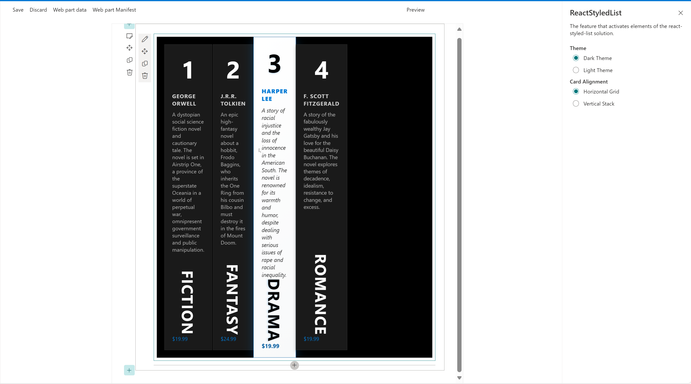

# Styled List

## Summary

This SharePoint web part displays items from a SharePoint list in a modern, responsive, and styled grid layout. 

## Prerequisites

  Use can use the [Powershell script](./Script/SampleList.ps1) to provision the list.

## Compatibility

| :warning: Important          |
|:---------------------------|
| Every SPFx version is only compatible with specific version(s) of Node.js. In order to be able to build this sample, please ensure that the version of Node on your workstation matches one of the versions listed in this section. This sample will not work on a different version of Node.|
|Refer to <https://aka.ms/spfx-matrix> for more information on SPFx compatibility.   |

-Incompatible-red.svg "SharePoint Server 2016 Feature Pack 2 requires SPFx 1.1")

## Applies to

- [SharePoint Framework Developer Preview](https://learn.microsoft.com/sharepoint/dev/spfx/sharepoint-framework-overview)
- [Office 365 developer tenant](https://learn.microsoft.com/sharepoint/dev/spfx/set-up-your-developer-tenant)

## Contributors

- [Sudeep Ghatak](https://github.com/sudeepghatak)

## Version history

|Version|Date|Comments|
|-------|----|--------|
|1.0|August 23, 2025|Initial release|

## Minimal Path to Awesome

### Build and Test

> This sample can also be opened with [VS Code Remote Development](https://code.visualstudio.com/docs/remote/remote-overview). Visit <https://aka.ms/spfx-devcontainer> for further instructions.

1. Clone this repo
1. In the command line run
    - `npm i`
    - `gulp build`
    - `gulp serve --nobrowser`
1. Create a custom list (e.g. Bookmarks)
1. Navigate to the hosted version of SharePoint workbench, e.g. **https://\<tenant>.sharepoint.com/sites/\<your site>/_layouts/15/workbench.aspx**
1. Add the Web Part to the canvas and configure it.

### Features

- Displays SharePoint list items in a modern, styled grid
- Responsive and theme-aware UI
- Card-based layout
- Supports horizontal and vertical alignment

## References

- [Getting started with SharePoint Framework](https://docs.microsoft.com/en-us/sharepoint/dev/spfx/set-up-your-developer-tenant)
- [Building for Microsoft teams](https://docs.microsoft.com/en-us/sharepoint/dev/spfx/build-for-teams-overview)
- [Use Microsoft Graph in your solution](https://docs.microsoft.com/en-us/sharepoint/dev/spfx/web-parts/get-started/using-microsoft-graph-apis)
- [Publish SharePoint Framework applications to the Marketplace](https://docs.microsoft.com/en-us/sharepoint/dev/spfx/publish-to-marketplace-overview)
- [Microsoft 365 Patterns and Practices](https://aka.ms/m365pnp) - Guidance, tooling, samples and open-source controls for your Microsoft 365 development

## Disclaimer

**THIS CODE IS PROVIDED *AS IS* WITHOUT WARRANTY OF ANY KIND, EITHER EXPRESS OR IMPLIED, INCLUDING ANY IMPLIED WARRANTIES OF FITNESS FOR A PARTICULAR PURPOSE, MERCHANTABILITY, OR NON-INFRINGEMENT.**

