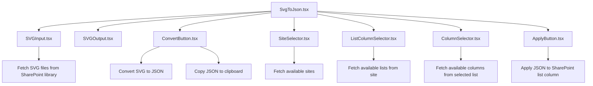

# SVG to JSON Converter

## Summary

This web part allows users to read SVGs from a SharePoint library, select one of them and have the code converted into a JSON format that is ready to be used in a SharePoint List in advanced formatting. Users can both copy the JSON format to their clipboard (for further manipulation) or select a site, a list, and a column and then directly apply the format to this column.

For usage in SharePoint, the Property Pane is used to define the Site URL and the library Name where the SVGs come from, for usage in Microsoft Teams there is a basic form to save the configuration.

Web Part works in both English and German and can easily be extended to work in more languages.

## Overview of the Web Part

This Web Part is designed to allow users to select an SVG file from a SharePoint library, convert it to JSON format, and apply that JSON format to a SharePoint List column. The Web Part is built using React and leverages the PnPjs library.

## Key Components

* `SvgToJson.tsx`: This is the main component of the web part. It orchestrates the overall functionality by integrating other components like `SVGInput`, `SVGOutput`, `ConvertButton`, `ApplyButton`, and `ListColumnSelector`.

* `SVGInput.tsx`: This component is responsible for fetching and displaying the list of SVG files from the specified SharePoint library. It uses a dropdown to allow users to select an SVG file.
* `SVGOutput.tsx`: This component displays the content of the selected SVG file. It provides a visual preview of the SVG.
* `ConvertButton.tsx`: This component provides a button to convert the selected SVG content to JSON format. It also copies the JSON to the clipboard.
* `SiteSelector.tsx`: This component allows users to select a SharePoint Site. It fetches all Site Collections in the tenant.
* `ListSelector.tsx`: This component allows users to select a SharePoint List. It fetches the available lists from the specified site.
* `ColumnSelector.tsx`: This component allows users to select a Column. It fetches the available columns from the specified site.
* `ApplyButton.tsx`: This component provides a button to apply the JSON format to the specified SharePoint List column. It handles the logic for updating the column formatting.

## Example Workflow

* Select Site and Library: The user selects a **SharePoint Site** and **library** from which to fetch SVG files.
* Select SVG File: The user selects an **SVG file** from the dropdown in the SVGInput component.
* Display SVG Content: The selected SVG content is displayed in the SVGOutput component.
* Convert SVG to JSON: The user selects the **ConvertButton** to convert the SVG content to JSON format. The JSON is copied to the clipboard.
* Select List and Column: The user selects a **SharePoint List** and **column** using the ListColumnSelector component.
* Apply JSON Format: The user selects the **ApplyButton** to apply the JSON format to the selected column.

## Conclusion

This web part provides a user-friendly interface for selecting, converting, and applying SVG files to SharePoint list columns. It leverages React for the UI and PnPjs for SharePoint operations, to ensure a seamless integration with SharePoint. By breaking down the functionality into modular components, the web part is easy to maintain and extend.

If you want to read more about this Web Part, [this blog post series is for you](https://m365princess.com/blogs/spfx-1)

## Compatibility

| :warning: Important          |
|:---------------------------|
| Every SPFx version is optimally compatible with specific versions of Node.js. In order to be able to build this sample, you need to ensure that the version of Node on your workstation matches one of the versions listed in this section. This sample will not work on a different version of Node.|
|Refer to <https://aka.ms/spfx-matrix> for more information on SPFx compatibility.   |

This sample is optimally compatible with the following environment configuration:

-Incompatible-red.svg "SharePoint Server 2016 Feature Pack 2 requires SPFx 1.1")

## Applies to

- [SharePoint Framework](https://aka.ms/spfx)
- [Microsoft 365 tenant](https://docs.microsoft.com/sharepoint/dev/spfx/set-up-your-developer-tenant)

> Get your own free development tenant by subscribing to [Microsoft 365 developer program](http://aka.ms/o365devprogram)

## Prerequisites

In the property pane, you can enter a SharePoint Site URL and a library name on that SharePoint Site where SVGs can be selected from.

## Contributors

- [Luise Freese](https://github.com/LuiseFreese)

## Version history

| Version | Date             | Comments        |
| ------- | ---------------- | --------------- |
| 1.0     | November 1, 2024 | Initial release |

* Clone this repository (or [download this solution as a .ZIP file](https://pnp.github.io/download-partial/?url=https://github.com/pnp/sp-dev-fx-webparts/tree/main/samples/react-svg-to-json-converter) then unzip it)
* From your command line, change your current directory to the directory containing this sample (`react-svg-to-json-converter`, located under `samples`)
* in the command line run:
  * `npm install`
  * `gulp serve`

> This sample can also be opened with [VS Code Remote Development](https://code.visualstudio.com/docs/remote/remote-overview). Visit <https://aka.ms/spfx-devcontainer> for further instructions.

## References

- [Getting started with SharePoint Framework](https://docs.microsoft.com/en-us/sharepoint/dev/spfx/set-up-your-developer-tenant)
- [Building for Microsoft teams](https://docs.microsoft.com/en-us/sharepoint/dev/spfx/build-for-teams-overview)
- [Use Microsoft Graph in your solution](https://docs.microsoft.com/en-us/sharepoint/dev/spfx/web-parts/get-started/using-microsoft-graph-apis)
- [Publish SharePoint Framework applications to the Marketplace](https://docs.microsoft.com/en-us/sharepoint/dev/spfx/publish-to-marketplace-overview)
- [Microsoft 365 Patterns and Practices](https://aka.ms/m365pnp) - Guidance, tooling, samples and open-source controls for your Microsoft 365 development

## Help

We do not support samples, but this community is always willing to help, and we want to improve these samples. We use GitHub to track issues, which makes it easy for  community members to volunteer their time and help resolve issues.

If you're having issues building the solution, please run [spfx doctor](https://pnp.github.io/cli-microsoft365/cmd/spfx/spfx-doctor/) from within the solution folder to diagnose incompatibility issues with your environment.

You can try looking at [issues related to this sample](https://github.com/pnp/sp-dev-fx-webparts/issues?q=label%3A%22sample%3A%20react-svg-to-json-converter%22) to see if anybody else is having the same issues.

You can also try looking at [discussions related to this sample](https://github.com/pnp/sp-dev-fx-webparts/discussions?discussions_q=react-svg-to-json-converter) and see what the community is saying.

If you encounter any issues using this sample, [create a new issue](https://github.com/pnp/sp-dev-fx-webparts/issues/new?assignees=&labels=Needs%3A+Triage+%3Amag%3A%2Ctype%3Abug-suspected%2Csample%3A%20react-svg-to-json-converter&template=bug-report.yml&sample=react-svg-to-json-converter&authors=@LuiseFreese&title=react-svg-to-json-converter%20-%20).

For questions regarding this sample, [create a new question](https://github.com/pnp/sp-dev-fx-webparts/issues/new?assignees=&labels=Needs%3A+Triage+%3Amag%3A%2Ctype%3Aquestion%2Csample%3A%20react-svg-to-json-converter&template=question.yml&sample=react-svg-to-json-converter&authors=@LuiseFreese&title=react-svg-to-json-converter%20-%20).

Finally, if you have an idea for improvement, [make a suggestion](https://github.com/pnp/sp-dev-fx-webparts/issues/new?assignees=&labels=Needs%3A+Triage+%3Amag%3A%2Ctype%3Aenhancement%2Csample%3A%20react-svg-to-json-converter&template=suggestion.yml&sample=react-svg-to-json-converter&authors=@LuiseFreese&title=react-svg-to-json-converter%20-%20).

## Disclaimer

**THIS CODE IS PROVIDED *AS IS* WITHOUT WARRANTY OF ANY KIND, EITHER EXPRESS OR IMPLIED, INCLUDING ANY IMPLIED WARRANTIES OF FITNESS FOR A PARTICULAR PURPOSE, MERCHANTABILITY, OR NON-INFRINGEMENT.**

