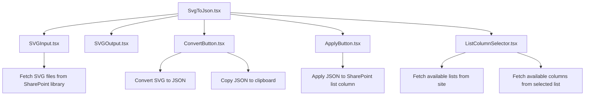
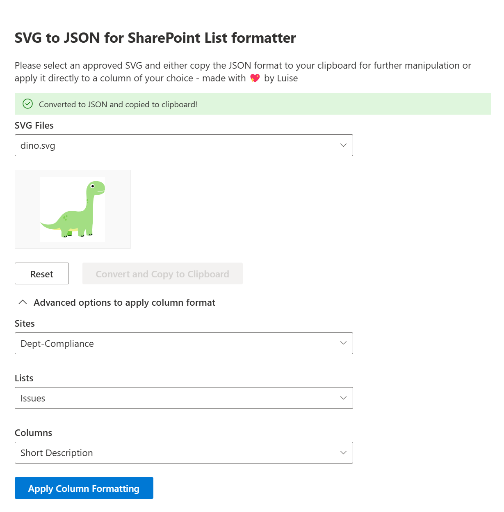

# svg-converter-solution

## Summary

This web part allows users to read SVGs from a SharePoint library, select one of them and have the code converted into a JSON format that is ready to be used in a SharePoint List in advanced formatting. Users can both copy the JSON format to their clipboard (for further manipulation) or select a site, a list, and a column and then directly apply the format to this column.

For usage in SharePoint, the Property Pane is used to define the Site URL and the library Name where the SVGs come from, for usage in Microsoft Teams there is a basic form to save the configuration.

## Overview of the Web Part

This Web Part is designed to allow users to select an SVG file from a SharePoint library, convert it to JSON format, and apply that JSON format to a SharePoint List column. The Web Part is built using React and leverages the PnPjs library.

## Key Components

* SvgToJson.tsx: This is the main component of the web part. It orchestrates the overall functionality by integrating other components like SVGInput, SVGOutput, ConvertButton, ApplyButton, and ListColumnSelector.

* SVGInput.tsx: This component is responsible for fetching and displaying the list of SVG files from the specified SharePoint library. It uses a dropdown to allow users to select an SVG file.

* SVGOutput.tsx: This component displays the content of the selected SVG file. It provides a visual preview of the SVG.

* ConvertButton.tsx: This component provides a button to convert the selected SVG content to JSON format. It also copies the JSON to the clipboard.

* ApplyButton.tsx: This component provides a button to apply the JSON format to a specified SharePoint List column. It handles the logic for updating the column formatting.

* ListColumnSelector.tsx: This component allows users to select a SharePoint List and a column within that list. It fetches the available lists and columns from the specified site.

## Example Workflow

* Select Site and Library: The user selects a **SharePoint Site** and **library** from which to fetch SVG files.
* Select SVG File: The user selects an **SVG file** from the dropdown in the SVGInput component.
* Display SVG Content: The selected SVG content is displayed in the SVGOutput component.
* Convert SVG to JSON: The user selects the **ConvertButton** to convert the SVG content to JSON format. The JSON is copied to the clipboard.
* Select List and Column: The user selects a **SharePoint List** and **column** using the ListColumnSelector component.
* Apply JSON Format: The user selects the **ApplyButton** to apply the JSON format to the selected column.

## Conclusion

This web part provides a user-friendly interface for selecting, converting, and applying SVG files to SharePoint list columns. It leverages React for the UI and PnPjs for SharePoint operations, to ensure a seamless integration with SharePoint. By breaking down the functionality into modular components, the web part is easy to maintain and extend.

If you want to read more about this Web Part, [this blog post series is for you](https://m365princess.com/blogs/spfx-1)

## Used SharePoint Framework Version

## Applies to

- [SharePoint Framework](https://aka.ms/spfx)
- [Microsoft 365 tenant](https://docs.microsoft.com/sharepoint/dev/spfx/set-up-your-developer-tenant)

> Get your own free development tenant by subscribing to [Microsoft 365 developer program](http://aka.ms/o365devprogram)

## Prerequisites

In the property pane, you can enter a SharePoint Site URL and a library name on that SharePoint Site where SVGs can be selected from.

## Solution

| Solution    | Author(s)                                               |
| ----------- | ------------------------------------------------------- |
| react-svg-to-json-converter | [Luise Freese](https://github.com/LuiseFreese) | @LuiseFreese |

## Version history

| Version | Date             | Comments        |
| ------- | ---------------- | --------------- |
| 1.0     | October 16 | Initial release |

## Disclaimer

**THIS CODE IS PROVIDED _AS IS_ WITHOUT WARRANTY OF ANY KIND, EITHER EXPRESS OR IMPLIED, INCLUDING ANY IMPLIED WARRANTIES OF FITNESS FOR A PARTICULAR PURPOSE, MERCHANTABILITY, OR NON-INFRINGEMENT.**

---

## Minimal Path to Awesome

- Clone this repository
- Ensure that you are at the solution folder
- in the command-line run:
  - **npm install**
  - **gulp serve**

> Include any additional steps as needed.

## Features

1. Reads SVGs from a Sharepoint Document Library and displays their name in a dropdown
2. Allows users to select an SVG, the SVG code will now be visible in an output box
3. Allows users to convert this SVG code to a JSON format that is accepted by a SharePoint List column.

## References

- [Getting started with SharePoint Framework](https://docs.microsoft.com/en-us/sharepoint/dev/spfx/set-up-your-developer-tenant)
- [Building for Microsoft teams](https://docs.microsoft.com/en-us/sharepoint/dev/spfx/build-for-teams-overview)
- [Use Microsoft Graph in your solution](https://docs.microsoft.com/en-us/sharepoint/dev/spfx/web-parts/get-started/using-microsoft-graph-apis)
- [Publish SharePoint Framework applications to the Marketplace](https://docs.microsoft.com/en-us/sharepoint/dev/spfx/publish-to-marketplace-overview)
- [Microsoft 365 Patterns and Practices](https://aka.ms/m365pnp) - Guidance, tooling, samples and open-source controls for your Microsoft 365 development
