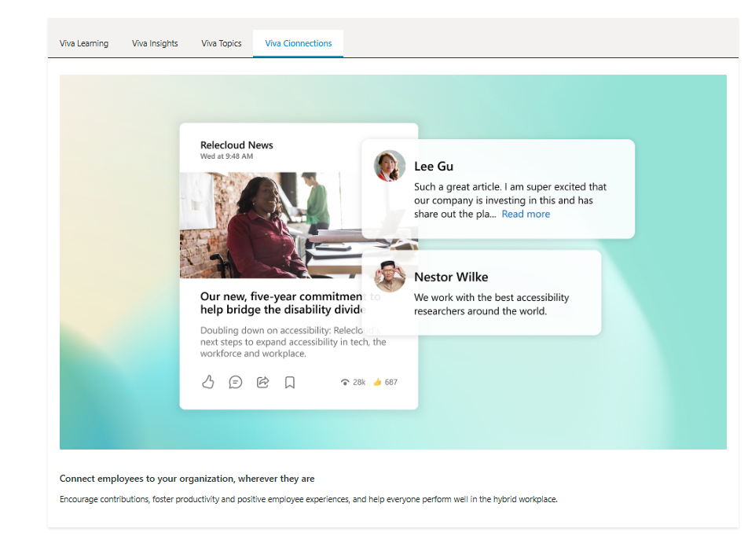
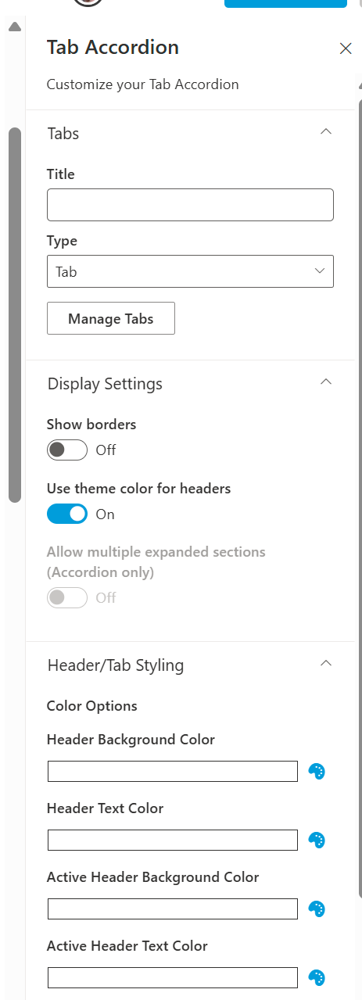
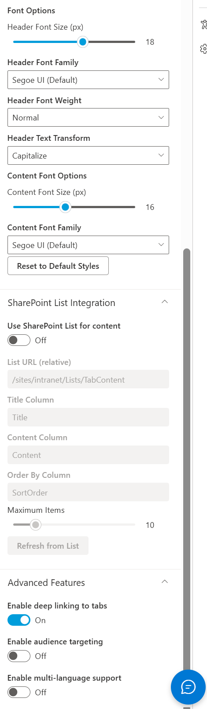
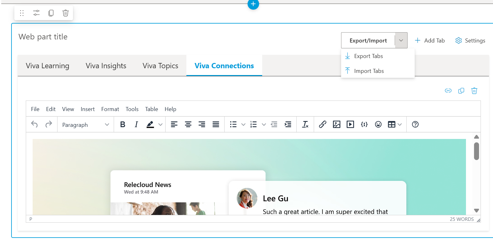

# Tab Accordion Web Part with Modern Features

## Summary

- This Web Part allows users to create content in Tab or Accordion format with rich editing capabilities.
- Built on modern SPFx 1.20+ and Fluent UI React components for seamless SharePoint integration.
- Responsive design automatically switches to Accordion view on mobile devices.
- Extensive personalization options including audience targeting and multi-language support.
- Deep linking capabilities for easy sharing of specific tabs.
- Comprehensive styling options for complete visual customization.

## Compatibility

## Features

This enhanced web part includes the following features:

### Core Functionality
- **Tab/Accordion Toggle**: Display content in either Tab or Accordion format
- **Mobile Responsive**: Automatically switches to Accordion view on mobile devices
- **Rich Text Editing**: Advanced TinyMCE editor with enhanced media support
- **Theme Integration**: Automatically adapts to SharePoint themes

### Content Management
- **Import/Export**: Backup and restore tab configurations as JSON
- **Tab Duplication**: Easily duplicate tabs with a single click
- **Drag & Drop Reordering**: Intuitive drag-and-drop interface for tab management
- **SharePoint List Integration**: Pull tab content directly from SharePoint lists

### Advanced Features
- **Deep Linking**: Direct links to specific tabs via URL parameters
- **Microsoft Graph Integration**: Personalization using Microsoft Graph data
- **Audience Targeting**: Show different tabs to different user groups
- **Multi-language Support**: Display content in the user's preferred language

### Enhanced Styling Options
- **Color Customization**: Customize header background and text colors
- **Active State Styling**: Define unique styles for active tabs/accordion items
- **Typography Control**: Customize font family, size, weight, and text transforms
- **Content Typography**: Apply consistent typography settings to content areas
- **Theme Override**: Choose between SharePoint theme colors or custom colors
- **Border Control**: Toggle borders on and off for different visual styles

### Enhanced Media Support
- **Improved Embeds**: Better support for video, audio, and other media
- **SharePoint Content Integration**: Embed document libraries and list views
- **Templates**: Pre-defined content templates for common scenarios
- **Consistent Font Rendering**: Typography settings apply to content editor

## Applies to

- [SharePoint Framework](https://aka.ms/spfx)
- [Microsoft 365 tenant](https://learn.microsoft.com/sharepoint/dev/spfx/set-up-your-developer-tenant)

> Get your own free development tenant by subscribing to [Microsoft 365 developer program](https://aka.ms/m365/devprogram)

## Prerequisites

- SharePoint Online tenant
- Permission to deploy SPFx solutions
- For Microsoft Graph features: Admin approval for required API permissions

## Solution

Solution|Author(s)
--------|---------
react-tabaccordion | [Nicolas Kheirallah](https://github.com/arunkumarperumal)
react-tabaccordion | [Arun Kumar Perumal](https://github.com/arunkumarperumal)

## Version history

Version|Date|Comments
-------|----|--------
1.0|March 30, 2022|Initial release
2.0|March 2025|Major update with modern SPFx, Fluent UI, and advanced features
2.1|March 2025|Added comprehensive styling and typography controls

## Minimal path to awesome

- Clone this repository
- In the command-line run:
  - `npm install`
  - `gulp serve`

For Microsoft Graph features:
- Add the solution to the SharePoint App Catalog
- Approve the requested API permissions in SharePoint Admin Center

## Features

### Core Features
- Create and manage tabs with rich content using tinymce
- Toggle between Tab and Accordion display modes
- Seamless SharePoint theme integration
- Mobile-responsive design

### Content Import/Export

- Export all tabs to a JSON file for backup or sharing
- Import tabs from JSON files
- Validation to ensure proper data structure

### Tab Reordering and Duplication
- Drag and drop tabs to reorder
- Duplicate tabs with a single click
- Remove tabs with confirmation

### SharePoint List Integration
- Pull tab content directly from SharePoint lists
- Configure list URL, columns, and sort order
- Refresh from list with a single click

### Enhanced Styling Options
- Customize header and active state colors
- Control typography with font family, size, weight options
- Text transformation options (uppercase, lowercase, capitalize)
- Content area font customization for consistent reading experience
- Style reset option to quickly return to defaults

### Typography Controls
- Font family selection with web-safe font options
- Font size control for headers and content
- Font weight options from light to extra bold
- Text transformation for creative styling
- Consistent typography applied to TinyMCE editor

### Enhanced Media Support
- Improved support for video and audio content
- Custom SharePoint content embedding
- Pre-defined content templates

### Deep Linking
- Direct links to specific tabs
- Copy link functionality for easy sharing
- Browser history management

### Microsoft Graph Integration & Audience Targeting
- Target tabs to specific Microsoft 365 groups
- Visual indicators for audience targeting
- Integration with Microsoft Graph

### Multi-language Support
- Content in multiple languages
- Automatic language detection
- Language selector for manual switching

## Configuration

### Basic Configuration
1. Add the web part to a page
2. Set the title and display mode (Tab/Accordion)
3. Add tabs with titles and content using the rich text editor

### Visual Customization
1. Navigate to the "Header/Tab Styling" section in properties
2. Set custom colors for headers and active states
3. Select font family, size, weight, and text transformation
4. Configure content typography for a consistent reading experience
5. Use the reset button to return to default styling if needed

### SharePoint List Integration
1. Enable "Use SharePoint List for content"
2. Enter the list URL (relative to site)
3. Configure column mappings for title and content
4. Click "Refresh from List" to load content

### Microsoft Graph Features
1. Add the solution to the App Catalog
2. Approve the requested Graph API permissions in SharePoint Admin Center
3. Enable audience targeting in the web part properties
4. Configure audience targets for individual tabs

### Multi-language Support
1. Enable multi-language support in the web part properties
2. Add languages using the language selector
3. Enter content for each language
4. Users can switch languages using the language selector

## Help

We do not support samples, but this community is always willing to help, and we want to improve these samples. We use GitHub to track issues, which makes it easy for community members to volunteer their time and help resolve issues.

You can try looking at [issues related to this sample](https://github.com/pnp/sp-dev-fx-webparts/issues?q=label%3A%22sample%3A%20react-tabaccordion%22) to see if anybody else is having the same issues.

You can also try looking at [discussions related to this sample](https://github.com/pnp/sp-dev-fx-webparts/discussions?discussions_q=react-tabaccordion) and see what the community is saying.

If you encounter any issues while using this sample, [create a new issue](https://github.com/pnp/sp-dev-fx-webparts/issues/new?assignees=&labels=Needs%3A+Triage+%3Amag%3A%2Ctype%3Abug-suspected%2Csample%3A%20react-tabaccordion&template=bug-report.yml&sample=react-tabaccordion&authors=@arunkumarperumal&title=react-tabaccordion%20-%20).

For questions regarding this sample, [create a new question](https://github.com/pnp/sp-dev-fx-webparts/issues/new?assignees=&labels=Needs%3A+Triage+%3Amag%3A%2Ctype%3Aquestion%2Csample%3A%20react-tabaccordion&template=question.yml&sample=react-tabaccordion&authors=@arunkumarperumal&title=react-tabaccordion%20-%20).

Finally, if you have an idea for improvement, [make a suggestion](https://github.com/pnp/sp-dev-fx-webparts/issues/new?assignees=&labels=Needs%3A+Triage+%3Amag%3A%2Ctype%3Aenhancement%2Csample%3A%20react-tabaccordion&template=suggestion.yml&sample=react-tabaccordion&authors=@arunkumarperumal&title=react-tabaccordion%20-%20).

## Disclaimer

**THIS CODE IS PROVIDED *AS IS* WITHOUT WARRANTY OF ANY KIND, EITHER EXPRESS OR IMPLIED, INCLUDING ANY IMPLIED WARRANTIES OF FITNESS FOR A PARTICULAR PURPOSE, MERCHANTABILITY, OR NON-INFRINGEMENT.**

