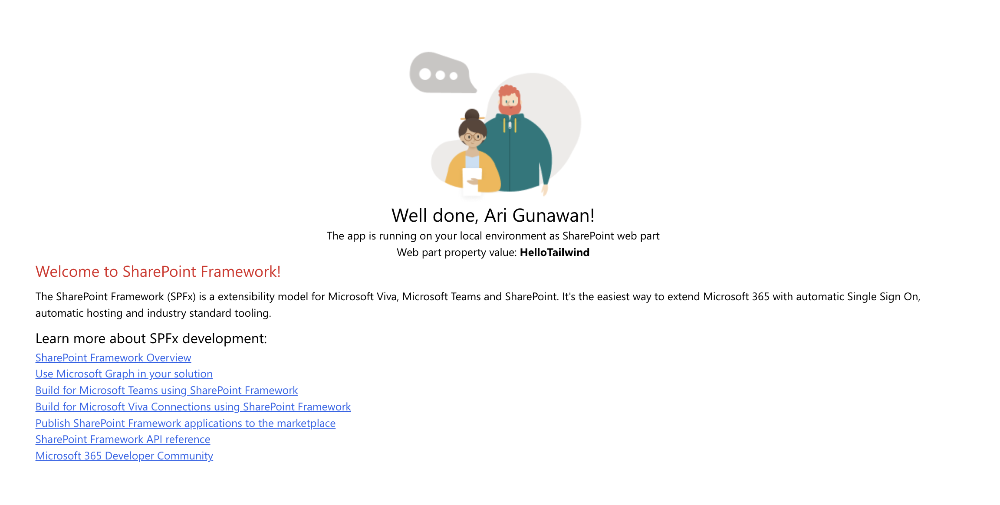
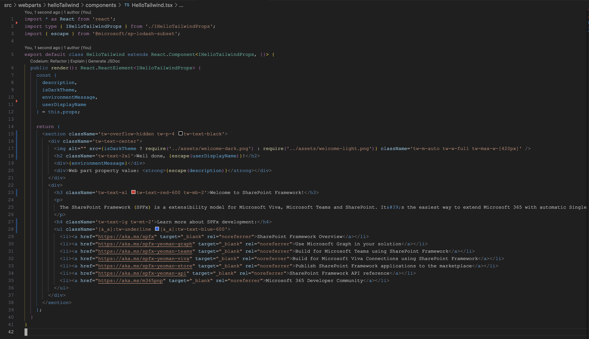

# Tailwind 3

## Summary

This project showcases an integration of Tailwind CSS into an SPFx project. It offers a sample implementation, facilitating straightforward setup and utilization of Tailwind CSS for enhanced styling and design in SharePoint Framework projects.

Here is an illustration of the styling outcome achieved with Tailwind, along with the corresponding code.

To setup Tailwind on your existing project, proceed with the following steps:

1. Execute the following commands:
   - `npm i -D react-tailwindcss postcss autoprefixer gulp-postcss`
   - `npx react-tailwindcss init`
2. Add the following files:
   - /assets/tailwind.css
   - postcss.config.js
   - tailwind.config.js
3. Update the following files:
   - gulpfile.js
      - Check the changes in this project
   - entry/main component file (e.g. /src/webparts/HelloTailwind/HelloTailwindWebPart.ts)
      - Add `import '../../../assets/dist/tailwind.css`

## Compatibility

| :warning: Important          |
|:---------------------------|
| Every SPFx version is optimally compatible with specific versions of Node.js. In order to be able to build this sample, you need to ensure that the version of Node on your workstation matches one of the versions listed in this section. This sample will not work on a different version of Node.|
|Refer to <https://aka.ms/spfx-matrix> for more information on SPFx compatibility.   |

This sample is optimally compatible with the following environment configuration:

## Applies to

- [SharePoint Framework](https://learn.microsoft.com/sharepoint/dev/spfx/sharepoint-framework-overview)
- [Microsoft 365 tenant](https://learn.microsoft.com/sharepoint/dev/spfx/set-up-your-development-environment)

> Get your own free development tenant by subscribing to [Microsoft 365 developer program](https://aka.ms/m365devprogram)

## Contributors

- [Ari Gunawan](https://github.com/AriGunawan)

## Version history

Version|Date|Comments
-------|----|--------
1.0|October 7, 2023|Initial release

## Minimal path to awesome

- Clone this repository (or [download this solution as a .ZIP file](https://pnp.github.io/download-partial/?url=https://github.com/pnp/sp-dev-fx-webparts/tree/main/samples/react-tailwindcss3) then unzip it)
- From your command line, change your current directory to the directory containing this sample (`react-tailwindcss3`, located under `samples`)
- in the command line run:
  - `npm install`
  - `gulp serve`

> This sample can also be opened with [VS Code Remote Development](https://code.visualstudio.com/docs/remote/remote-overview). Visit <https://aka.ms/spfx-devcontainer> for further instructions.

## Help

We do not support samples, but this community is always willing to help, and we want to improve these samples. We use GitHub to track issues, which makes it easy for  community members to volunteer their time and help resolve issues.

If you're having issues building the solution, please run [spfx doctor](https://pnp.github.io/cli-microsoft365/cmd/spfx/spfx-doctor/) from within the solution folder to diagnose incompatibility issues with your environment.

You can try looking at [issues related to this sample](https://github.com/pnp/sp-dev-fx-webparts/issues?q=label%3A%22sample%3A%20react-tailwindcss3%22) to see if anybody else is having the same issues.

You can also try looking at [discussions related to this sample](https://github.com/pnp/sp-dev-fx-webparts/discussions?discussions_q=react-tailwindcss3) and see what the community is saying.

If you encounter any issues using this sample, [create a new issue](https://github.com/pnp/sp-dev-fx-webparts/issues/new?assignees=&labels=Needs%3A+Triage+%3Amag%3A%2Ctype%3Abug-suspected%2Csample%3A%20react-tailwindcss3&template=bug-report.yml&sample=react-tailwindcss3&authors=@AriGunawan&title=react-tailwindcss3%20-%20).

For questions regarding this sample, [create a new question](https://github.com/pnp/sp-dev-fx-webparts/issues/new?assignees=&labels=Needs%3A+Triage+%3Amag%3A%2Ctype%3Aquestion%2Csample%3A%20react-tailwindcss3&template=question.yml&sample=react-tailwindcss3&authors=@AriGunawan&title=react-tailwindcss3%20-%20).

Finally, if you have an idea for improvement, [make a suggestion](https://github.com/pnp/sp-dev-fx-webparts/issues/new?assignees=&labels=Needs%3A+Triage+%3Amag%3A%2Ctype%3Aenhancement%2Csample%3A%20react-tailwindcss3&template=suggestion.yml&sample=react-tailwindcss3&authors=@AriGunawan&title=react-tailwindcss3%20-%20).

## Disclaimer

**THIS CODE IS PROVIDED *AS IS* WITHOUT WARRANTY OF ANY KIND, EITHER EXPRESS OR IMPLIED, INCLUDING ANY IMPLIED WARRANTIES OF FITNESS FOR A PARTICULAR PURPOSE, MERCHANTABILITY, OR NON-INFRINGEMENT.**

