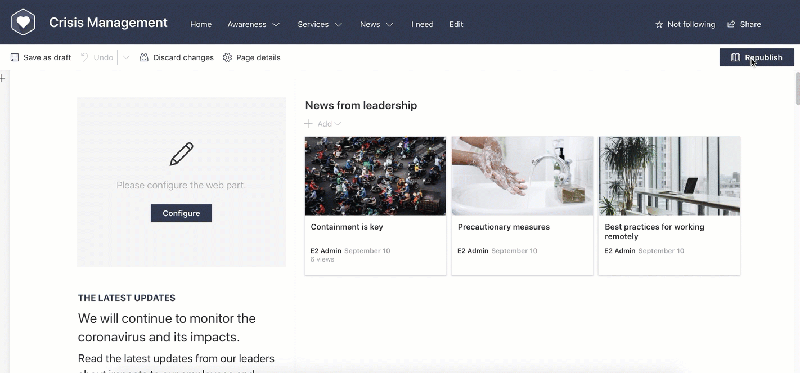

# Target audience generic component

## Summary

Sample web part which uses a Generic React Component which enables it to have Target Audience functionality like what was available in classic web parts.
Targets SharePoint Groups only within the site.



## Compatibility


-Incompatible-red.svg "SharePoint Server 2016 Feature Pack 2 requires SPFx 1.1")


## Applies to

* [SharePoint Framework](https://docs.microsoft.com/sharepoint/dev/spfx/sharepoint-framework-overview)
* [Office 365 developer tenant](https://docs.microsoft.com/sharepoint/dev/spfx/set-up-your-developer-tenant)

## Solution

Solution|Author(s)
--------|---------
target-audience-generic-component | Rabia Williams([@williamsrabia](https://twitter.com/williamsrabia) , [rabiawilliams.com](https://rabiawilliams.com))

## Version history

Version|Date|Comments
-------|----|--------
1.0|Jan 28, 2020|Initial release


## Disclaimer

**THIS CODE IS PROVIDED *AS IS* WITHOUT WARRANTY OF ANY KIND, EITHER EXPRESS OR IMPLIED, INCLUDING ANY IMPLIED WARRANTIES OF FITNESS FOR A PARTICULAR PURPOSE, MERCHANTABILITY, OR NON-INFRINGEMENT.**


## Minimal Path to Awesome

* Clone this repository
* in the command line run:
  * `npm install`
  * `gulp serve`
* Define one or more groups to use as an audience
* Add the web part to a page
* In the web part's properties, select the audience you wish to see the web part

>  This sample can also be opened with [VS Code Remote Development](https://code.visualstudio.com/docs/remote/remote-overview). Visit https://aka.ms/spfx-devcontainer for further instructions.

## Features

This Web Part illustrates the following concepts on top of the SharePoint Framework:

* Adding audience targeting to web parts using a generic React component

When the web part is configured, the sample content will only appear to users who belong to the targeted audience.

You can use the `TargetAudience` control (located under `src/common/TargetAudience.tsx`) by inserting one or more in your web parts, specifying the `pageContext` and `groupIds` props, and adding the content you wish to show/hide as children elements of the `TargetAudience` control, as follows:

```tsx
<TargetAudience pageContext={this.props.pageContext} groupIds={this.props.groupIds}>
    <div>
        Your sample content goes here
    </div>
</TargetAudience>
```

## Help

We do not support samples, but we this community is always willing to help, and we want to improve these samples. We use GitHub to track issues, which makes it easy for  community members to volunteer their time and help resolve issues.

If you encounter any issues while using this sample, [create a new issue](https://github.com/pnp/sp-dev-fx-webparts/issues/new?assignees=&labels=Needs%3A+Triage+%3Amag%3A%2Ctype%3Abug-suspected%2Csample%3A%20react-target-audience&template=bug-report.yml&sample=react-target-audience&authors=@rabwill&title=react-target-audience%20-%20).

For questions regarding this sample, [create a new question](https://github.com/pnp/sp-dev-fx-webparts/issues/new?assignees=&labels=Needs%3A+Triage+%3Amag%3A%2Ctype%3Aquestion%2Csample%3A%20react-target-audience&template=question.yml&sample=react-target-audience&authors=@rabwill&title=react-target-audience%20-%20).

Finally, if you have an idea for improvement, [make a suggestion](https://github.com/pnp/sp-dev-fx-webparts/issues/new?assignees=&labels=Needs%3A+Triage+%3Amag%3A%2Ctype%3Aenhancement%2Csample%3A%20react-target-audience&template=question.yml&sample=react-target-audience&authors=@rabwill&title=react-target-audience%20-%20).


## Disclaimer

**THIS CODE IS PROVIDED *AS IS* WITHOUT WARRANTY OF ANY KIND, EITHER EXPRESS OR IMPLIED, INCLUDING ANY IMPLIED WARRANTIES OF FITNESS FOR A PARTICULAR PURPOSE, MERCHANTABILITY, OR NON-INFRINGEMENT.**


