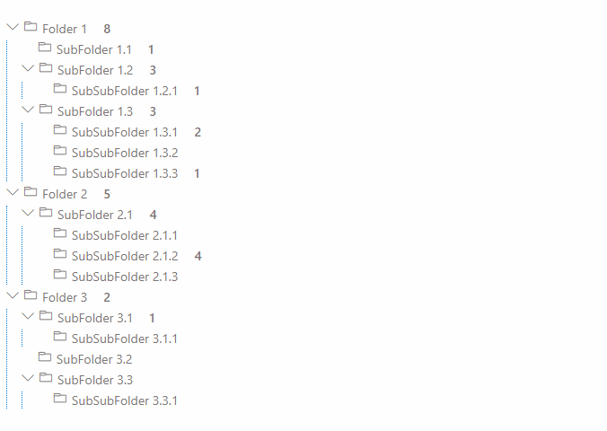
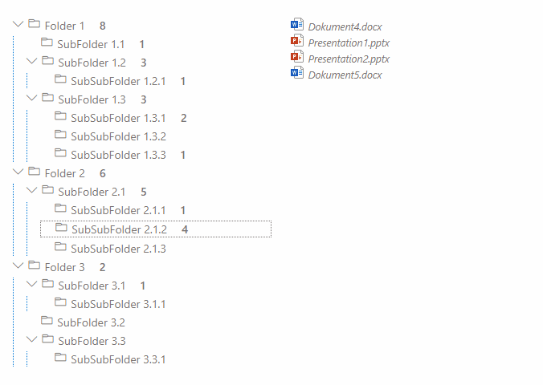

# React Taxonomy File Explorer

## Summary

This solution renders a given Termset as a Tree and incorporates files similar than a folder structure in file explorer. Benefit: Due to multiple selection in the managed metadata column the same file can occur more than once.
Additionally with drag and drop options the file can be changed:
- By replacing the managed metadata column with the target term (Move)
- By adding the target term to the managed metadata column (Link)
- By copying the file to a new one with (only) the target term in the managed metadata column (Copy)

In action this looks like:

Link:

Move:

Copy:

For further details see the author's [blog post](https://mmsharepoint.wordpress.com/2021/12/23/a-sharepoint-file-explorer-based-on-managed-metadata-and-spfx/)

## Compatibility

 

-Incompatible-red.svg "SharePoint Server 2016 Feature Pack 2 requires SPFx 1.1")

## Applies to

- [SharePoint Framework](https://aka.ms/spfx)
- [Microsoft 365 tenant](https://docs.microsoft.com/en-us/sharepoint/dev/spfx/set-up-your-developer-tenant)

> Get your own free development tenant by subscribing to [Microsoft 365 developer program](http://aka.ms/o365devprogram)

## Prerequisites

- A hierarchical Termset bound to a managed metadata column
- A document library using that managed metadata column and several documents with selected terms

## Solution

Solution|Author(s)
--------|---------
react-taxonomy-file-explorer| [Markus Moeller](https://github.com/mmsharepoint) ([@moeller2_0](http://www.twitter.com/moeller2_0))

## Version history

Version|Date|Comments
-------|----|--------
1.0|December 26, 2021|Initial release

## Minimal Path to Awesome

- Clone this repository (or [download this solution as a .ZIP file](https://pnp.github.io/download-partial/?url=https://github.com/pnp/sp-dev-fx-webparts/tree/main/samples/react-taxonomy-file-explorer) then unzip it)
- Ensure that you are at the solution folder
- in the command-line run:
  - `npm install`
  - `gulp serve`
- Instantiate the web part in the online workbench on a site where prerequisites are met:
  - A hierarchical Termset bound to a managed metadata column
  - A document library using that managed metadata column and several documents with selected terms
- In the web part properties set the library name and the internal field name of the managed metadata column
- Done!

>  This sample can also be opened with [VS Code Remote Development](https://code.visualstudio.com/docs/remote/remote-overview). Visit https://aka.ms/spfx-devcontainer for more information.

## Features

This web part illustrates the following concepts:

- Use HTML5 drag and drop event handling
  - Use options by modifier key pressed
- Update Managed Metadata columns with [PnPJS](https://pnp.github.io/pnpjs/)
- Build trees with recursive components
- Traverse trees with callback functions
- [FluentUI React File Type Icons](https://www.npmjs.com/package/@fluentui/react-file-type-icons)
- [FluentUI Contextual Menu](https://developer.microsoft.com/en-us/fluentui#/controls/web/contextualmenu)

## References

- [Getting started with SharePoint Framework](https://docs.microsoft.com/en-us/sharepoint/dev/spfx/set-up-your-developer-tenant)
- [Building for Microsoft teams](https://docs.microsoft.com/en-us/sharepoint/dev/spfx/build-for-teams-overview)
- [Use Microsoft Graph in your solution](https://docs.microsoft.com/en-us/sharepoint/dev/spfx/web-parts/get-started/using-microsoft-graph-apis)
- [Publish SharePoint Framework applications to the Marketplace](https://docs.microsoft.com/en-us/sharepoint/dev/spfx/publish-to-marketplace-overview)
- [Microsoft 365 Patterns and Practices](https://aka.ms/m365pnp) - Guidance, tooling, samples and open-source controls for your Microsoft 365 development

## Help

We do not support samples, but this community is always willing to help, and we want to improve these samples. We use GitHub to track issues, which makes it easy for  community members to volunteer their time and help resolve issues.

If you're having issues building the solution, please run [spfx doctor](https://pnp.github.io/cli-microsoft365/cmd/spfx/spfx-doctor/) from within the solution folder to diagnose incompatibility issues with your environment.

You can try looking at [issues related to this sample](https://github.com/pnp/sp-dev-fx-webparts/issues?q=label%3A%22sample%3A%20react-taxonomy-file-explorer") to see if anybody else is having the same issues.

You can also try looking at [discussions related to this sample](https://github.com/pnp/sp-dev-fx-webparts/discussions?discussions_q=react-taxonomy-file-explorer) and see what the community is saying.

If you encounter any issues while using this sample, [create a new issue](https://github.com/pnp/sp-dev-fx-webparts/issues/new?assignees=&labels=Needs%3A+Triage+%3Amag%3A%2Ctype%3Abug-suspected%2Csample%3A%20react-taxonomy-file-explorer&template=bug-report.yml&sample=react-taxonomy-file-explorer&authors=@mmsharepoint&title=react-taxonomy-file-explorer%20-%20).

For questions regarding this sample, [create a new question](https://github.com/pnp/sp-dev-fx-webparts/issues/new?assignees=&labels=Needs%3A+Triage+%3Amag%3A%2Ctype%3Aquestion%2Csample%3A%20react-taxonomy-file-explorer&template=question.yml&sample=react-taxonomy-file-explorer&authors=@mmsharepoint&title=react-taxonomy-file-explorer%20-%20).

Finally, if you have an idea for improvement, [make a suggestion](https://github.com/pnp/sp-dev-fx-webparts/issues/new?assignees=&labels=Needs%3A+Triage+%3Amag%3A%2Ctype%3Aenhancement%2Csample%3A%20react-taxonomy-file-explorer&template=suggestion.yml&sample=react-taxonomy-file-explorer&authors=@mmsharepoint&title=react-taxonomy-file-explorer%20-%20).

