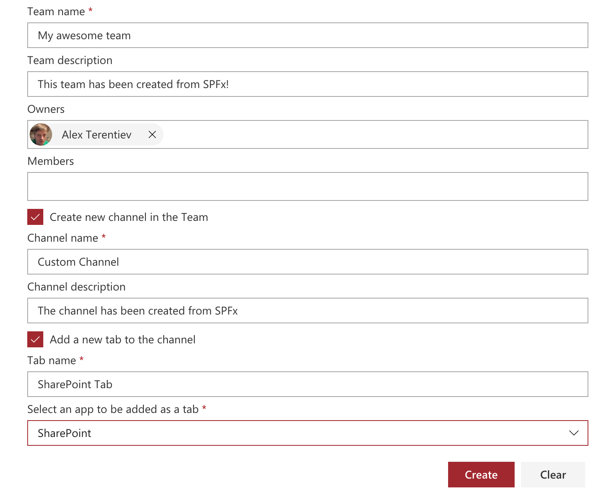

# Teams Creator

## Summary

The web part illustrates usage of MS Graph beta APIs to work with Teams:
* O365 group creation
* Team creation
* Channel creation
* Installation of an app
* Adding tab
* Getting apps from App Catalog



## Compatibility

 
 


-Incompatible-red.svg "SharePoint Server 2016 Feature Pack 2 requires SPFx 1.1")


## Applies to

* [SharePoint Framework](https://docs.microsoft.com/sharepoint/dev/spfx/sharepoint-framework-overview)
* [MS Graph](https://developer.microsoft.com/en-us/graph)
* [MS Teams](https://docs.microsoft.com/en-us/microsoftteams/microsoft-teams)

## Solution

Solution|Author(s)
--------|---------
teams-creator-client-side-solution | Alex Terentiev ([Sharepointalist Inc.](http://www.sharepointalist.com), [AJIXuMuK](https://github.com/AJIXuMuK))

## Version history

Version|Date|Comments
-------|----|--------
1.0|October 17, 2018|Initial release
1.1|November 19, 2018|Upgrade to SPFx v1.7.0, updated to use v1.0 MS Graph endpoints

## Features
Sample features:
- O365 Group creation
- MS Team creation
- Channel creation
- Teams App installation
- Adding Teams tab
- Usage of PnP React Controls

## Caveats
- There is no way to filter Teams Apps requested from App Catalog by App Type. Because of that dropdown displays not only apps that are available as Tabs but all of them.
- Although the app can be added as a Tab there is no API to configure the app completely. At least, there is no way to figure out what settings are there for this or that specific app. So, after tab creation in the Teams app a user will see "Set up tab" button in the fresh tab.

## Building the code

```bash
git clone the repo
npm i
npm i -g gulp
gulp
```

This package produces the following:

* lib/* - intermediate-stage commonjs build artifacts
* dist/* - the bundled script, along with other resources
* deploy/* - all resources which should be uploaded to a CDN.


