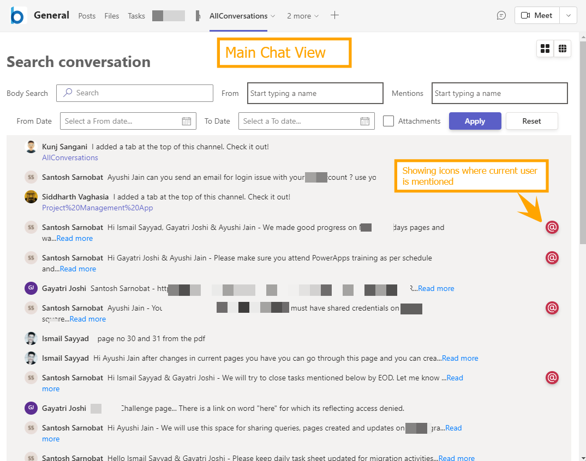
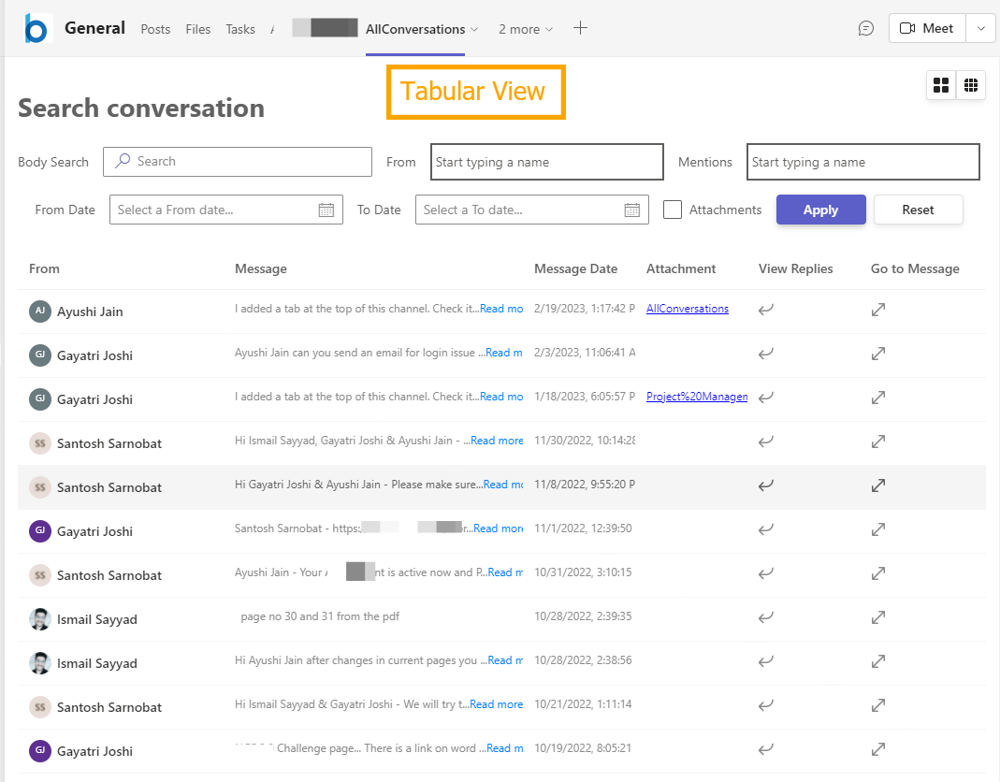
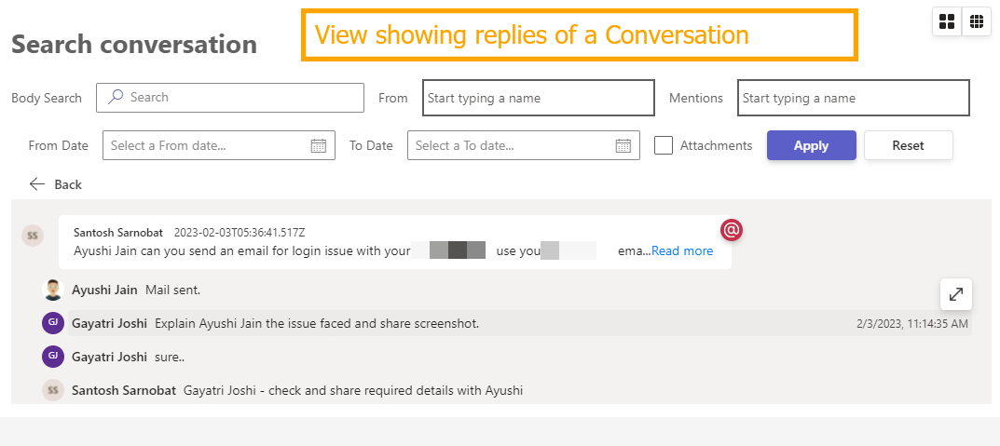

# Teams Tab Conversation View

## Summary

Have you ever struggled to find or search the conversations from Microsoft Team's channel ?

This sample web part is developed to display the Microsoft Team's channel's conversation in a simpler way which makes easy to search and filters the new conversations and its replies. Please note that this web part is designed to use in Microsoft Teams only.

## Features

- SPFx based Team's tab.
- Displays all the New(Parent) Conversations on the top
- Ability to view all the replies of particular conversation
- Option to go to message or reply
- Find messages based on different filters
  - Body search(free text)
  - Based on sender(from)
  - Based on mentions(who all were mentioned in that message)
  - From and To date
  - With Attachments
- Display options - Chat format vs  Tabular view
- Ability to use same filters on all the replies
- Icon on message where current user is mentioned.

## Compatibility

| :warning: Important          |
|:---------------------------|
| Every SPFx version is optimally compatible with specific versions of Node.js. In order to be able to build this sample, you need to ensure that the version of Node on your workstation matches one of the versions listed in this section. This sample will not work on a different version of Node.|
|Refer to <https://aka.ms/spfx-matrix> for more information on SPFx compatibility.   |

This sample is optimally compatible with the following environment configuration:

-Incompatible-red.svg "SharePoint Server 2016 Feature Pack 2 requires SPFx 1.1")

## Applies to

- [SharePoint Framework](https://aka.ms/spfx)
- [Microsoft 365 tenant](https://docs.microsoft.com/sharepoint/dev/spfx/set-up-your-developer-tenant)

> Get your own free development tenant by subscribing to [Microsoft 365 developer program](http://aka.ms/m365devprogram)

## Prerequisites

- As we are using MGT-Toolkit for SPFx, we need to make sure below SPPKG solution is deployed on tenant before current package can be used.

[MGT SPFx](https://learn.microsoft.com//graph/toolkit/get-started/mgt-spfx#prerequisites)

[Download Latest MGT-Toolkit for SPFx Package](https://github.com/microsoftgraph/microsoft-graph-toolkit/releases)

Following Microsoft Graph permissions needs to be approved after uploading the package in the App Catalog

| Permissions         |
|---------------------|
| ChannelMessage.Read.All           |

## Contributors

- [Kunj Sangani](https://github.com/kunj-sangani)
- [Siddharth Vaghasia](https://github.com/siddharth-vaghasia)

## Version history

| Version | Date             | Comments        |
| ------- | ---------------- | --------------- |
| 1.0     | March 1st , 2023 | Initial release |

## Minimal Path to Awesome

- Clone this repository (or [download this solution as a .ZIP file](https://pnp.github.io/download-partial/?url=https://github.com/pnp/sp-dev-fx-webparts/tree/main/samples/react-teams-conversationview) then unzip it)
- From your command line, change your current directory to the directory containing this sample (`react-teams-conversationview`, located under `samples`)
- in the command line run:
  - `npm install`
  - `gulp serve`

As this SPFx web part only works with in Teams's context, please follow below links to deploy it to tenant and make it available in Microsoft Teams

[Package and Deploy](https://learn.microsoft.com//sharepoint/dev/spfx/web-parts/get-started/using-web-part-as-ms-teams-tab#package-and-deploy-your-web-part-to-sharepoint)

[Making the web part available in Teams](https://learn.microsoft.com//sharepoint/dev/spfx/web-parts/get-started/using-web-part-as-ms-teams-tab#make-the-web-part-available-in-microsoft-teams)

## Concept Explored

This extension illustrates the following concepts:

- Developing Team's Tab with SPFx
- Usage of Graph Toolkit in SPFx
- Usage of React North Start library SPFx
- Calling Graph API in SPFx
- Concept of using Teams's Aware Logic in SPFx

## References

- [Getting started with SharePoint Framework](https://docs.microsoft.com/sharepoint/dev/spfx/set-up-your-developer-tenant)
- [Building for Microsoft teams](https://docs.microsoft.com/sharepoint/dev/spfx/build-for-teams-overview)
- [Use Microsoft Graph in your solution](https://docs.microsoft.com/sharepoint/dev/spfx/web-parts/get-started/using-microsoft-graph-apis)
- [Publish SharePoint Framework applications to the Marketplace](https://docs.microsoft.com/sharepoint/dev/spfx/publish-to-marketplace-overview)
- [Microsoft 365 Patterns and Practices](https://aka.ms/m365pnp) - Guidance, tooling, samples and open-source controls for your Microsoft 365 development
- [Build Microsoft Teams tab using SharePoint Framework - Tutorial](https://learn.microsoft.com/sharepoint/dev/spfx/web-parts/get-started/using-web-part-as-ms-teams-tab)
- [Using MGT Toolkit in SPFx](https://learn.microsoft.com//graph/toolkit/get-started/mgt-spfx)

## Help

We do not support samples, but this community is always willing to help, and we want to improve these samples. We use GitHub to track issues, which makes it easy for  community members to volunteer their time and help resolve issues.

If you're having issues building the solution, please run [spfx doctor](https://pnp.github.io/cli-microsoft365/cmd/spfx/spfx-doctor/) from within the solution folder to diagnose incompatibility issues with your environment.

You can try looking at [issues related to this sample](https://github.com/pnp/sp-dev-fx-webparts/issues?q=label%3A%22sample%3A%20react-teams-conversationview%22) to see if anybody else is having the same issues.

You can also try looking at [discussions related to this sample](https://github.com/pnp/sp-dev-fx-webparts/discussions?discussions_q=react-teams-conversationview) and see what the community is saying.

If you encounter any issues using this sample, [create a new issue](https://github.com/pnp/sp-dev-fx-webparts/issues/new?assignees=&labels=Needs%3A+Triage+%3Amag%3A%2Ctype%3Abug-suspected%2Csample%3A%20react-teams-conversationview&template=bug-report.yml&sample=react-teams-conversationview&authors=@kunj-sangani%20@siddharth-vaghasia&title=react-teams-conversationview%20-%20).

For questions regarding this sample, [create a new question](https://github.com/pnp/sp-dev-fx-webparts/issues/new?assignees=&labels=Needs%3A+Triage+%3Amag%3A%2Ctype%3Aquestion%2Csample%3A%20react-teams-conversationview&template=question.yml&sample=react-teams-conversationview&authors=@kunj-sangani%20@siddharth-vaghasia&title=react-teams-conversationview%20-%20).

Finally, if you have an idea for improvement, [make a suggestion](https://github.com/pnp/sp-dev-fx-webparts/issues/new?assignees=&labels=Needs%3A+Triage+%3Amag%3A%2Ctype%3Aenhancement%2Csample%3A%20react-teams-conversationview&template=suggestion.yml&sample=react-teams-conversationview&authors=@kunj-sangani%20@siddharth-vaghasia&title=react-teams-conversationview%20-%20).

## Disclaimer

**THIS CODE IS PROVIDED *AS IS* WITHOUT WARRANTY OF ANY KIND, EITHER EXPRESS OR IMPLIED, INCLUDING ANY IMPLIED WARRANTIES OF FITNESS FOR A PARTICULAR PURPOSE, MERCHANTABILITY, OR NON-INFRINGEMENT.**

