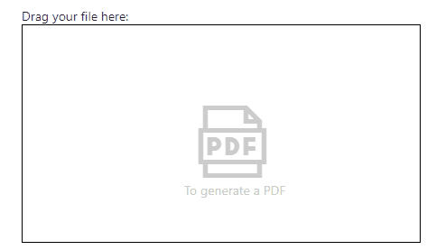

# Teams Graph Upload as PDF

## Summary
This SPFx web part (or Teams Tab) enables a user to upload a supported file type via drag and drop while the uploaded file will be converted as PDF.
In SharePoint context it uploads to the default drive (library) while in Teams context it uses the current channel as a Folder name in the default drive.
It uses the following capabilities (mostly) on behalf of Microsoft Graph:
* Use HTML5 drag and drop event handling
* Writing normal files smaller 4MB
* Retrieving files with format=pdf conversion

A detailed functionality and technical description can be found in the [author's blog post](https://mmsharepoint.wordpress.com/2020/11/10/a-simple-spfx-file-upload-by-dragdrop-including-pdf-conversion/)

## Compatibility

 

-Incompatible-red.svg "SharePoint Server 2016 Feature Pack 2 requires SPFx 1.1")

-yellow.svg)

## Applies to

- [SharePoint Framework](https://aka.ms/spfx)
- [Microsoft 365 tenant](https://docs.microsoft.com/en-us/sharepoint/dev/spfx/set-up-your-developer-tenant)

## Solution

Solution|Author(s)
--------|---------
react-teams-graph-upload-as-pdf| [Markus Moeller](https://github.com/mmsharepoint) ([@moeller2_0](http://www.twitter.com/moeller2_0))

## Version history

Version|Date|Comments
-------|----|--------
1.0|November 10, 2020|Initial release
1.1|November 08, 2021|Updated to SPFx 1.13 & Shared with PnP repo

## Minimal Path to Awesome

- Clone this repository (or [download this solution as a .ZIP file](https://pnp.github.io/download-partial/?url=https://github.com/pnp/sp-dev-fx-webparts/tree/main/samples/react-teams-graph-upload-as-pdf) then unzip it)
- Ensure that you are at the solution folder
- in the command-line run:
  - `npm install`
  - `gulp bundle --ship`
  - `gulp package-solution --ship`
- Upload your package from `/sharepoint/solution/` to your app catalog
- In SharePoint CA approve following web api permissions
  - `Files.ReadWrite`
  - `Sites.ReadWrite.All`

>  This sample can also be opened with [VS Code Remote Development](https://code.visualstudio.com/docs/remote/remote-overview). Visit https://aka.ms/spfx-devcontainer for more information.

## Features

This web part illustrates the following concepts:

- Use HTML5 drag and drop event handling
- [Writing normal files smaller 4MB](https://docs.microsoft.com/en-us/graph/api/driveitem-put-content?view=graph-rest-1.0&tabs=http)
- Retrieving files with [format=pdf](https://docs.microsoft.com/en-us/graph/api/driveitem-get-content-format?view=graph-rest-1.0&tabs=http) conversion
- [FluentUI Progress Indicator](https://developer.microsoft.com/en-us/fluentui#/controls/web/progressindicator)

## Alternative
When looking for a robust solution in Microsoft Teams espacially also consider my alternative sample created with the yeoman generator for Teams.
There the up- and download functionality takes place in the backend and not via the frontend (browser).
Of course consider the same code to be combined with a SPFx forntend (only).
(https://github.com/pnp/teams-dev-samples/tree/main/samples/tab-sso-graph-upload-as-pdf)

## Help

We do not support samples, but this community is always willing to help, and we want to improve these samples. We use GitHub to track issues, which makes it easy for  community members to volunteer their time and help resolve issues.

If you're having issues building the solution, please run [spfx doctor](https://pnp.github.io/cli-microsoft365/cmd/spfx/spfx-doctor/) from within the solution folder to diagnose incompatibility issues with your environment.

You can try looking at [issues related to this sample](https://github.com/pnp/sp-dev-fx-webparts/issues?q=label%3A%22sample%3A%20react-teams-graph-upload-as-pdf") to see if anybody else is having the same issues.

You can also try looking at [discussions related to this sample](https://github.com/pnp/sp-dev-fx-webparts/discussions?discussions_q=react-teams-graph-upload-as-pdf) and see what the community is saying.

If you encounter any issues while using this sample, [create a new issue](https://github.com/pnp/sp-dev-fx-webparts/issues/new?assignees=&labels=Needs%3A+Triage+%3Amag%3A%2Ctype%3Abug-suspected%2Csample%3A%20react-teams-graph-upload-as-pdf&template=bug-report.yml&sample=react-teams-graph-upload-as-pdf&authors=@mmsharepoint&title=react-teams-graph-upload-as-pdf%20-%20).

For questions regarding this sample, [create a new question](https://github.com/pnp/sp-dev-fx-webparts/issues/new?assignees=&labels=Needs%3A+Triage+%3Amag%3A%2Ctype%3Aquestion%2Csample%3A%20react-teams-graph-upload-as-pdf&template=question.yml&sample=react-teams-graph-upload-as-pdf&authors=@mmsharepoint&title=react-teams-graph-upload-as-pdf%20-%20).

Finally, if you have an idea for improvement, [make a suggestion](https://github.com/pnp/sp-dev-fx-webparts/issues/new?assignees=&labels=Needs%3A+Triage+%3Amag%3A%2Ctype%3Aenhancement%2Csample%3A%20react-teams-graph-upload-as-pdf&template=suggestion.yml&sample=react-teams-graph-upload-as-pdf&authors=@mmsharepoint&title=react-teams-graph-upload-as-pdf%20-%20).

## Disclaimer

**THIS CODE IS PROVIDED *AS IS* WITHOUT WARRANTY OF ANY KIND, EITHER EXPRESS OR IMPLIED, INCLUDING ANY IMPLIED WARRANTIES OF FITNESS FOR A PARTICULAR PURPOSE, MERCHANTABILITY, OR NON-INFRINGEMENT.**

