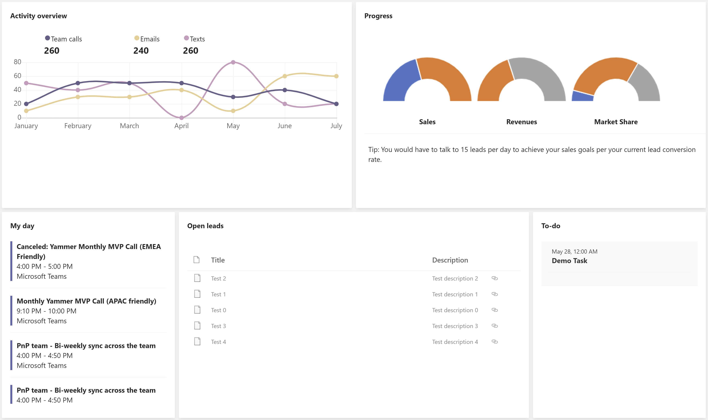
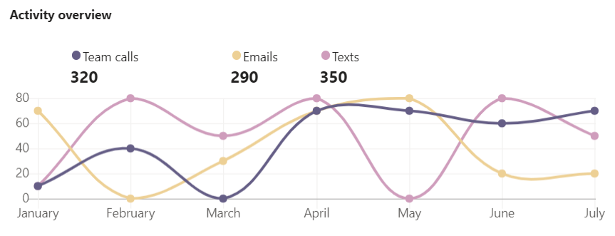
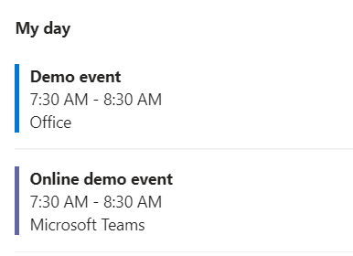
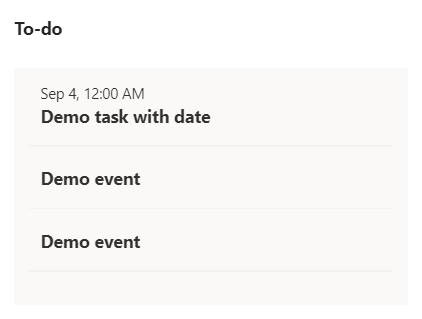

# Lead Assist Dashboard

## Summary

This sample shows how to integrate SharePoint Framework, PnP React Controls, and Microsoft Graph Toolkit in a solution available for SharePoint web parts or Microsoft Teams personal application.

## Compatibility

 
 

-Incompatible-red.svg "SharePoint Server 2016 Feature Pack 2 requires SPFx 1.1")

## Applies to

- [SharePoint Framework](https://aka.ms/spfx)
- [Microsoft 365 tenant](https://docs.microsoft.com/en-us/sharepoint/dev/spfx/set-up-your-developer-tenant)
- [Microsoft Teams](https://www.microsoft.com/en-ww/microsoft-teams)

> Get your own free development tenant by subscribing to [Microsoft 365 developer program](http://aka.ms/o365devprogram)

## Solution

Solution|Author(s)
--------|---------
Lead Assist Dashboard | [PnP](https://pnp.github.io/)

## Version history

Version|Date|Comments
-------|----|--------
1.0.0|October 5, 2021|Initial release

## Minimal Path to Awesome

- Clone this repository
- Ensure that you are at the solution folder
- In the command-line run:
  - `npm install`
  - `npm run package`
- Upload the generated SPPKG file into the SharePoint App Catalog of your tenant
- Select the SPPKG in the App Catalog and click on "Sync to Teams" button
- Add the web part to a SharePoint page
- In the first run the web part will ask for the target SharePoint site URL

>  This sample can also be opened with [VS Code Remote Development](https://code.visualstudio.com/docs/remote/remote-overview). Visit https://aka.ms/spfx-devcontainer for further instructions.

If needed:
- Using the control panel of the web part
  - Create the SharePoint demo lists
  - Populate the SharePoint demo lists
  - Generate the Microsoft Graph demo data

## Features

This solution provides an example of how to implement a SharePoint Framework web part, that is also usable as a Microsoft Teams personal app, using the [SharePoint Framework React Controls](https://github.com/pnp/sp-dev-fx-controls-react/) and the [Microsoft Graph Toolkit](https://github.com/microsoftgraph/microsoft-graph-toolkit).

This web part illustrates the following concepts:

- How to use the [PnP React Controls](https://github.com/pnp/sp-dev-fx-controls-react/) such as the chart control

- How to integrate the [Microsoft Graph Toolkit](https://github.com/microsoftgraph/microsoft-graph-toolkit) in a SharePoint Framework web part such as the Agenda control

  

  and the Todo control

  

- How to execute operations on SharePoint using [PnP JS](https://github.com/pnp/pnpjs/)

## References

- [Getting started with SharePoint Framework](https://docs.microsoft.com/en-us/sharepoint/dev/spfx/set-up-your-developer-tenant)
- [Building for Microsoft Teams](https://docs.microsoft.com/en-us/sharepoint/dev/spfx/build-for-teams-overview)
- [Use Microsoft Graph in your solution](https://docs.microsoft.com/en-us/sharepoint/dev/spfx/web-parts/get-started/using-microsoft-graph-apis)
- [Publish SharePoint Framework applications to the Marketplace](https://docs.microsoft.com/en-us/sharepoint/dev/spfx/publish-to-marketplace-overview)
- [The easiest way to store user settings of your Microsoft 365 app
](https://blog.mastykarz.nl/easiest-store-user-settings-microsoft-365-app/ )
- [Microsoft 365 Patterns and Practices](https://aka.ms/m365pnp)

## Disclaimer

**THIS CODE IS PROVIDED *AS IS* WITHOUT WARRANTY OF ANY KIND, EITHER EXPRESS OR IMPLIED, INCLUDING ANY IMPLIED WARRANTIES OF FITNESS FOR A PARTICULAR PURPOSE, MERCHANTABILITY, OR NON-INFRINGEMENT.**

> "Sharing is Caring"