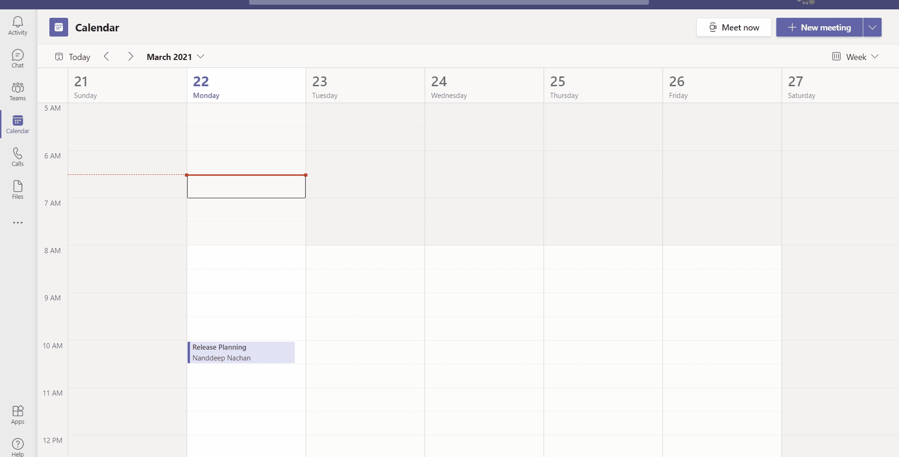
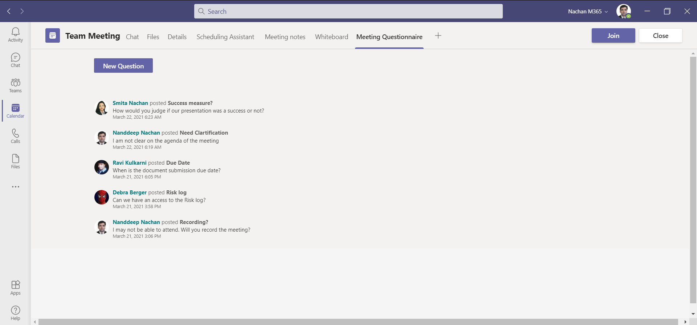
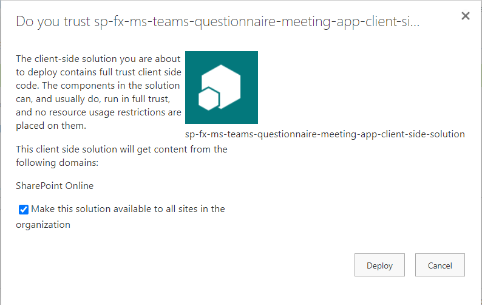
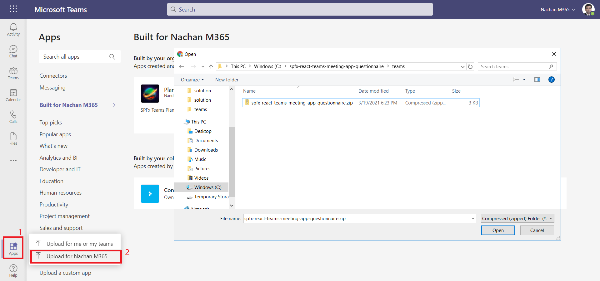

# Questionnaire Teams Meeting App

## Summary

SPFx v1.12.1 support for Microsoft Teams meeting apps development. Questionnaire meeting app provides Pre-meeting app experience for MS Teams meeting attendees to ask the questions related to meeting before the meeting starts.  



The Questionnaire meeting app displays the questions from attendees as pre-meeting app experience.



### NPM Packages Used

Below NPM package(s) are used to develop this sample:

1. @pnp/sp (https://pnp.github.io/pnpjs/sp/)
2. moment (https://www.npmjs.com/package/moment)

### Project setup and important files

```txt
spfx-react-teams-meeting-app-questionnaire
    ├── teams                                                     <-- MS Teams manifest
    │   └── manifest.json
    └── src
        └── models
            ├── IQuestionnaireItem.ts
        └── services
            ├── SPOService.ts                                     <-- Extensible Service
        └── webparts
            └── questionnaireMeetingApp
                ├── QuestionnaireMeetingAppWebPart.manifest.json  <-- Configurable web part properties
                ├── QuestionnaireMeetingAppWebPart.ts
                ├── components
                │   └── QuestionnaireMeetingApp
                │   │   ├── QuestionnaireMeetingApp.tsx           <-- Questionnaire Component
                │   │   ├── QuestionnaireMeetingApp.module.scss
                │   │   ├── IQuestionnaireMeetingAppProps.ts
                │   │   ├── IQuestionnaireMeetingAppState.ts
                │   └── Popup                                     <-- New Question Creation Component
                |   │   ├── AskQuestion.tsx
                |   │   ├── IAskQuestionProps.ts
                |   │   ├── IAskQuestionState.ts
                └── loc
                    ├── en-us.js
                    └── mystrings.d.ts
```

## Compatibility


## Compatibility


 


-Incompatible-red.svg "SharePoint Server 2016 Feature Pack 2 requires SPFx 1.1")


## Applies to

- [Microsoft Teams](https://aka.ms/microsoftteams)
- [SharePoint Framework](https://aka.ms/spfx)
- [Microsoft 365 tenant](https://docs.microsoft.com/en-us/sharepoint/dev/spfx/set-up-your-developer-tenant)

> Get your own free development tenant by subscribing to [Microsoft 365 developer program](http://aka.ms/o365devprogram)

## Prerequisites

- Administrative access to MS Teams to deploy the package

### Web Part Properties

The properties should be pre-configured inside `QuestionnaireMeetingAppWebPart.manifest.json` as when the web part is added as MS Teams meeting experience, we do not get any settings to configure.

Property|Type|Required|Default value|Comments
--------|----|--------|-------------|--------
siteUrl|Text|Yes|/|Provide the relative URL of the site where below list exists.
listName|Text|Yes|Teams Meeting Questionnaire|Title of the list storing meeting questionnaires.

### SharePoint Asset

A SharePoint list (named `Teams Meeting Questionnaire`) should be manually created to store the meeting questionnaires. The schema of the list is as below.

Display Name|Internal Name|Type|Required|Comments
------------|-------------|----|--------|--------
Title|Title|Single line of text|Y|OOB Title column
Description|Description|Multiple lines of text|N|
MeetingID|MeetingID|Single line of text|N|

## Minimal Path to Awesome

### SharePoint deployment

>  This sample can also be opened with [VS Code Remote Development](https://code.visualstudio.com/docs/remote/remote-overview). Visit https://aka.ms/spfx-devcontainer for further instructions.

- Clone this repo
- Navigate to the folder with current sample
- Restore dependencies: `$ npm i`
- Bundle the solution: `$ gulp bundle --ship`
- Package the solution: `$ gulp package-solution --ship`
- Locate the solution at `./sharepoint/solution/spfx-ms-teams-questionnaire-meeting-app.sppkg` and upload it to SharePoint tenant app catalog



- Select `Make this solution available to all sites in the organization`.
- Click `Deploy`.

### MS Teams deployment

- Navigate to `teams` folder and zip the content (2 png files and manifest.json).
- Open MS Teams.
- Click `Apps`.
- Click `Upload a custom app` > `Upload for <tenant>`.




## Solution

Solution|Author(s)
--------|---------
spfx-react-teams-meeting-app-questionnaire|[Nanddeep Nachan](https://github.com/nanddeepn) (https://www.linkedin.com/in/nanddeepnachan/) (SharePoint Consultant, [@NanddeepNachan](https://twitter.com/NanddeepNachan))
spfx-react-teams-meeting-app-questionnaire|[Ravi Kulkarni](https://www.linkedin.com/in/ravi-kulkarni-a5381723/) (SharePoint Consultant, [@RaviKul16a87](https://twitter.com/RaviKul16a87))
spfx-react-teams-meeting-app-questionnaire|[Smita Nachan](https://www.linkedin.com/in/smitanachan/) (SharePoint Consultant, [@SmitaNachan](https://twitter.com/SmitaNachan))

## Version history

Version|Date|Comments
-------|----|--------
2.0.0|September 28, 2021|Upgraded to SPFx v1.12.1 (Nanddeep Nachan, Smita Nachan)
1.0.0|March 22, 2021|Initial release

## Features

This project contains sample client-side web part built on the SharePoint Framework illustrating possibilities to surface SPFx web part as Microsoft Teams meeting app.

This sample illustrates the following concepts on top of the SharePoint Framework:

- Surface SPFx web part as Microsoft Teams meeting app
- Using PnP/PnPjs
- Creating extensible services
- Using Office UI Fabric controls for building SharePoint Framework client-side web parts

## Video

[](https://www.youtube.com/watch?v=gDcT7yu6UmU "Microsoft Teams Meeting Questionnaire App with SharePoint Framework")

## Help

We do not support samples, but we this community is always willing to help, and we want to improve these samples. We use GitHub to track issues, which makes it easy for  community members to volunteer their time and help resolve issues.

If you're having issues building the solution, please run [spfx doctor](https://pnp.github.io/cli-microsoft365/cmd/spfx/spfx-doctor/) from within the solution folder to diagnose incompatibility issues with your environment.

You can try looking at [issues related to this sample](https://github.com/pnp/sp-dev-fx-webparts/issues?q=label%3A%22sample%3A%20react-teams-meeting-app-questionnaire") to see if anybody else is having the same issues.

You can also try looking at [discussions related to this sample](https://github.com/pnp/sp-dev-fx-webparts/discussions?discussions_q=react-teams-meeting-app-questionnaire) and see what the community is saying.

If you encounter any issues while using this sample, [create a new issue](https://github.com/pnp/sp-dev-fx-webparts/issues/new?assignees=&labels=Needs%3A+Triage+%3Amag%3A%2Ctype%3Abug-suspected%2Csample%3A%20react-teams-meeting-app-questionnaire&template=bug-report.yml&sample=react-teams-meeting-app-questionnaire&authors=@nanddeepn&title=react-teams-meeting-app-questionnaire%20-%20).

For questions regarding this sample, [create a new question](https://github.com/pnp/sp-dev-fx-webparts/issues/new?assignees=&labels=Needs%3A+Triage+%3Amag%3A%2Ctype%3Aquestion%2Csample%3A%20react-teams-meeting-app-questionnaire&template=question.yml&sample=react-teams-meeting-app-questionnaire&authors=@nanddeepn&title=react-teams-meeting-app-questionnaire%20-%20).

Finally, if you have an idea for improvement, [make a suggestion](https://github.com/pnp/sp-dev-fx-webparts/issues/new?assignees=&labels=Needs%3A+Triage+%3Amag%3A%2Ctype%3Aenhancement%2Csample%3A%20react-teams-meeting-app-questionnaire&template=question.yml&sample=react-teams-meeting-app-questionnaire&authors=@nanddeepn&title=react-teams-meeting-app-questionnaire%20-%20).


## References

- [Getting started with SharePoint Framework](https://docs.microsoft.com/en-us/sharepoint/dev/spfx/set-up-your-developer-tenant)
- [Building for Microsoft teams](https://docs.microsoft.com/en-us/sharepoint/dev/spfx/build-for-teams-overview)
- [Apps in Teams meetings](https://docs.microsoft.com/en-us/microsoftteams/platform/apps-in-teams-meetings/teams-apps-in-meetings)
- [Use Microsoft Graph in your solution](https://docs.microsoft.com/en-us/sharepoint/dev/spfx/web-parts/get-started/using-microsoft-graph-apis)
- [Publish SharePoint Framework applications to the Marketplace](https://docs.microsoft.com/en-us/sharepoint/dev/spfx/publish-to-marketplace-overview)
- [Microsoft 365 Patterns and Practices](https://aka.ms/m365pnp) - Guidance, tooling, samples and open-source controls for your Microsoft 365 development
- [PnPjs Configuration](https://pnp.github.io/pnpjs/concepts/configuration/)
- [Support Microsoft Teams Themes in SharePoint Framework Solutions](https://blog.aterentiev.com/support-microsoft-teams-themes-in) by Alex Terentiev, [@alexaterentiev](https://twitter.com/alexaterentiev)

## Disclaimer

**THIS CODE IS PROVIDED *AS IS* WITHOUT WARRANTY OF ANY KIND, EITHER EXPRESS OR IMPLIED, INCLUDING ANY IMPLIED WARRANTIES OF FITNESS FOR A PARTICULAR PURPOSE, MERCHANTABILITY, OR NON-INFRINGEMENT.**


