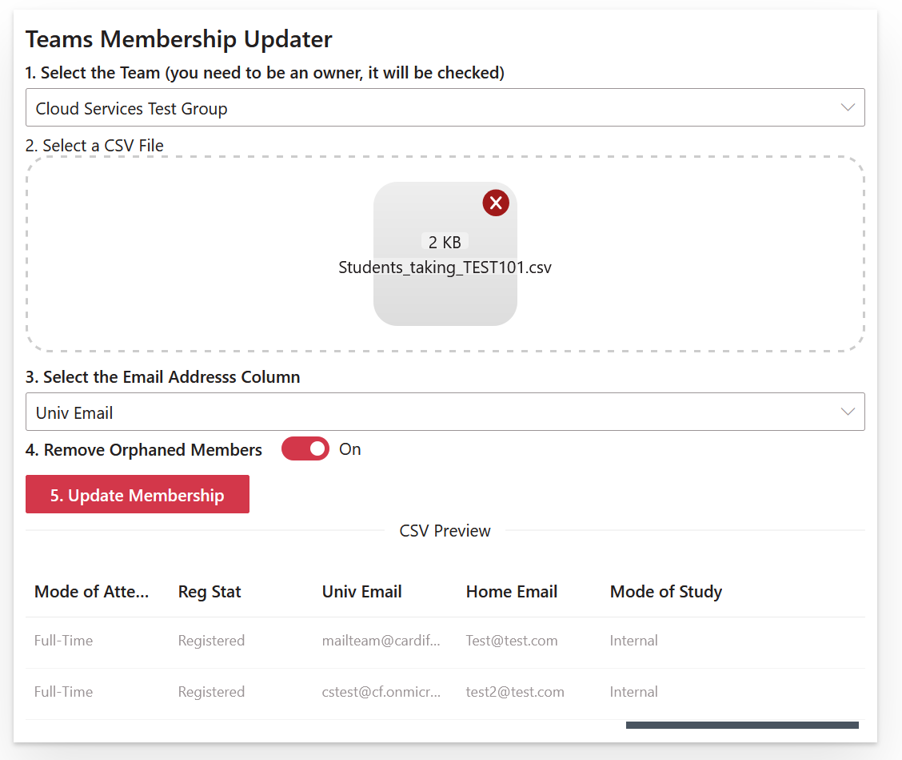
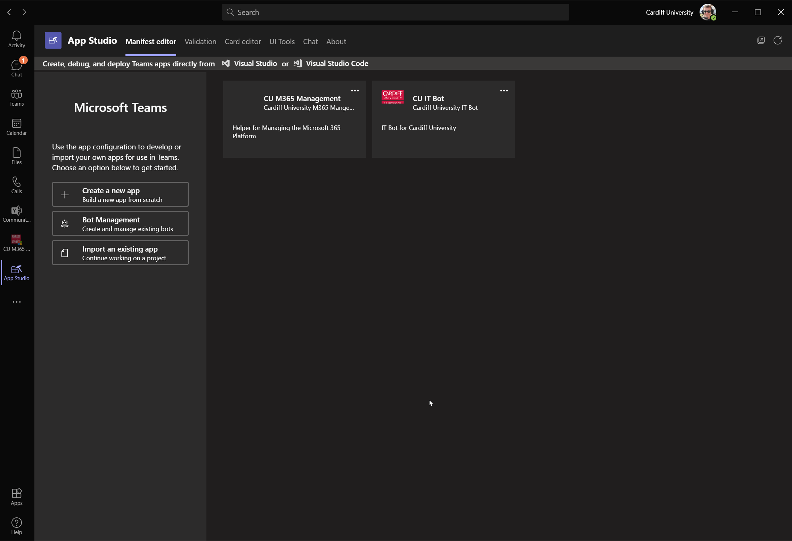

# Teams Membership Updater

## Summary

Used to update the membership of a team based on the contents of a CSV file, can be hosted in a SharePoint site where a list can be defined for logging purposes or run inside teams as a personal app.

## Screen

## Compatibility

## Applies to

* [SharePoint Online](https://docs.microsoft.com/sharepoint/dev/spfx/sharepoint-framework-overview)

## Solution

This web part can be deployed to a site or as a teams personal app.  This does require graph permission granting in the SharePoint Admin Center

Uses:

* PnP React Controls
* PnP React Property Controls
* React Papaparse (CSV parsing)

Solution|Author(s)
--------|---------
Teams Membership Updater  Web Part|[Nick Brown](https://github.com/techienickb)

## Version history

Version|Date|Comments
-------|----|--------
1.0.0|April 27, 2020|Initial release
1.0.2|May 1, 2020|Ability to disable Orphaned Member removals
1.0.4|June 3, 2020|Switched to using Graph Batching
1.0.7|April 20, 2021|Switched to using PnP's file picker and option to log to a configuration list
1.0.8|April 22, 2021|Added support for paging on the team member list get
1.1.0|July 13, 2021|Upgraded to v1.12.1 of SPFx and v3 of pnp controls
1.2.0|August 17, 2021|Added support for populating private channels inside of a team, added support for paged list of teams from Graph, added sorting to the Team list
1.2.1|September 21, 2021| Missing '/members' in the private channel membership url
1.2.2|March, 24, 2022|Upgraded to SPFx v1.14 and v4 of react-papaparse

## Minimal Path to Awesome

* Clone this repository (or [download this solution as a .ZIP file](https://pnp.github.io/download-partial/?url=https://github.com/pnp/sp-dev-fx-webparts/tree/main/samples/react-teams-membership-updater) then unzip it)
* From your command line, change your current directory to the directory containing this sample (`react-teams-membership-updater`, located under `samples`)
* in the command line run:
  * `npm install`
  * `gulp build`
  * `gulp bundle --ship`
  * `gulp package-solution --ship`
  * Add to AppCatalog and deploy

> This sample can also be opened with [VS Code Remote Development](https://code.visualstudio.com/docs/remote/remote-overview). Visit <https://aka.ms/spfx-devcontainer> for further instructions.

## Help

We do not support samples, but this community is always willing to help, and we want to improve these samples. We use GitHub to track issues, which makes it easy for  community members to volunteer their time and help resolve issues.

If you're having issues building the solution, please run [spfx doctor](https://pnp.github.io/cli-microsoft365/cmd/spfx/spfx-doctor/) from within the solution folder to diagnose incompatibility issues with your environment.

You can try looking at [issues related to this sample](https://github.com/pnp/sp-dev-fx-webparts/issues?q=label%3A"sample%3A%20react-teams-membership-updater" ) to see if anybody else is having the same issues.

You can also try looking at [discussions related to this sample](https://github.com/pnp/sp-dev-fx-webparts/discussions?discussions_q=react-teams-membership-updater) and see what the community is saying.

If you encounter any issues while using this sample, [create a new issue](https://github.com/pnp/sp-dev-fx-webparts/issues/new?assignees=&labels=Needs%3A+Triage+%3Amag%3A%2Ctype%3Abug-suspected%2Csample%3A%20react-teams-membership-updater&template=bug-report.yml&sample=react-teams-membership-updater&authors=@techienickb&title=react-teams-membership-updater%20-%20).

For questions regarding this sample, [create a new question](https://github.com/pnp/sp-dev-fx-webparts/issues/new?assignees=&labels=Needs%3A+Triage+%3Amag%3A%2Ctype%3Aquestion%2Csample%3A%20react-teams-membership-updater&template=question.yml&sample=react-teams-membership-updater&authors=@techienickb&title=react-teams-membership-updater%20-%20).

Finally, if you have an idea for improvement, [make a suggestion](https://github.com/pnp/sp-dev-fx-webparts/issues/new?assignees=&labels=Needs%3A+Triage+%3Amag%3A%2Ctype%3Aenhancement%2Csample%3A%20react-teams-membership-updater&template=question.yml&sample=react-teams-membership-updater&authors=@techienickb&title=react-teams-membership-updater%20-%20).

## Disclaimer

**THIS CODE IS PROVIDED *AS IS* WITHOUT WARRANTY OF ANY KIND, EITHER EXPRESS OR IMPLIED, INCLUDING ANY IMPLIED WARRANTIES OF FITNESS FOR A PARTICULAR PURPOSE, MERCHANTABILITY, OR NON-INFRINGEMENT.**

 />
