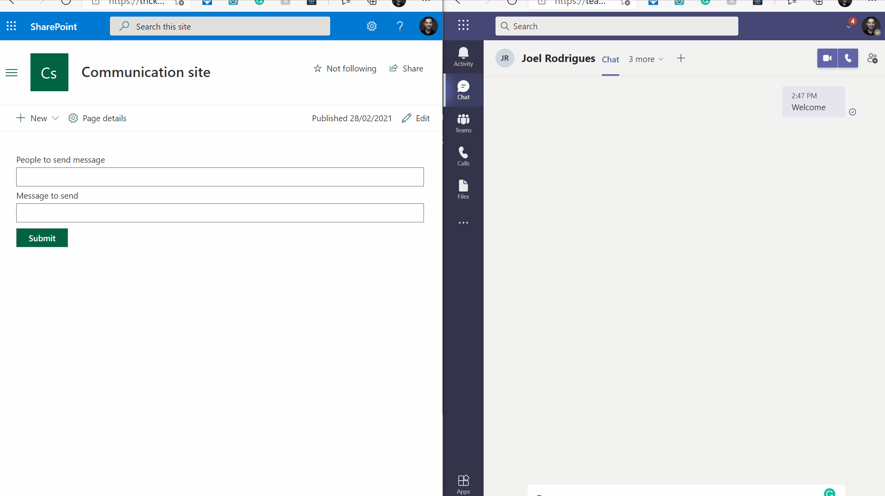

# Display List

## Summary

Sample that shows how to send a message to Micosoft Teams using a SharePoint framework solution using Microsoft Graph.

.

## Applies to

* [SharePoint Framework](https://docs.microsoft.com/sharepoint/dev/spfx/sharepoint-framework-overview)
* [Office 365 tenant](https://docs.microsoft.com/sharepoint/dev/spfx/set-up-your-developer-tenant)


## Prerequisites

* SharePoint Online tenant
* You have provided permission in SharePoint admin for accessing Graph API on behalf of your solution. We can do it before deployment as proactive steps, or after deployment. You can refer to [steps about how to do this post-deployment](https://docs.microsoft.com/en-us/sharepoint/dev/spfx/use-aad-tutorial#deploy-the-solution-and-grant-permissions). Basically you have to use API Access Page of SharePoint admin and add below permission for our use case. 

```
 "webApiPermissionRequests": [
  {
    "resource": "Microsoft Graph",
    "scope": "ChatMessage.Send"
  },
  {
    "resource": "Microsoft Graph",
    "scope": "Chat.Create"
  },
  {
    "resource": "Microsoft Graph",
    "scope": "Chat.ReadWrite" 
  },
  {
    "resource": "Microsoft Graph",
    "scope": "User.Read"
  },
  {
    "resource": "Microsoft Graph",
    "scope": "User.ReadWrite.All"
  },
  {
    "resource": "Microsoft Graph",
    "scope": "Directory.Read.All"
  },
  {
    "resource": "Microsoft Graph",
    "scope": "Directory.ReadWrite.All"
  }
]

```

## Concepts

This Web Part illustrates the following concepts on top of the SharePoint Framework:

* Using react framework in SPFx webpart
* Calling Microsoft Graph API in SPFx webpart
## Applies to

* [SharePoint Framework Developer](https://docs.microsoft.com/sharepoint/dev/spfx/sharepoint-framework-overview)
* [Office 365 developer tenant](https://docs.microsoft.com/sharepoint/dev/spfx/set-up-your-developer-tenant)


## Solution

Solution|Author(s)
--------|---------
teams-messages| David Ramalho([@davRamalho](https://twitter.com/davRamalho))


## Version history

Version|Date|Comments
-------|----|--------
1.0|February 28, 2021|Initial release


## Disclaimer

**THIS CODE IS PROVIDED *AS IS* WITHOUT WARRANTY OF ANY KIND, EITHER EXPRESS OR IMPLIED, INCLUDING ANY IMPLIED WARRANTIES OF FITNESS FOR A PARTICULAR PURPOSE, MERCHANTABILITY, OR NON-INFRINGEMENT.**

---

## Minimal Path to Awesome

- Clone this repository
- in the command line run:
  - `npm install`
  - `gulp serve`


.
