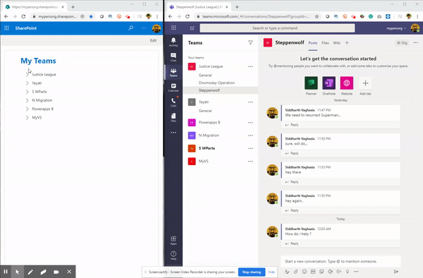
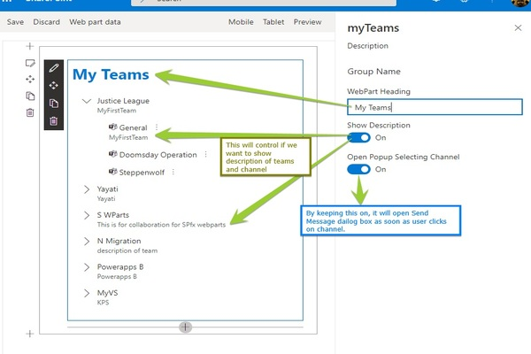

# Current User's MS Teams and send message.

## Summary

This is a sample web part that displays currently logged in user's Microsoft Teams(user is member of), its channels and will allow sending messages to any Team's channel. It will also allow the user to open the team's channel via the link. This web part can be useful on the Intranet home page which can be added as My Teams web part.


* Web Part in Action



* Configurable Web Part Properties



## Features

* Show Current logged in user's Teams in Tree View
* On Expanding any Team, it will show selected team's channels.
* Message can send to any Team's channel by either by selecting any channel(configurable as web part properties)
* Context menu for every channel to 1) To open channel's link in Teams. 2) To send message to team.
* A dialog box to send message.

Configurable Web part Properties
* Web Part Title to be displayed On top of tree view (like My Teams).
* Toggle to Show/hide Teams and channel's Description.
* Toggle On/Off whether to open send message popup should open soon as a channel is selected.

* Please refer this [link](https://www.c-sharpcorner.com/article/microsoft-teams-operations-in-spfx-webpart-using-graph-api/) if you are interested in learning step by step on how to call Team graph API from SPFx web part.

## Compatibility

 
 


-Incompatible-red.svg "SharePoint Server 2016 Feature Pack 2 requires SPFx 1.1")

-yellow.svg)


## Applies to

* [SharePoint Framework](https://docs.microsoft.com/sharepoint/dev/spfx/sharepoint-framework-overview)
* [Office 365 tenant](https://docs.microsoft.com/sharepoint/dev/spfx/set-up-your-developer-tenant)


## Prerequisites

* SharePoint Online tenant
* You have provided permission in SharePoint admin for accessing Graph API on behalf of your solution. We can do it before deployment as proactive steps, or after deployment. You can refer to [steps about how to do this post-deployment](https://docs.microsoft.com/en-us/sharepoint/dev/spfx/use-aad-tutorial#deploy-the-solution-and-grant-permissions). Basically you have to use API Access Page of SharePoint admin and add below permission for our use case. 

```
 "webApiPermissionRequests": [
      {
        "resource": "Microsoft Graph",
        "scope": "User.Read.All"
      },
      {
        "resource": "Microsoft Graph",
        "scope": "User.ReadWrite.All"
      },
      {
        "resource": "Microsoft Graph",
        "scope": "Group.Read.All"
      },
      {
        "resource": "Microsoft Graph",
        "scope": "Group.ReadWrite.All"
      }
    ]

```
## Concepts

This Web Part illustrates the following concepts on top of the SharePoint Framework:

* Using react framework in SPFx web part
* Calling Teams Graph API in SPFx web part
* Usage of PnP Tree View  Control
* Usage of Fluent UI/Office UI Fabric Controls

## Solution

Solution|Author(s)
--------|---------
react-teams-message | [Siddharth Vaghasia](https://github.com/siddharth-vaghasia) (@siddh_me)

## Version history

Version|Date|Comments
-------|----|--------
1.0.0|May 23, 2020|Initial release

## Minimal Path to Awesome

* Clone this repository
* From your command line, change your current directory to the directory containing this sample (`react-teams-message`, located under `samples`)
* in the command line run:
  * `npm install`
  * `gulp serve`

>  This sample can also be opened with [VS Code Remote Development](https://code.visualstudio.com/docs/remote/remote-overview). Visit https://aka.ms/spfx-devcontainer for further instructions.

## Video

[](https://www.youtube.com/watch?v=lzOcAL_6A7c "Sending a Teams Message using Microsoft Graph from a SPFx web part")

## Help

We do not support samples, but we this community is always willing to help, and we want to improve these samples. We use GitHub to track issues, which makes it easy for  community members to volunteer their time and help resolve issues.

If you're having issues building the solution, please run [spfx doctor](https://pnp.github.io/cli-microsoft365/cmd/spfx/spfx-doctor/) from within the solution folder to diagnose incompatibility issues with your environment.

You can try looking at [issues related to this sample](https://github.com/pnp/sp-dev-fx-webparts/issues?q=label%3A%22sample%3A%20react-teams-message") to see if anybody else is having the same issues.

You can also try looking at [discussions related to this sample](https://github.com/pnp/sp-dev-fx-webparts/discussions?discussions_q=react-teams-message) and see what the community is saying.

If you encounter any issues while using this sample, [create a new issue](https://github.com/pnp/sp-dev-fx-webparts/issues/new?assignees=&labels=Needs%3A+Triage+%3Amag%3A%2Ctype%3Abug-suspected%2Csample%3A%20react-teams-message&template=bug-report.yml&sample=react-teams-message&authors=@siddharth-vaghasia&title=react-teams-message%20-%20).

For questions regarding this sample, [create a new question](https://github.com/pnp/sp-dev-fx-webparts/issues/new?assignees=&labels=Needs%3A+Triage+%3Amag%3A%2Ctype%3Aquestion%2Csample%3A%20react-teams-message&template=question.yml&sample=react-teams-message&authors=@siddharth-vaghasia&title=react-teams-message%20-%20).

Finally, if you have an idea for improvement, [make a suggestion](https://github.com/pnp/sp-dev-fx-webparts/issues/new?assignees=&labels=Needs%3A+Triage+%3Amag%3A%2Ctype%3Aenhancement%2Csample%3A%20react-teams-message&template=question.yml&sample=react-teams-message&authors=@siddharth-vaghasia&title=react-teams-message%20-%20).


## Disclaimer

**THIS CODE IS PROVIDED *AS IS* WITHOUT WARRANTY OF ANY KIND, EITHER EXPRESS OR IMPLIED, INCLUDING ANY IMPLIED WARRANTIES OF FITNESS FOR A PARTICULAR PURPOSE, MERCHANTABILITY, OR NON-INFRINGEMENT.**


