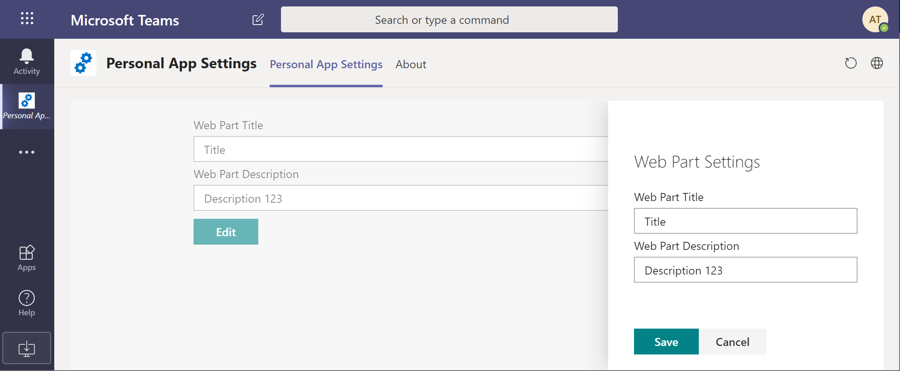

## React Teams Personal App Settings Web Part

Sample web part that demonstrates how you can store Teams Personal App Web Part's properties in user's OneDrive.

## Details

Teams Personal Apps, or Personal Tabs don't have settings.
For SPFx it means few things:
* Web Part will never be switched to **Edit** mode
* Property Pane will never be shown
* `this.properties` value is always `undefined`

But there are definitely scenarios when we want to be able to configure Personal App and store this configuration somehow.
The provided sample demonstrates how it can be achieved using custom Settings Panel and custom list in user's OneDrive.

`OneDriveListWebPartPropertiesService` can be copied from this sample to your web parts and used to implement the same approach.

Downside of this approach is we need to additionally implement "app uninstalled" event to correctly remove properties from OneDrive list.

## Compatibility

 
 

-Incompatible-red.svg "SharePoint Server 2016 Feature Pack 2 requires SPFx 1.1")

-yellow.svg)

## Applies to

* [SharePoint Framework](https://docs.microsoft.com/sharepoint/dev/spfx/sharepoint-framework-overview)
* [Office 365 developer tenant](https://docs.microsoft.com/sharepoint/dev/spfx/set-up-your-developer-tenant)

## Solution

Solution|Author(s)
--------|---------
react-teams-personal-app-settings-client-side-solution|[AJIXuMuK](https://github.com/AJIXuMuK)

## Version history

Version|Date|Comments
-------|----|--------
1.0|April 24, 2020|Initial release

## Minimal Path to Awesome
* clone this repo
* move to right folder
* in the command line run:
  * `npm install`
  * `gulp bundle --ship`
  * `gulp package-solution --ship`
* from the `sharepoint/solution` folder, deploy the `.sppkg` file to the App catalog in your tenant
* select deployed package in the App Catalog and click **Sync to Teams** in the Ribbon
* Go to Teams and add **Personal App Settings** personal app

>  This sample can also be opened with [VS Code Remote Development](https://code.visualstudio.com/docs/remote/remote-overview). Visit https://aka.ms/spfx-devcontainer for further instructions.

## Features

* Using MS Graph to work with SharePoint lists and list items (create list, create and read list items)
* Using React Hooks for implementing custom components
* Exposing SPFx Web Part as MS Teams Personal App

## Help

We do not support samples, but we this community is always willing to help, and we want to improve these samples. We use GitHub to track issues, which makes it easy for  community members to volunteer their time and help resolve issues.

If you're having issues building the solution, please run [spfx doctor](https://pnp.github.io/cli-microsoft365/cmd/spfx/spfx-doctor/) from within the solution folder to diagnose incompatibility issues with your environment.

You can try looking at [issues related to this sample](https://github.com/pnp/sp-dev-fx-webparts/issues?q=label%3A%22sample%3A%20react-teams-personal-app-settings") to see if anybody else is having the same issues.

You can also try looking at [discussions related to this sample](https://github.com/pnp/sp-dev-fx-webparts/discussions?discussions_q=react-teams-personal-app-settings) and see what the community is saying.

If you encounter any issues while using this sample, [create a new issue](https://github.com/pnp/sp-dev-fx-webparts/issues/new?assignees=&labels=Needs%3A+Triage+%3Amag%3A%2Ctype%3Abug-suspected%2Csample%3A%20react-teams-personal-app-settings&template=bug-report.yml&sample=react-teams-personal-app-settings&authors=@AJIXuMuK&title=react-teams-personal-app-settings%20-%20).

For questions regarding this sample, [create a new question](https://github.com/pnp/sp-dev-fx-webparts/issues/new?assignees=&labels=Needs%3A+Triage+%3Amag%3A%2Ctype%3Aquestion%2Csample%3A%20react-teams-personal-app-settings&template=question.yml&sample=react-teams-personal-app-settings&authors=@AJIXuMuK&title=react-teams-personal-app-settings%20-%20).

Finally, if you have an idea for improvement, [make a suggestion](https://github.com/pnp/sp-dev-fx-webparts/issues/new?assignees=&labels=Needs%3A+Triage+%3Amag%3A%2Ctype%3Aenhancement%2Csample%3A%20react-teams-personal-app-settings&template=question.yml&sample=react-teams-personal-app-settings&authors=@AJIXuMuK&title=react-teams-personal-app-settings%20-%20).

## Disclaimer

**THIS CODE IS PROVIDED *AS IS* WITHOUT WARRANTY OF ANY KIND, EITHER EXPRESS OR IMPLIED, INCLUDING ANY IMPLIED WARRANTIES OF FITNESS FOR A PARTICULAR PURPOSE, MERCHANTABILITY, OR NON-INFRINGEMENT.**

