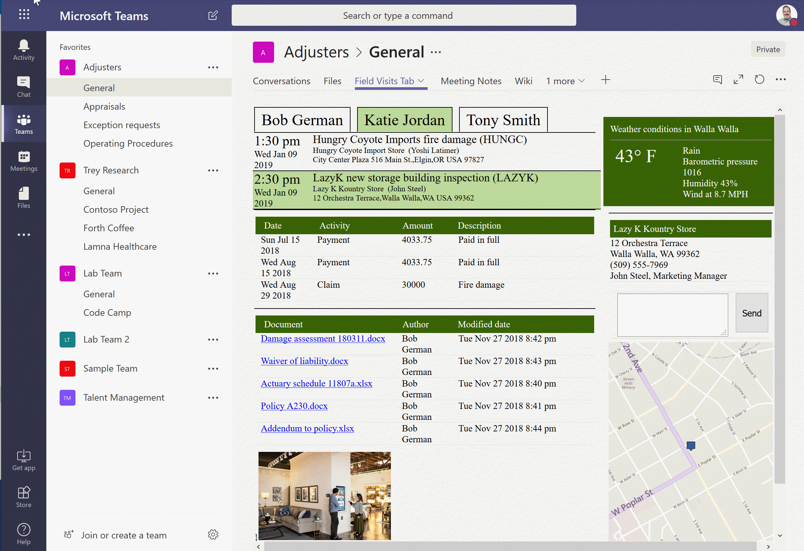

# Teams Tab - Field Visit Demo (Mashup)

## Summary
A web part for use in Microsoft Teams that displays a mashup of information partaining to customer visits. Visits are obtained from the Team's shared calendar and displayed by user. When a visit is selected, the solution displays:
 * customer information (from the Northwind database)
 * documents (from SharePoint)
 * recent transactions (mock)
 * a map (Bing maps)
 * current weather (Open Weather Map)
 * photos (from SharePoint)
 * a text box for sending messages to the Teams channel with deep links back to the selected visit

The solution demonstrates:

 * A Teams tab using SharePoint Framework
 * Accessing the hosting Team using the teams context and the Graph API
 * Deep linking to a SharePoint Framework tab
 * A mashup using React components

## Compatibility

 
 

-Incompatible-red.svg "SharePoint Server 2016 Feature Pack 2 requires SPFx 1.1")

## Applies to

* [SharePoint Framework Developer](https://docs.microsoft.com/sharepoint/dev/spfx/sharepoint-framework-overview)
* [Building Microsoft Teams Tabs using SharePoint Framework](https://docs.microsoft.com/en-us/sharepoint/dev/spfx/integrate-with-teams-introduction)
* [Office 365 developer tenant](https://docs.microsoft.com/sharepoint/dev/spfx/set-up-your-developer-tenant)

## Solution

Solution|Author(s)
--------|---------
field-visit-demo-tab | [Bob German](https://github.com/BobGerman) ([@Bob1German](http://www.twitter.com/Bob1German))

Many thanks to [Arbindo Chattopadhyay](https://www.linkedin.com/in/arbindoc/) for writing the [detailed installation instructions ](./documentation/setup.md) and compiling [links to resources](./documentation/resources.md).

## Version history

Version|Date|Comments
-------|----|--------
1.1|April 20, 2019|Updated for SPFx 1.8, moved to sp-dev-fx-webparts
1.0|April 5, 2019|Initial release

## Minimal Path to Awesome

The quickest path to building the web part and running it with mock data:

>  This sample can also be opened with [VS Code Remote Development](https://code.visualstudio.com/docs/remote/remote-overview). Visit https://aka.ms/spfx-devcontainer for further instructions.

 * Obtain API keys for [Bing Maps](https://docs.microsoft.com/en-us/bingmaps/getting-started/bing-maps-dev-center-help/getting-a-bing-maps-key) and [Open Weather Maps](https://openweathermap.org/api). In src/webparts/fieldVisitTab/, copy constants.sample.ts to constants.ts and add the API keys.
 * npm install
 * gulp serve

To work with real data, the web part requires content to be in place including:

* A Microsoft Team
* Calendar items in the Team's shared calendar, encoded with Northwind database customer IDs
* Documents and photos in SharePoint

[Detailed setup instructions are here](./documentation/setup.md).

## Help

We do not support samples, but this community is always willing to help, and we want to improve these samples. We use GitHub to track issues, which makes it easy for  community members to volunteer their time and help resolve issues.

If you're having issues building the solution, please run [spfx doctor](https://pnp.github.io/cli-microsoft365/cmd/spfx/spfx-doctor/) from within the solution folder to diagnose incompatibility issues with your environment.

You can try looking at [issues related to this sample](https://github.com/pnp/sp-dev-fx-webparts/issues?q=label%3A%22sample%3A%20react-teams-tab-field-visit-mashup%22) to see if anybody else is having the same issues.

You can also try looking at [discussions related to this sample](https://github.com/pnp/sp-dev-fx-webparts/discussions?discussions_q=react-teams-tab-field-visit-mashup) and see what the community is saying.

If you encounter any issues while using this sample, [create a new issue](https://github.com/pnp/sp-dev-fx-webparts/issues/new?assignees=&labels=Needs%3A+Triage+%3Amag%3A%2Ctype%3Abug-suspected%2Csample%3A%20react-teams-tab-field-visit-mashup&template=bug-report.yml&sample=react-teams-tab-field-visit-mashup&authors=@BobGerman&title=react-teams-tab-field-visit-mashup%20-%20).

For questions regarding this sample, [create a new question](https://github.com/pnp/sp-dev-fx-webparts/issues/new?assignees=&labels=Needs%3A+Triage+%3Amag%3A%2Ctype%3Aquestion%2Csample%3A%20react-teams-tab-field-visit-mashup&template=question.yml&sample=react-teams-tab-field-visit-mashup&authors=@BobGerman&title=react-teams-tab-field-visit-mashup%20-%20).

Finally, if you have an idea for improvement, [make a suggestion](https://github.com/pnp/sp-dev-fx-webparts/issues/new?assignees=&labels=Needs%3A+Triage+%3Amag%3A%2Ctype%3Aenhancement%2Csample%3A%20react-teams-tab-field-visit-mashup&template=suggestion.yml&sample=react-teams-tab-field-visit-mashup&authors=@BobGerman&title=react-teams-tab-field-visit-mashup%20-%20).

## Disclaimer

**THIS CODE IS PROVIDED *AS IS* WITHOUT WARRANTY OF ANY KIND, EITHER EXPRESS OR IMPLIED, INCLUDING ANY IMPLIED WARRANTIES OF FITNESS FOR A PARTICULAR PURPOSE, MERCHANTABILITY, OR NON-INFRINGEMENT.**

