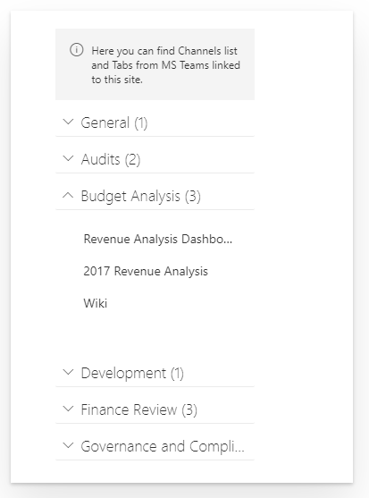
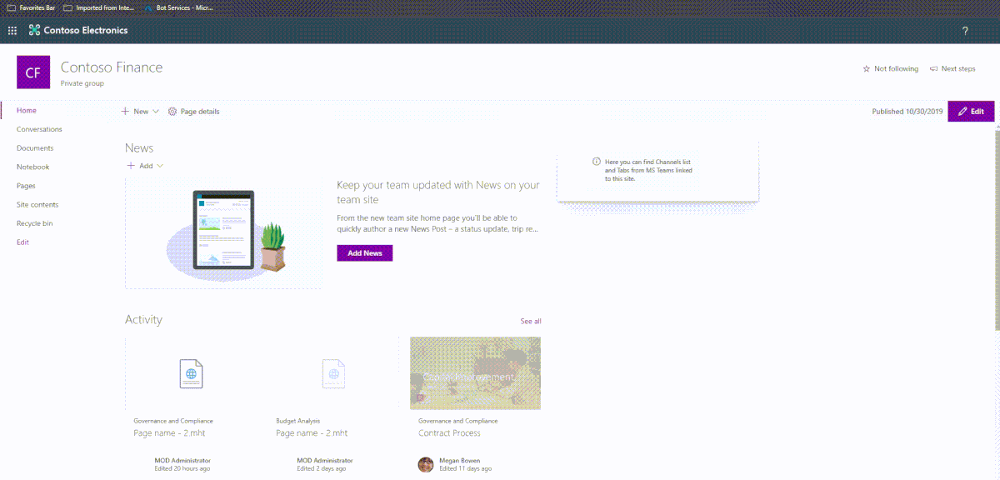

# react-teams-tabs-pnpjs - MS Teams Channels and Tabs from Modern Team site.

## Summary

A SPFx WebPart using [@pnp/graph/teams](https://pnp.github.io/pnpjs/graph/docs/teams/). It shows Channels and Tabs (with link) from a Modern Team Site connected to Microsoft Teams.

## react-teams-tabs-pnpjs preview

## react-teams-tabs-pnpjs in action

## Used SharePoint Framework Version

## Applies to

* [SharePoint Framework](https://docs.microsoft.com/sharepoint/dev/spfx/sharepoint-framework-overview)
* [Office 365 tenant](https://docs.microsoft.com/sharepoint/dev/spfx/set-up-your-development-environment)

## Solution

Solution|Author(s)
--------|---------
react-teams-tabs-pnpjs |  [Federico Porceddu](https://www.federicoporceddu.com)

## Version history

Version|Date|Comments
-------|----|--------
1.0|October 30, 2019|Initial release

## Disclaimer

**THIS CODE IS PROVIDED *AS IS* WITHOUT WARRANTY OF ANY KIND, EITHER EXPRESS OR IMPLIED, INCLUDING ANY IMPLIED WARRANTIES OF FITNESS FOR A PARTICULAR PURPOSE, MERCHANTABILITY, OR NON-INFRINGEMENT.**

---

## Minimal Path to Awesome

* Clone this repository
* in the command line run:
  * restore dependencies: `npm install`
  * build solution `gulp build --ship`
  * bundle solution: `gulp bundle --ship`
  * package solution: `gulp package-solution --ship`
  * locate solution at `.\sharepoint\solution\react-teams-tabs-pnpjs.sppkg` 
  * upload it to your tenant app catalog
  * [approve permission requests](https://docs.microsoft.com/en-us/sharepoint/dev/spfx/use-aadhttpclient#manage-permission-requests) into SharePoint Online Admin API Permission page
  * add `react-teams-tabs-pnpjs` app to your site
  * add `react-teams-tabs-pnpjs` webpart to your page to see it in action

## Features

This Web Part illustrates the following concepts on top of the SharePoint Framework:

* How to use Microsoft Graph with PnPJS
* How to use [@pnp/graph/teams](https://pnp.github.io/pnpjs/graph/docs/teams/)
* How to configure SharePoint Online Tenant and SPFx solution to allow Microsoft Graph calls.
* Microsoft Graph API for Microsoft Teams
* [Fabric UI Nav component](https://developer.microsoft.com/en-us/fabric#/controls/web/nav)

