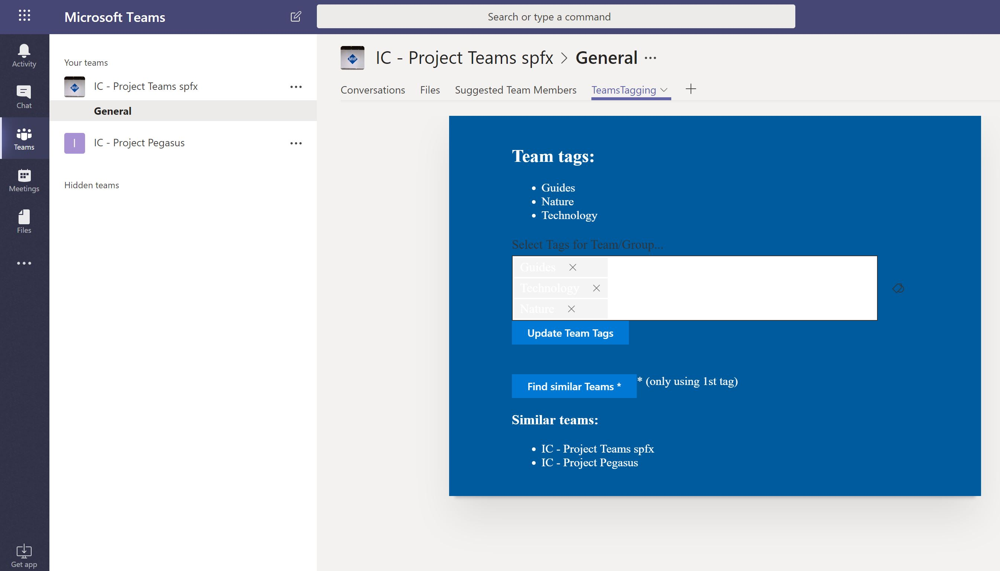

# spfx webpart to Tag Teams using a TermSet in SharePoint

## Summary
This sample shows how read and update a custom Schema extension in MS Graph to Tag a Team using metadata from a specific TermSet in SharePoint. The user can select different Terms (up to 3), and are saved as a custom Schema extension in Group Graph entity. Besides, the webpart allows to find other Teams tagged wit the same Tag (for demo puposes only 1st Tag is used to run the query)



## Used SharePoint Framework Version


## Applies to

* [SharePoint Framework Developer](https://docs.microsoft.com/sharepoint/dev/spfx/sharepoint-framework-overview)
* [Office 365 developer tenant](https://docs.microsoft.com/sharepoint/dev/spfx/set-up-your-developer-tenant)

## Solution

Solution|Author(s)
--------|---------
react-teams-tagging|Luis Mañez (MVP, [ClearPeople](http://www.clearpeople.com), @luismanez)

## Version history

Version|Date|Comments
-------|----|--------
1.0.0|Apr 18, 2019|Initial release

## Disclaimer

**THIS CODE IS PROVIDED *AS IS* WITHOUT WARRANTY OF ANY KIND, EITHER EXPRESS OR IMPLIED, INCLUDING ANY IMPLIED WARRANTIES OF FITNESS FOR A PARTICULAR PURPOSE, MERCHANTABILITY, OR NON-INFRINGEMENT.**

---

## Prerequisites
* Create a custom extenion for Groups using Graph API: Currently, spfx has no permissions to create custom extensions
for entities in Graph API. To create the custom extension, you can use the [MS Graph Explorer website](https://developer.microsoft.com/en-us/graph/graph-explorer).

To create the extension you must do a POST request to:

```js
POST https://graph.microsoft.com/v1.0/schemaExtensions
content-type: application/json
{
    "id": "inheritscloud_TeamsTagging",
    "description": "Adding Tags to Teams",
    "owner": "bbb1b0ef-2f6b-4b50-bcc9-b6a062f202c2",
    "targetTypes": [
        "Group"
    ],
    "properties": [
        {
            "name": "tag1", "type": "String"
        },
        {
            "name": "tag2", "type": "String"
        },
        {
            "name": "tag3", "type": "String"
        }
    ]
}
```

See here for more information about the attributes: [https://developer.microsoft.com/en-us/graph/docs/api-reference/beta/resources/schemaextension](https://developer.microsoft.com/en-us/graph/docs/api-reference/beta/resources/schemaextension)

__Note__:
* For the _id_ attribute, You can assign a value in one of two ways:
    * Concatenate the name of one of your verified domains with a name for the schema extension to form a unique string in this format, {domainName}_{schemaName}. As an example, contoso_mySchema. 
    * Provide a schema name, and let Microsoft Graph use that schema name to complete the id assignment in this format: ext{8-random-alphanumeric-chars}_{schema-name}. An example would be extkvbmkofy_mySchema.
* The _owner_ attribute must be a valid ClientId registered in Azure AD
* The _targetTypes_ is an array with the different Entities that you want to extend (users, groups, event, message). However, spfx only allows to update Groups, so the value is set to _group_

## Minimal Path to Awesome

* clone repo
* edit _TeamsTagging.tsx_ file and change lines 30, 47, 86 with the _id_ "inheritscloud_TeamsTagging" assigned when you created the custom Schema extension
* run _gulp serve_

## Features

This sample shows how read and update a custom Schema extension in MS Graph. The schema extension is composed of 3 string values (list of Tags). For demo purposes we are not storing the ID of the Terms, only the label (and the TaxonomyPicker is not bound with the stored values)

This sample illustrates the following concepts on top of the SharePoint Framework:

* How to create a custom schema extension in Graph API using Graph Explorer tool
* Using GraphHttpClient to get data from MS Graph API
* Using TaxonomyPicker control from spfx PnP React controls
* How to update an MS Graph entity (in this case, Office 365 Group) with custom data
* How to filter Graph data using a custom Schema Extension
* Using async / await for the async calls
* Office UI fabric components


