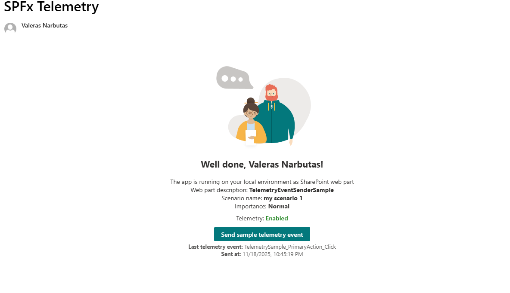
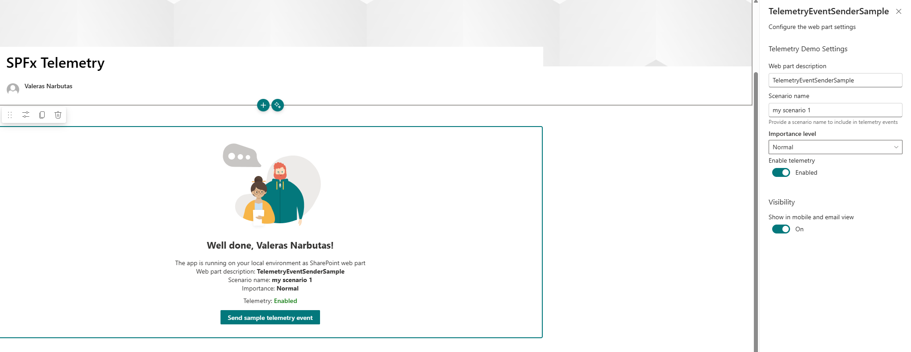
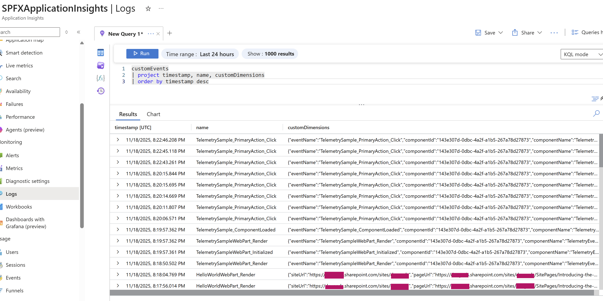
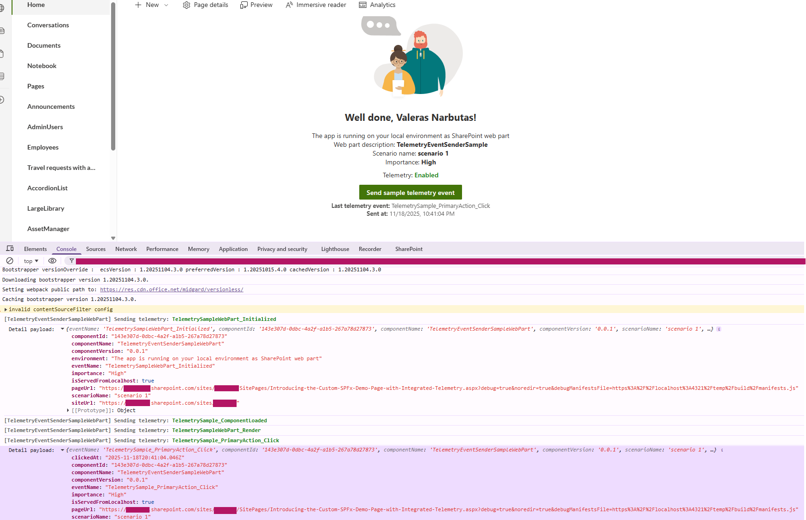

# Telemetry Event Sender

## Summary

The **Telemetry Event Sender** sample is a React-based SharePoint Framework web part that demonstrates how SPFx components can emit lightweight telemetry events which are picked up by a **tenant-wide telemetry Application Customizer**.

The web part:

- Exposes a simple UI with:
  - Web part description
  - Scenario name
  - Importance level
  - Telemetry enabled/disabled state
- Sends telemetry events using the browser `CustomEvent` API with the event name **`spfx-telemetry`**
- Includes:
  - Initialization and render events from the web part
  - A “Send sample telemetry event” button in the UI
- Is designed to work together with the **Tenant Telemetry Application Customizer** sample (from the `sp-dev-fx-extensions` repository), which:
  - Listens for `spfx-telemetry` events
  - Enriches them with page context
  - Forwards them to **Azure Application Insights** or an **Azure Function** endpoint

This sample is ideal for understanding how to instrument SPFx web parts for telemetry **without adding any direct dependency on Application Insights or backend services**.





## Compatibility

| :warning: Important          |
|:---------------------------|
| Every SPFx version is optimally compatible with specific versions of Node.js. In order to be able to build this sample, you need to ensure that the version of Node on your workstation matches one of the versions listed in this section. This sample will not work on a different version of Node.|
|Refer to <https://aka.ms/spfx-matrix> for more information on SPFx compatibility.   |

This sample is optimally compatible with the following environment configuration:


-Incompatible-red.svg "SharePoint Server 2016 Feature Pack 2 requires SPFx 1.1")


## Applies to

* [SharePoint Framework](https://learn.microsoft.com/sharepoint/dev/spfx/sharepoint-framework-overview)
* [Microsoft 365 tenant](https://learn.microsoft.com/sharepoint/dev/spfx/set-up-your-development-environment)

> Get your own free development tenant by subscribing to [Microsoft 365 developer program](https://aka.ms/m365/devprogram)

## Contributors

* [Valeras Narbutas](https://github.com/ValerasNarbutas)

## Version history

|Version|Date|Comments|
|-------|----|--------|
|1.0|November 18, 2025|Initial release|

## Prerequisites

This web part is designed to be used **together** with the **Tenant Telemetry Application Customizer** sample, which must be:

1. Deployed to your tenant (from the `sp-dev-fx-extensions` repo)
  [pnp/sp-dev-fx-extensions#1546](https://github.com/pnp/sp-dev-fx-extensions/issues/1546)
  [https://github.com/pnp/sp-dev-fx-extensions/tree/main/samples/react-application-tenant-telemetry-listener](https://github.com/pnp/sp-dev-fx-extensions/tree/main/samples/react-application-tenant-telemetry-listener)
2. Registered via:
   - Tenant App Catalog, and
   - **Tenant Wide Extensions** list
3. Configured with telemetry settings, for example:

**Application Insights mode**

```json
{
  "mode": "appinsights",
  "endpoint": "InstrumentationKey=...;IngestionEndpoint=..."
}
````

**Azure Function mode**

```json
{
  "mode": "function",
  "endpoint": "https://your-function.azurewebsites.net/api/telemetry"
}
```





Without the Application Customizer running, this web part will still render, but the telemetry events will have nowhere to go.

## Minimal path to awesome

1. Clone this repository (or [download this solution as a .ZIP file](https://pnp.github.io/download-partial/?url=https://github.com/pnp/sp-dev-fx-webparts/tree/main/samples/react-telemetry-sample-webpart) then unzip it)

2. From your command line, change your current directory to the directory containing this sample:

   ```bash
   cd samples/react-telemetry-sample-webpart
   ```

3. In the command line run:

   ```bash
   npm install
   gulp serve
   ```

4. Use the hosted workbench or a modern SharePoint page (with `?loadSPFX=true&debugManifestsFile=...`) to load the web part.

5. Ensure the **Tenant Telemetry Application Customizer** sample is active on the same page so that `spfx-telemetry` events are captured.

## Features

The **Telemetry Event Sender** web part illustrates the following concepts on top of the SharePoint Framework:

* Sending telemetry from SPFx web parts via the browser `CustomEvent` API
* Using a **tenant-wide Application Customizer** as a shared telemetry listener
* Decoupling web parts from specific telemetry backends (App Insights vs Azure Function)
* Enriching telemetry with:

  * Scenario name (configured in the property pane)
  * Importance level (Low / Normal / High)
  * Component identity (id, name, version)
* Exposing a clear visual indicator of telemetry state:

  * Telemetry enabled/disabled toggle in the property pane
  * “Last telemetry event” information directly in the web part UI

### Telemetry events sent by this sample

The web part sends several example events:

* `TelemetrySampleWebPart_Initialized` – when the web part initializes
* `TelemetrySampleWebPart_Render` – after render
* `TelemetrySample_PrimaryAction_Click` – when the user selects **Send sample telemetry event**

Each event includes:

* `eventName`
* `scenarioName`
* `importance`
* `componentId`, `componentName`, `componentVersion`
* `siteUrl`, `pageUrl`
* Additional context such as `clickedAt` (ISO timestamp)

You can query them in **Application Insights** using:

```kusto
customEvents
| where name startswith "TelemetrySample"
| project timestamp, name, customDimensions
| order by timestamp desc
```

## Help

We do not support samples, but this community is always willing to help, and we want to improve these samples. We use GitHub to track issues, which makes it easy for community members to volunteer their time and help resolve issues.

If you're having issues building the solution, please run [spfx doctor](https://pnp.github.io/cli-microsoft365/cmd/spfx/spfx-doctor/) from within the solution folder to diagnose incompatibility issues with your environment.

You can try looking at [issues related to this sample](https://github.com/pnp/sp-dev-fx-webparts/issues?q=label%3A%22sample%3A%20react-telemetry-sample-webpart%22) to see if anybody else is having the same issues.

You can also try looking at [discussions related to this sample](https://github.com/pnp/sp-dev-fx-webparts/discussions?discussions_q=react-telemetry-sample-webpart) and see what the community is saying.

If you encounter any issues using this sample, [create a new issue](https://github.com/pnp/sp-dev-fx-webparts/issues/new?assignees=&labels=Needs%3A+Triage+%3Amag%3A%2Ctype%3Abug-suspected%2Csample%3A%20react-telemetry-sample-webpart&template=bug-report.yml&react-telemetry-event-sender-sample&authors=@ValerasNarbutas&title=react-telemetry-sample-webpart%20-%20).

For questions regarding this sample, [create a new question](https://github.com/pnp/sp-dev-fx-webparts/issues/new?assignees=&labels=Needs%3A+Triage+%3Amag%3A%2Ctype%3Aquestion%2Csample%3A%20react-telemetry-sample-webpart&template=question.yml&react-telemetry-event-sender-sample&authors=@ValerasNarbutas&title=react-telemetry-sample-webpart%20-%20).

Finally, if you have an idea for improvement, [make a suggestion](https://github.com/pnp/sp-dev-fx-webparts/issues/new?assignees=&labels=Needs%3A+Triage+%3Amag%3A%2Ctype%3Aenhancement%2Csample%3A%20react-telemetry-sample-webpart&template=suggestion.yml&react-telemetry-event-sender-sample&authors=@ValerasNarbutas&title=react-telemetry-sample-webpart%20-%20).
## Disclaimer

**THIS CODE IS PROVIDED *AS IS* WITHOUT WARRANTY OF ANY KIND, EITHER EXPRESS OR IMPLIED, INCLUDING ANY IMPLIED WARRANTIES OF FITNESS FOR A PARTICULAR PURPOSE, MERCHANTABILITY, OR NON-INFRINGEMENT.**


