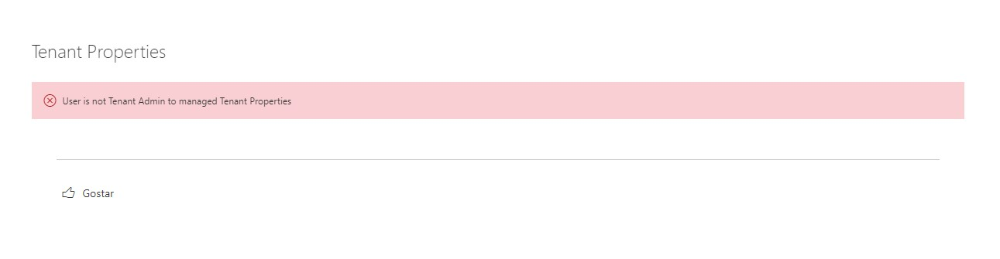
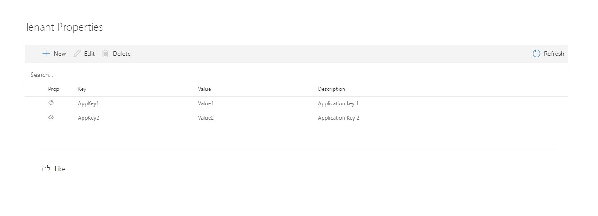
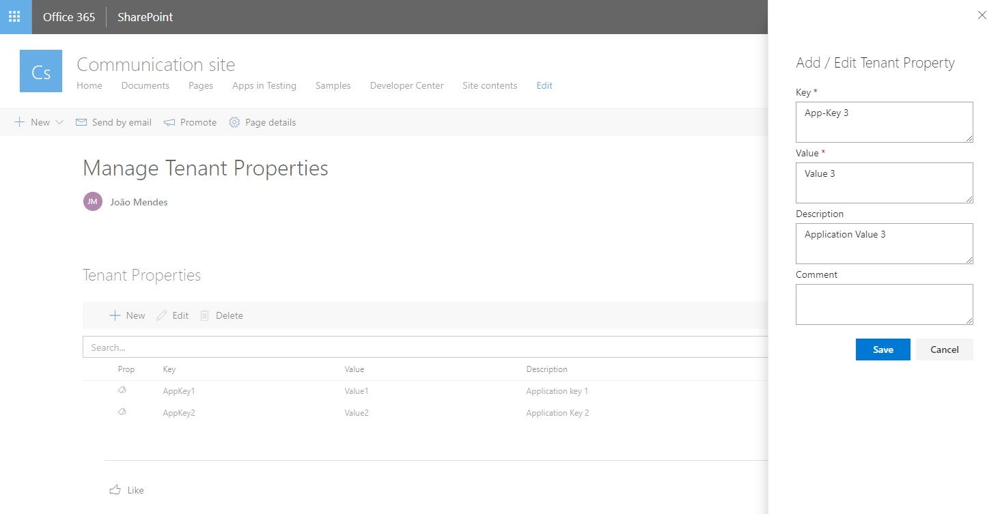
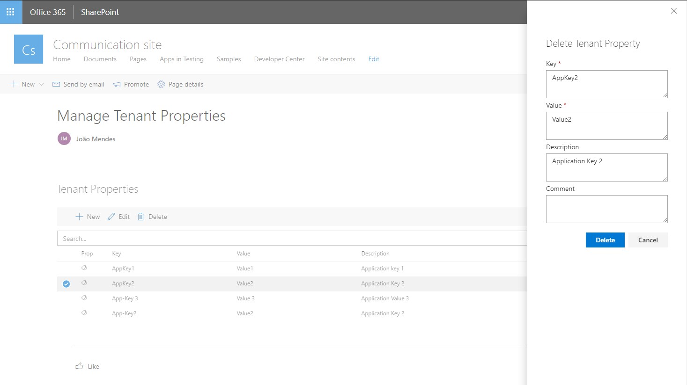

# Tenant Properties

## Summary

This web part allows tenant administrators to manage tenant properties through a graphical interface.  
We can create, edit or delete tenant properties.

Only users with Tenant Admin Role are allowed to managed tenant properties.

### User without Tenant Admin Role got this message

### List tenant properties

### Add Tenant property

### Edit tenant property

### Delete tenant property

## Compatibility

-Incompatible-red.svg "SharePoint Server 2016 Feature Pack 2 requires SPFx 1.1")

## Applies to

* [SharePoint Framework](https://docs.microsoft.com/sharepoint/dev/spfx/sharepoint-framework-overview)
* [Office 365 tenant](https://docs.microsoft.com/sharepoint/dev/spfx/set-up-your-development-environment)

## Web Part Properties
 
Property |Type|Required| comments
--------------------|----|--------|----------
WebPart Title| Text| no|
 

## Solution

The Web Part Use MSGraph API and need to SharePoint Administrator approve de scope "Directory.ReadWrite.All" in SharePoint Admin Center.

Solution|Author(s)
--------|---------
Tenant Properties Web Part|[João Mendes](https://github.com/joaojmendes)

## Version history

Version|Date|Comments
-------|----|--------
1.0.0|Mar 08, 2019|Initial release
1.0.1|October 20, 2020|Update to SPFx 1.11.0

## Minimal Path to Awesome

- Clone this repository
- in the command line run:
  - `npm install`
  - `gulp build`
  - `gulp bundle --ship`
  - `gulp package-solution --ship`
- Add to AppCatalog and deploy
- Approve API permission on SharePoint Admin Center

>  This sample can also be opened with [VS Code Remote Development](https://code.visualstudio.com/docs/remote/remote-overview). Visit https://aka.ms/spfx-devcontainer for further instructions.

## Help

We do not support samples, but we this community is always willing to help, and we want to improve these samples. We use GitHub to track issues, which makes it easy for  community members to volunteer their time and help resolve issues.

If you're having issues building the solution, please run [spfx doctor](https://pnp.github.io/cli-microsoft365/cmd/spfx/spfx-doctor/) from within the solution folder to diagnose incompatibility issues with your environment.

If you encounter any issues while using this sample, [create a new issue](https://github.com/pnp/sp-dev-fx-webparts/issues/new?assignees=&labels=Needs%3A+Triage+%3Amag%3A%2Ctype%3Abug-suspected%2Csample%3A%20react-tenant-properties&template=bug-report.yml&sample=react-tenant-properties&authors=@joaojmendes&title=react-tenant-properties%20-%20).

For questions regarding this sample, [create a new question](https://github.com/pnp/sp-dev-fx-webparts/issues/new?assignees=&labels=Needs%3A+Triage+%3Amag%3A%2Ctype%3Aquestion%2Csample%3A%20react-tenant-properties&template=question.yml&sample=react-tenant-properties&authors=@joaojmendes&title=react-tenant-properties%20-%20).

Finally, if you have an idea for improvement, [make a suggestion](https://github.com/pnp/sp-dev-fx-webparts/issues/new?assignees=&labels=Needs%3A+Triage+%3Amag%3A%2Ctype%3Aenhancement%2Csample%3A%20react-tenant-properties&template=question.yml&sample=react-tenant-properties&authors=@joaojmendes&title=react-tenant-properties%20-%20).

## Disclaimer

**THIS CODE IS PROVIDED *AS IS* WITHOUT WARRANTY OF ANY KIND, EITHER EXPRESS OR IMPLIED, INCLUDING ANY IMPLIED WARRANTIES OF FITNESS FOR A PARTICULAR PURPOSE, MERCHANTABILITY, OR NON-INFRINGEMENT.**

