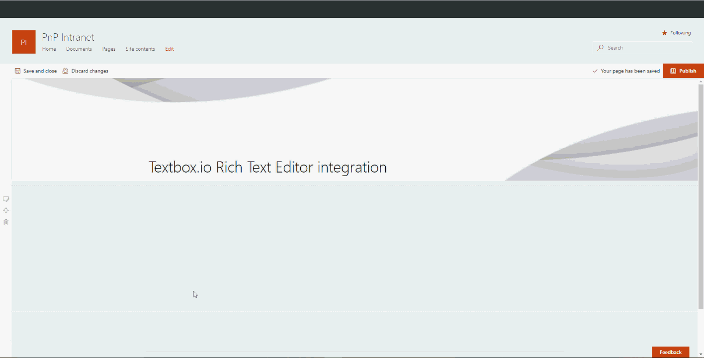

# SharePoint Framework Textbox.io Rich Text Editor

## Summary
This sample Web Part allows contributors to create rich text content in modern SharePoint pages using the third party Textbox.io editor.
The Texbox.io editor is a free web rich text editor (https://textbox.io/) offering much more content edition features than the original OOTB SharePoint Web Part (a CKEditor based subset with custom toolbar) to build dynamic pages (like Microsoft Word copy/paste).

<p align="center">
  
</p>

## Used SharePoint Framework Version 


## Applies to

* [SharePoint Framework](https:/dev.office.com/sharepoint)
* [Office 365 tenant](https://dev.office.com/sharepoint/docs/spfx/set-up-your-development-environment)

## Solution

Solution|Author(s)
--------|---------
react-collapsible-textboxio | Franck Cornu (MVP Office Development at aequos) - Twitter @FranckCornu

## Textbox.io library integration recipe

To make Textbox.io work in an SPFx solution, follow these steps:

- Download the Textbox.io client SDK from the [official site](https://textbox.io/thank-you-for-downloading/). Then, copy the *textbox.io* folder directly in your solution (*/src/libraries/textboxio*).
- Configure the library as external in the *config.json* file and import it in your TypeScript file (see *ContentZoneEditor.tsx*):

```
  "externals": {
    "textboxio": {
      "path": "src/librairies/textboxio/textboxio.js",
      "globalName": "textboxio"
    }
  }
```

- Create a TypeScript definition file (*textboxio.d.ts*) for methods you need. Refer to the official [documentation](http://docs.ephox.com/display/tbio/API+reference) to know about all available methods:

```
declare module "textboxio" {
    interface ITextboxIO {
        replace(selector: string, config?: any): any;
        inline(selector: string, config?: any): any;
        replaceAll(selector: string, config?: any): any[];
        inlineAll(selector: string, config?: any): any[];
        get(id: string): any;
    }
    var textboxio: ITextboxIO;
    export = textboxio;
}
```
```
import * as tbio from "textboxio";
...

if (Environment.type === EnvironmentType.Local) {
    this._textboxio = tbio;
} else {
    this._textboxio = window["textboxio"];
}
```

- Configure the editor according to your requirements:

```
let editorInstance = this._textboxio.inline("#" + props.domElementId, {
                // You can configure your own options here: http://docs.ephox.com/display/tbio/toolbar
                ui: {
                    toolbar: {
                        items: [
                            'emphasis',
                            {  
                                label  : 'Common ',
                                items : ['styles', 'removeformat', 'font-color']
                            },
                            'align',
                            {
                                label: 'Align',
                                items: ['ul', 'ol', 'indent', 'outdent', 'blockquote']
                            },
                            {
                                label: 'Miscellaneous',
                                items: ['link', 'fileupload','media', 'table', 'hr']
                            }
                        ],
                        draggable: false,
                    },
                    locale: props.locale ? props.locale.split("-")[0] : ''
                },
                css : {
                    // Configure a list of available CSS classes   
                    styles : [     
                        { rule : 'h1'},
                        { rule : 'h2'},
                        { rule : 'h3'},
                        { rule : 'p' },                  
                    ],
                },
            });
```

- Copy the "*/resources*" folder into the Webpack output directory and remove hashes from filenames. Actually, to get it work, the Texbox.io library needs the "*resources*" folder located at the same level relativelty to the textbox.io.js file (hard coded in the library file).

*Deactivate auto hashes in file names in the output folder (gulpfile.js) by overriding the default task:*

```
build.copyAssets.taskConfig = {
    excludeHashFromFileNames: true,
}

```
*Copy Textbox.io resources folder in the Webpack output directory using a gulp task (gulpfile.js):*

```
let copyTextboxioAssets = build.subTask('copy-textboxio-assets', function(gulp, buildOptions, done) {

    let resourcesFolderPath = path.resolve(__dirname, "./src/librairies/textboxio/resources/**/*");
    if ((process.argv.indexOf('--ship') !== -1)) {
        gulp.src(resourcesFolderPath).pipe(gulp.dest('./temp/deploy/resources'));
        done();
    } else {
        gulp.src(resourcesFolderPath).pipe(gulp.dest('./dist/resources'));
        done();
    }
});
```

## Version history

Version|Date|Comments
-------|----|--------
1.0 | October 23, 2017 | Initial release

## Disclaimer
**THIS CODE IS PROVIDED *AS IS* WITHOUT WARRANTY OF ANY KIND, EITHER EXPRESS OR IMPLIED, INCLUDING ANY IMPLIED WARRANTIES OF FITNESS FOR A PARTICULAR PURPOSE, MERCHANTABILITY, OR NON-INFRINGEMENT.**

---

## Minimal Path to Awesome

- Clone this repository
- In the command line run:
  - `npm install`
  - `gulp serve`

## Features
This Web Part illustrates the following concepts on top of the SharePoint Framework:

- Integrate the Textbox.io third party rich text editor in a SPFx solution by playing with externals and gulp tasks.


