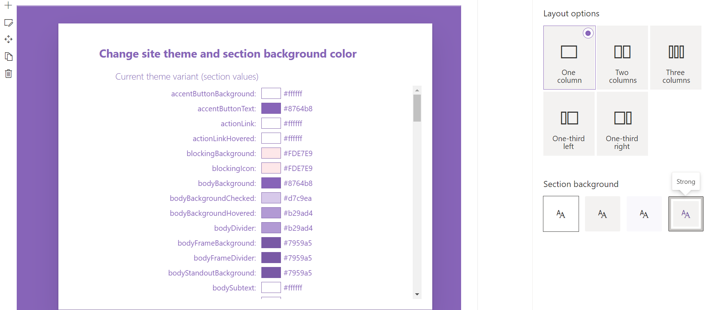

# SharePoint Themes 

## Summary

The Themes web part illustrates how to use SharePoint Theme variables in custom web parts.


The Section Theme web part illustrates how to use theme variant variables to style web parts based on selected site theme and section background colors.




## Compatibility

 
 


-Incompatible-red.svg "SharePoint Server 2016 Feature Pack 2 requires SPFx 1.1")


## Applies to

* [SharePoint Framework](https://docs.microsoft.com/sharepoint/dev/spfx/sharepoint-framework-overview)

Solution|Author(s)
--------|---------
react-themes | Alex Terentiev ([Sharepointalist Inc.](http://www.sharepointalist.com)[AJIXuMuK](https://github.com/AJIXuMuK))
react-themes | Artur Kukharevich ([akukharevich](https://github.com/akukharevich))
react-themes | Don Kirkham ([@DonKirkham](https://twitter.com/DonKirkham))

## Version history

Version|Date|Comments
-------|----|--------
1.0|April 27, 2017|Initial release
1.1|May 8, 2017| themePrimary variable example added
1.2|Nov 6, 2020| Upgrade to 1.11.0 (Don Kirkham)
1.3|Nov 16, 2020| Section awareness web part added (Don Kirkham)

## Disclaimer

**THIS CODE IS PROVIDED *AS IS* WITHOUT WARRANTY OF ANY KIND, EITHER EXPRESS OR IMPLIED, INCLUDING ANY IMPLIED WARRANTIES OF FITNESS FOR A PARTICULAR PURPOSE, MERCHANTABILITY, OR NON-INFRINGEMENT.**

## Features

This project contains two client-side web parts built on the SharePoint Framework illustrating multiple techniques showing how to use SharePoint themes variables and variant variables to style custom web parts

## Path to Awesomeness

```bash
git clone the repo
npm i
npm i -g gulp
gulp
```


