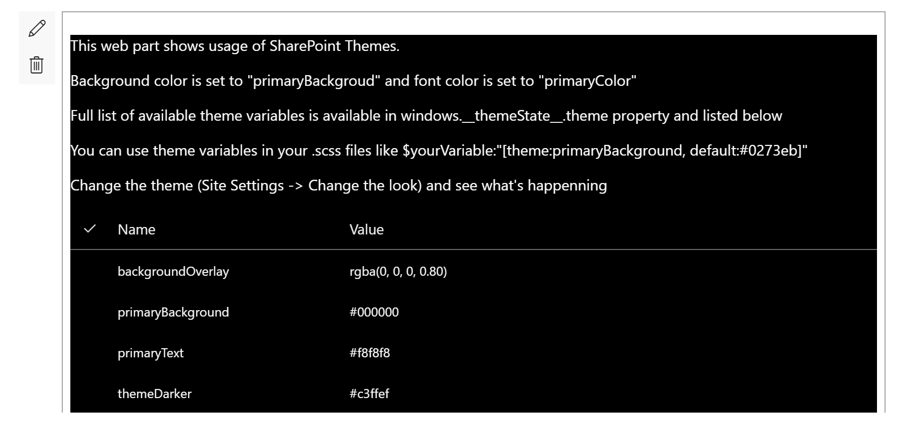

# SharePoint Themes Client Side Web Part

## Summary
This web part illustrates how to use SharePoint Theme variables in custom web parts.



## Used SharePoint Framework Version 


## Applies to

* [SharePoint Framework](https://docs.microsoft.com/sharepoint/dev/spfx/sharepoint-framework-overview)

Solution|Author(s)
--------|---------
react-themes | Alex Terentiev ([Sharepointalist Inc.](http://www.sharepointalist.com), [AJIXuMuK](https://github.com/AJIXuMuK)), Artur Kukharevich ([akukharevich](https://github.com/akukharevich))

## Version history

Version|Date|Comments
-------|----|--------
1.0|April 27, 2017|Initial release
1.1|May 8, 2017| themePrimary variable example added

## Disclaimer
**THIS CODE IS PROVIDED *AS IS* WITHOUT WARRANTY OF ANY KIND, EITHER EXPRESS OR IMPLIED, INCLUDING ANY IMPLIED WARRANTIES OF FITNESS FOR A PARTICULAR PURPOSE, MERCHANTABILITY, OR NON-INFRINGEMENT.**

## Features
This project contains Client-Side Web Part built on the SharePoint Framework illustrating how to use SharePoint themes variables to style custom web parts

## Building the code

```bash
git clone the repo
npm i
npm i -g gulp
gulp
```

This package produces the following:

* lib/* - intermediate-stage commonjs build artifacts
* dist/* - the bundled script, along with other resources
* deploy/* - all resources which should be uploaded to a CDN.


