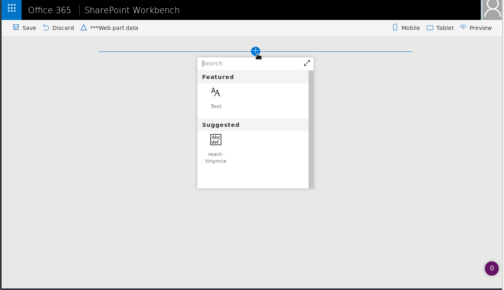

# TinyMCE Editor

## Summary
React TinyMCE is one of the worlds most popular editors for the web.
It has many features out of the box and many more plugins that can be
added when needed. You can create your own plugins if you want, the
editor is powered by the community.

## Compatibility

 
 

-Incompatible-red.svg "SharePoint Server 2016 Feature Pack 2 requires SPFx 1.1")

## Applies to

* [SharePoint Framework](https://docs.microsoft.com/sharepoint/dev/spfx/sharepoint-framework-overview)
* [Office 365 tenant](https://docs.microsoft.com/sharepoint/dev/spfx/set-up-your-development-environment)

## Prerequisites
If you are going to use tinymce be aware of it's license, and you must
agree to it.

## Solution

Solution|Author(s)
--------|---------
React-TinyMCE | @AustinBreslinDev

## Version history

Version|Date|Comments
-------|----|--------
1.0|Feb |Initial release

## Minimal Path to Awesome

- Clone this repository
- in the command line run:
  - `npm install`
  - `gulp serve`
  - `add web part to page`

>  This sample can also be opened with [VS Code Remote Development](https://code.visualstudio.com/docs/remote/remote-overview). Visit https://aka.ms/spfx-devcontainer for further instructions.

## Features
Description of the web part with possible additional details than in short summary. 
This Web Part illustrates the following concepts on top of the SharePoint Framework:

- Rich text editing, that has more features than the Out of the box.
- Uses an Open Source, community-driven Editor.
- Can be extended to accept copy/paste from using Paste Plugin.
- Can be extended to accept images using the manager in the Editor.
- Can write your own Styles for all content on your site.
- Can style your authoring experience using the skins folder.
- For more features please look at the extensive list of extensions available.

## Disclaimer

**THIS CODE IS PROVIDED *AS IS* WITHOUT WARRANTY OF ANY KIND, EITHER EXPRESS OR IMPLIED, INCLUDING ANY IMPLIED WARRANTIES OF FITNESS FOR A PARTICULAR PURPOSE, MERCHANTABILITY, OR NON-INFRINGEMENT.**

