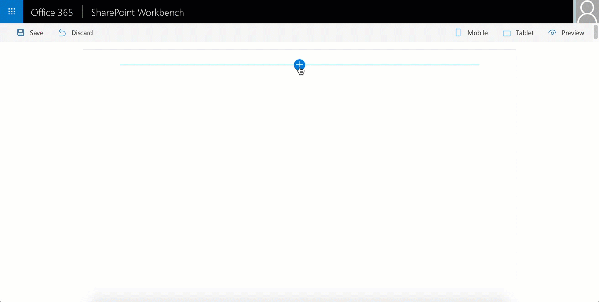
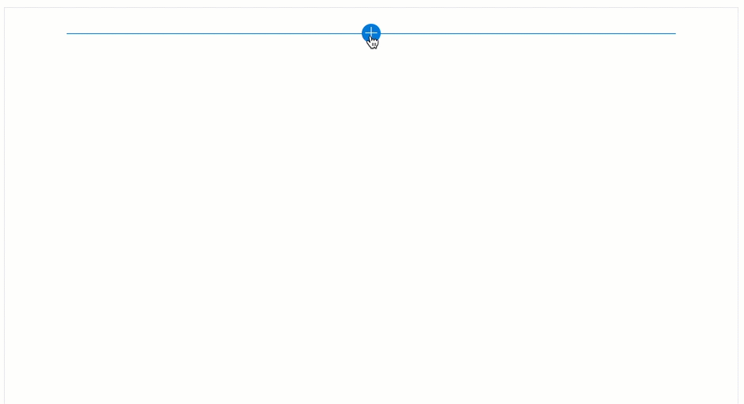
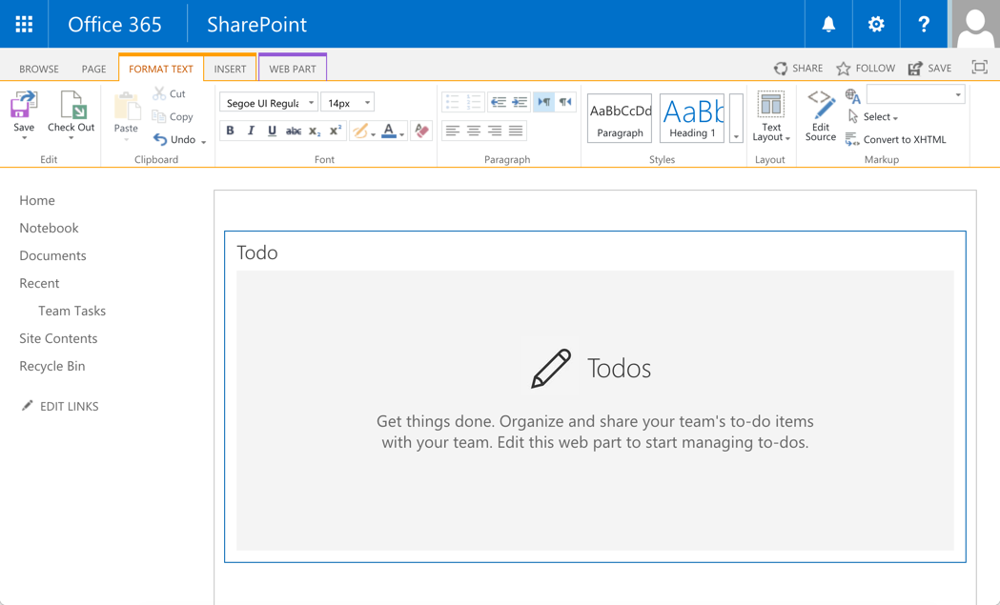
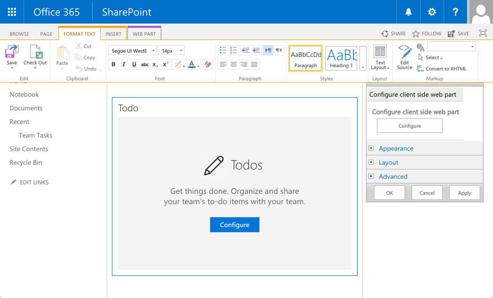
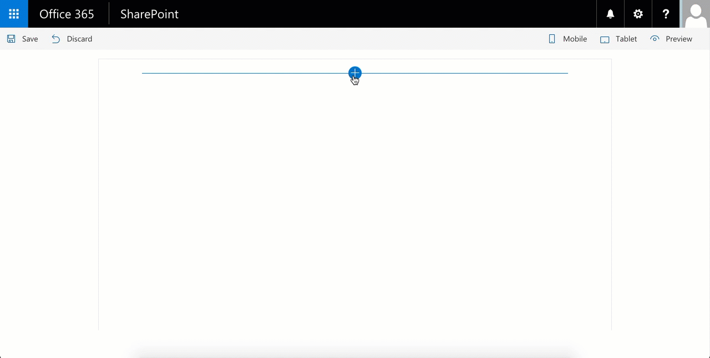

## Summary
A simple todo web part built using react to showcase some of the SharePoint Framework developer features, utilities and best practices in building react based web parts.



## Used SharePoint Framework Version 


## Applies to

* [SharePoint Framework Developer Documentation](http://dev.office.com/sharepoint/docs/spfx/sharepoint-framework-overview)

## Solution

Solution|Author(s)
--------|---------
react-todo-basic | Chakkaradeep Chandran (@chakkaradeep)

## Version history

Version|Date|Comments
-------|----|--------
1.0.2|May 4th, 2017|Updated to SPFx GA
1.0.1|February 1st, 2017|Updated to SPFx drop RC0
1.0.0|October 12th, 2016|Initial release

## Disclaimer
**THIS CODE IS PROVIDED *AS IS* WITHOUT WARRANTY OF ANY KIND, EITHER EXPRESS OR IMPLIED, INCLUDING ANY IMPLIED WARRANTIES OF FITNESS FOR A PARTICULAR PURPOSE, MERCHANTABILITY, OR NON-INFRINGEMENT.**

---

## Minimal Path to Awesome

- Clone this repository
- Move to sample folder
- in the command line run:
  - `npm install`
  - `gulp serve`

## Features
This todo basic sample web part showcases some of the SharePoint Framework developer features which will help you build web parts with great user experiences along with good coding pattern and practices for react based web parts. Below are some resources if you are not familiar with react:

- [React Quick Start](https://facebook.github.io/react/docs/tutorial.html)
- [TypeScript React Tutorials](https://www.typescriptlang.org/docs/handbook/react-&-webpack.html)

### React pattern

While there are many patterns that one can choose to build their react based app, this web part sample uses the [Container component](http://reactpatterns.com/#Container component) approach where there is a main contain component and then one or more dummy components that render the data. 

In our case, [TodoContainer.tsx](./src/webparts/todo/components/TodoContainer/TodoContainer.tsx) is the container component while the rest of the components are sub components.

All of the components are placed under the [components](./src/webparts/todo/components) folder. Each component folder has its corresponding:

- Component file | .tsx file
- Props interface, if applicable | .ts file
- State interface, if applicable | .ts file
- Sass file, if applicable | .module.scss file

The code ensures that the web part file, [TodoWebPart.ts](./src/webparts/todo/TodoWebPart.ts), only handles the key web part specific operations including property pane. 

While you can choose from many patterns, this kind of an approach, to break into multiple components and handling only the web part specific code in the web part file, helps to keep your react based web part structured and well formed. 

### Status Renderers

SharePoint Framework provides status renderers to use when the web part is loading information from SharePoint or display error if the web part run into issues that could prevent it from working properly. The following status renderers are available via the web part context property. Do note that the status renderers take up the entire web part UX.

- Loading indicator
   - Used to display the loading indicator. Useful when you are initializing or loading any content in your web part.
- Error indicator
   - Used to display error messages. 



Here is an example of using the loading indicator. You can find this code in the `onInit` method in the [TodoWebPart.ts](./src/webparts/todo/TodoWebPart.ts) file.

```ts
this.context.statusRenderer.displayLoadingIndicator(this.domElement, "Todo");
```
The code above displays the default loading indicator for web parts. The `this.domElement` specifically instructs the loading indicator to be displayed in the web part's DOM element. 

To clear the loading indicator when your operation is complete, you just call [`clearLoadingIndicator`](https://dev.office.com/sharepoint/reference/spfx/sp-webpart-base/iclientsidewebpartstatusrenderer):

```ts
this.context.statusRenderer.clearLoadingIndicator(this.domElement);
```

### Placeholders
Placeholders are a great way to show default information when the web part is first run or needs to be configured. SharePoint Framework provides a default placeholder react component that you can use in your react based web parts.


To use this placeholder component, you will need to import the `Placeholder` component from `@microsoft/sp-webpart-base` module.

```ts
import { Placeholder } from '@microsoft/sp-webpart-base';
```
Once imported, then you can simply create the component. You can find this code in the [TodoContainer.tsx](./src/webparts/todo/components/TodoContainer/TodoContainer.tsx) file.

```tsx
 <Placeholder
            icon={ 'ms-Icon--Edit' }
            iconText='Todos'
            description='Get things done. Organize and share your team\'s to-do items with your team. Edit this web part to start managing to-dos.' />
```
You can also include a button in the placeholder if you want to aid specific operation that helps end users. 

```tsx
<Placeholder
            icon={ 'ms-Icon--Edit' }
            iconText='Todos'
            description='Get things done. Organize and share your team\'s to-do items with your team.'
            buttonLabel='Configure'
            onAdd={ this._configureWebPart }  />
```
### Lodash Utility Library
[lodash](https://lodash.com/) is a great JavaScript utility library that you can use to perform operations on various objects like arrays, numbers, strings etc., SharePoint Framework includes [`lodash` utility library](https://www.npmjs.com/package/@microsoft/sp-lodash-subset) for use with SharePoint Framework out of the box so you need not install it separately. To improve runtime performance, it only includes a subset of the most essential lodash functions.

To use the `lodash` utility, you will need to first import the library from the `@microsoft/sp-lodash-subset` module:

```
import * as lodash from '@microsoft/sp-lodash-subset';
```
Here is an example how the [MockDataProvider](./src/webparts/todo/tests/MockDataProvider.ts) uses `lodash`'s `findIndex` method to find the index of the todo item to update. You can find this code in the `updateItem` method:

```
const index: number =
      lodash.findIndex(
        this._items[this._selectedList.Title],
        (item: ITodoItem) => item.Id === itemUpdated.Id
      );
```
### Page Display Modes
SharePoint pages have display modes which indicates in which mode that page and/or its contents (e.g. text and web parts) are displayed. In the classic server-side SharePoint page, the web part needs to be in edit mode even though the page is already in the edit mode while in the modern client-side SharePoint page, both the page and/or its contents are in the same mode.

You can provide a tailored experience using the display modes to enhance the web part user experience. In this web part, we display different placeholder depending on the page display mode. This is well demonstrated in the classic server-side SharePoint page.

When the page is in edit mode, but the web part is not, the web part displays the following placeholder.



When the page in in edit mode and also the web part, the web part displays the following placeholder:



You can see this in action in the the [TodoContainer.tsx](./src/webparts/todo/components/TodoContainer/TodoContainer.tsx) component's `render` method:

```ts
{ this._showPlaceHolder && this.props.webPartDisplayMode === DisplayMode.Edit &&
          <Placeholder
            icon={ 'ms-Icon--Edit' }
            iconText='Todos'
            description='Get things done. Organize and share your team\'s to-do items with your team.'
            buttonLabel='Configure'
            onAdd={ this._configureWebPart }  />
        }
        { this._showPlaceHolder && this.props.webPartDisplayMode === DisplayMode.Read &&
          <Placeholder
            icon={ 'ms-Icon--Edit' }
            iconText='Todos'
            description='Get things done. Organize and share your team\'s to-do items with your team. Edit this web part to start managing to-dos.' />
        }
        { !this._showPlaceHolder &&
          <div className={ styles.todo }>
            <div className={ styles.topRow }>
              <h2 className={ styles.todoHeading }>Todo</h2>
            </div>
            <TodoForm onAddTodoItem={ this._createTodoItem} />
            <TodoList items={this.state.todoItems}
              onCompleteTodoItem={this._completeTodoItem}
              onDeleteTodoItem={this._deleteTodoItem} />
          </div>
        }
```
### Loading SharePoint data in property pane
One of the things you may want to do in your web part is the ability to configure the data source of your web part. For example, selecting a SharePoint list to bind to. Usually, this is presented in the web part property pane. However, this requires you fetch the available lists from the SharePoint site. 

[TodoWebPart.ts](./src/webparts/todo/TodoWebPart.ts) demonstrates an approach that will help you fetch data from SharePoint and populate a property pane field, in this case, a dropdown. This operation is performed in the `onInit` method where it calls the `_getTaskLists` method to query the data source and populate the corresponding property pane dropdown field property array:

```ts
private _loadTaskLists(): Promise<any> {
    return this._dataProvider.getTaskLists()
      .then((taskLists: ITodoTaskList[]) => {
        this._disableDropdown = taskLists.length === 0;
        if (taskLists.length !== 0) {
          this._dropdownOptions = taskLists.map((list: ITodoTaskList) => {
            return {
              key: list.Id,
              text: list.Title
            };
          });
        }
      });
  }
```
As we do this operation in the `onInit` method, the dropdown values are initialized by the time property pane is initialized or invoked. Also, notice how we use the loading indicator in the `onInit` method during this operation to provide information to the end user:

```ts
protected onInit(): Promise<void> {
    this.context.statusRenderer.displayLoadingIndicator(this.domElement, "Todo");

    /* ...code removed for brevity... */

    this._loadTaskLists()
      .then(() => {
        /*
          If a list is already selected, then we would have stored the list Id in the associated web part property.
          So, check to see if we do have a selected list for the web part. If we do, then we set that as the selected list
          in the property pane dropdown field.
        */
        if (this.properties.spListIndex) {
          this._setSelectedList(this.properties.spListIndex.toString());
          this.context.statusRenderer.clearLoadingIndicator(this.domElement);
        }
      });

      return super.onInit();    
  }
```
### Handling empty data in property pane fields
This todo sample talks to a SharePoint task list. In the property pane, page authors can select the task list they want to use for the web part. However, in cases where there are no task lists available, we should communicate that to the author. While there are more than one experience you can choose to tackle this problem, the todo sample takes the following approach:

- If there are no task lists available to choose from, the dropdown field is disabled and a meaningful message is displayed to the author in the property pane.

Below is the experience:



You can see the code to render this experience in the `_getGroupFields` method in [TodoWebPart.ts](./src/webparts/todo/TodoWebPart.ts):

```ts
private _getGroupFields(): IPropertyPaneField<any>[] {
    const fields: IPropertyPaneField<any>[] = [];

    fields.push(PropertyPaneDropdown('spListIndex', {
      label: "Select a list",
      disabled: this._disableDropdown,
      options: this._dropdownOptions
    }));

    if (this._disableDropdown) {
      fields.push(PropertyPaneLabel(null, {
        text: 'Could not find tasks lists in your site. Create one or more tasks list and then try using the web part.'
      }));
    }

    return fields;
  }
```
The method returns a set of property pane fields to render in the property pane. In our case, we check to see if the dropdown is disabled. If it is, then we add a label field with the appropriate message.

### Data providers
This sample uses two data providers:
- [MockDataProvider](./src/webparts/todo/tests/MockDataProvider.ts) - a light weight provider that mocks SharePoint API calls and returns mock data.
- [SharePointDataProvider](./src/webparts/todo/dataProviders/SharePointDataProvider.ts) - the provider which talks to SharePoint and returns SharePoint data.

Depending on where you are web part is running, local environment or SharePoint environment, you use the respective data provider. You can see this in action in the [TodoWebPart.ts](./src/webparts/todo/TodoWebPart.ts) web part constructor. The [`Environment`](https://dev.office.com/sharepoint/reference/spfx/sp-core-library/environment) class and [`EnvironmentType`](https://dev.office.com/sharepoint/reference/spfx/sp-core-library/environmenttype) enum in the [`@microsoft/sp-core-library`](https://dev.office.com/sharepoint/reference/spfx/sp-core-library-module) module helps you determine where the web part is running. We use that to create the corresponding data provider instance in the `onInit` method:

```ts
 protected onInit(): Promise<void> {
    this.context.statusRenderer.displayLoadingIndicator(this.domElement, "Todo");

    /*
    Create the appropriate data provider depending on where the web part is running.
    The DEBUG flag will ensure the mock data provider is not bundled with the web part when you package the solution for distribution, that is, using the --ship flag with the package-solution gulp command.
    */
    if (DEBUG && Environment.type === EnvironmentType.Local) {
      this._dataProvider = new MockDataProvider();
    } else {
      this._dataProvider = new SharePointDataProvider();
      this._dataProvider.webPartContext = this.context;
    }

    this._openPropertyPane = this._openPropertyPane.bind(this);

    /* ...code removed for brevity... */
 }
```
### Using SPHttpClient to fetch SharePoint data

SharePoint Framework includes a [`SPHttpClient`](https://dev.office.com/sharepoint/reference/spfx/sp-http/sphttpclient) utility class that you can use to interact with SharePoint data using SharePoint REST APIs. It adds default headers, manages the digest needed for writes, and collects telemetry that helps the service to monitor the performance of an application. For communicating with non-SharePoint services, you can use the [`HttpClient`](https://dev.office.com/sharepoint/reference/spfx/sp-http/httpclient) utility class instead.

You can see this in action in the [SharePointDataProvider](./src/webparts/todo/dataProviders/SharePointDataProvider.ts). For example, here is what we do in the `createItem` method which creates a new todo item in the specific SharePoint list:

```ts
public createItem(title: string): Promise<ITodoItem[]> {
    const batch: SPHttpClientBatch = this.webPartContext.spHttpClient.beginBatch();

    const batchPromises: Promise<{}>[] = [
      this._createItem(batch, title),
      this._getItemsBatched(batch)
    ];

    return this._resolveBatch(batch, batchPromises);
}
```

And below is the code that retrieves todo items from the task list. We have a simple GET and a batched GET to accomodate for batch requests.

```ts
private _getItems(requester: SPHttpClient): Promise<ITodoItem[]> {
    const queryString: string = `?$select=Id,Title,PercentComplete`;
    const queryUrl: string = this._listItemsUrl + queryString;

    return requester.get(queryUrl, SPHttpClient.configurations.v1)
      .then((response: Response) => {
        return response.json();
      })
      .then((json: { value: ITodoItem[] }) => {
        return json.value.map((task: ITodoItem) => {
          return task;
        });
      });
  }

  private _getItemsBatched(requester: SPHttpClientBatch): Promise<ITodoItem[]> {
    const queryString: string = `?$select=Id,Title,PercentComplete`;
    const queryUrl: string = this._listItemsUrl + queryString;

    return requester.get(queryUrl, SPHttpClientBatch.configurations.v1)
      .then((response: Response) => {
        return response.json();
      })
      .then((json: { value: ITodoItem[] }) => {
        return json.value.map((task: ITodoItem) => {
          return task;
        });
      });
}
```
To execute multiple API requests, we create a new batch that includes those requests, and then resolve it. In our code, we create the following two requests:

- `_createItem` | Creating a new item in the list
- `_getItemsBatched` | Getting the new set of items

Each of the method will be executed in the order specified. To execute the batch requests, we call the `_resolveBatch` method

And finally the `_resolveBatch` method which executes and resolves the promises in the current batch:

```ts
private _resolveBatch(batch: SPHttpClientBatch, promises: Promise<{}>[]): Promise<ITodoItem[]> {
    return batch.execute()
      .then(() => Promise.all(promises).then(values => values[values.length - 1]));
}
```


